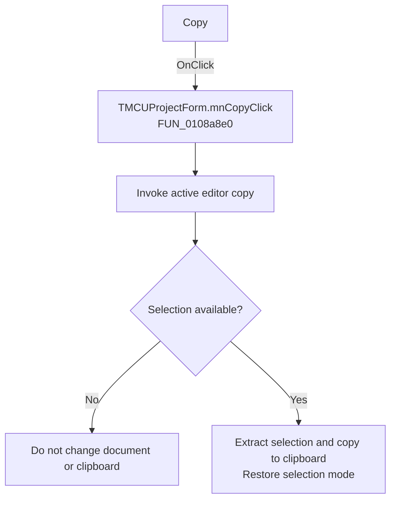

# Copy

> Analysis status: Recovered handler and relevant call path reviewed for mnCopyClick.

## Control

| Property | Recovered value |
| --- | --- |
| Form | MCUProjectForm |
| Component path | MCUProjectForm.MainMenu.mnEdit.mnCopy |
| Control class | TMenuItem |
| Caption | Copy |
| Hint | Not present in the recovered resource. |
| Text | Not present in the recovered resource. |
| Handler name | mnCopyClick |
| Handler address | 0108a8e0 |
| Graph node | `resource:dfm:MCUProjectForm/MCUProjectForm.MainMenu.mnEdit.mnCopy` |
| Handler node | `function:0108a8e0` |
| Graph layer | UI |

## What happens when clicked

The handler forwards the command to the active editor. The editor requires a selection. It temporarily clears one selection-mode flag when needed, extracts the selected text, passes it to the clipboard helper, and restores the flag. With no selection, it returns without changing the document or showing a message.

## Click flow

## Handler evidence

- Source: [DecompiledSources/Tina16/functions/000000000108A8E0__FUN_0108a8e0.c](../../../DecompiledSources/Tina16/functions/000000000108A8E0__FUN_0108a8e0.c)
- Recovered role: Not present in the recovered resource.
- Current graph summary: Handles 1 Delphi UI event: MCUProjectForm.MainMenu.mnEdit.mnCopy.OnClick.
- Current graph behavior: Not present in the recovered resource.
- Current graph evidence: Not present in the recovered resource.
- Complexity: simple
- Distinct outgoing calls: 1

## Direct calls

- `function:00bf1d60` — FUN_00bf1d60

## Resource evidence

- Kind: Not present in the recovered resource.
- Modal result: Not present in the recovered resource.
- Checked state: Not present in the recovered resource.
- List items: Not present in the recovered resource.
- Image reference: Not present in the recovered resource.
- Extracted glyph: None.

## Nearby label candidates

Nearby labels are layout candidates only. They are not proof of behavior.

- No same-parent label candidate is available.

## Reviewed boundaries

- The explanation comes from the recovered handler and the named call path. The caption, hint, and glyph are supporting UI evidence only.
- Unnamed virtual calls are described only by the values passed at this call site and by the state that this handler reads or writes.
- The handler has no local exception recovery unless the behavior section states otherwise.
