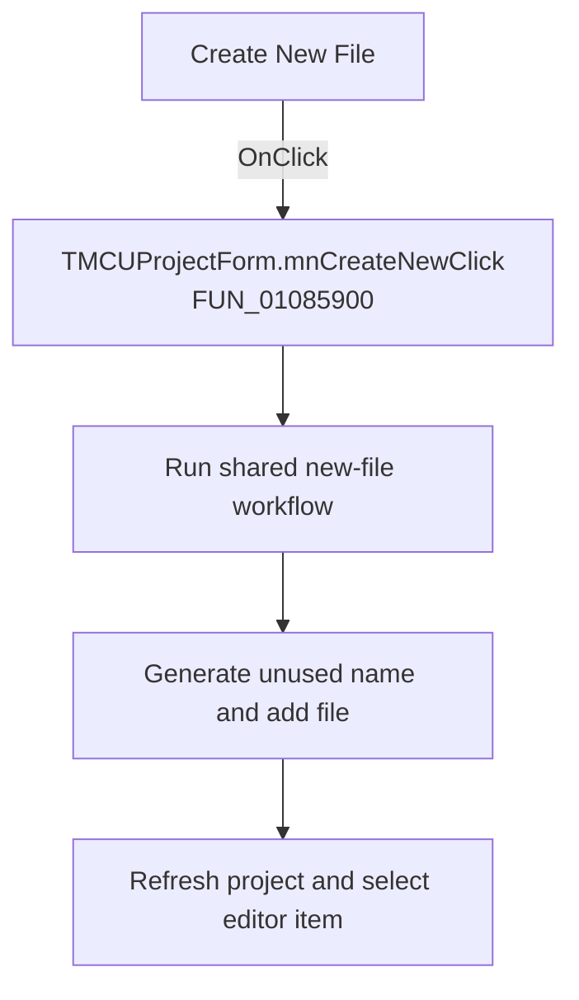

# Create New File

> Analysis status: Recovered handler and relevant call path reviewed for mnCreateNewClick.

## Control

| Property | Recovered value |
| --- | --- |
| Form | MCUProjectForm |
| Component path | MCUProjectForm.pmProjectProperties.mnCreateNew |
| Control class | TMenuItem |
| Caption | Create New File |
| Hint | Not present in the recovered resource. |
| Text | Not present in the recovered resource. |
| Handler name | mnCreateNewClick |
| Handler address | 01085900 |
| Graph node | `resource:dfm:MCUProjectForm/MCUProjectForm.pmProjectProperties.mnCreateNew` |
| Handler node | `function:01085900` |
| Graph layer | UI |

## What happens when clicked

The popup command is a one-call wrapper around the shared new-file handler. It does not inspect `Sender` and has no local decision or error handling. The shared path chooses a target-specific extension, generates an unused `noname` path, adds it to the project, refreshes the view, and selects the new editor item.

## Click flow

## Handler evidence

- Source: [DecompiledSources/Tina16/functions/0000000001085900__FUN_01085900.c](../../../DecompiledSources/Tina16/functions/0000000001085900__FUN_01085900.c)
- Recovered role: Not present in the recovered resource.
- Current graph summary: Handles 1 Delphi UI event: MCUProjectForm.pmProjectProperties.mnCreateNew.OnClick.
- Current graph behavior: Not present in the recovered resource.
- Current graph evidence: Not present in the recovered resource.
- Complexity: simple
- Distinct outgoing calls: 1

## Direct calls

- `function:010856d0` — Handles 3 Delphi UI events: MCUProjectForm.pnToolbar.sbAddNewFile.OnClick, MCUProjectForm.pmAddToProject.mnNew.OnClick, MCUProjectForm.MainMenu.mnFile.mnMainNew.OnClick.

## Resource evidence

- Kind: Not present in the recovered resource.
- Modal result: Not present in the recovered resource.
- Checked state: Not present in the recovered resource.
- List items: Not present in the recovered resource.
- Image reference: Not present in the recovered resource.
- Extracted glyph: None.

## Nearby label candidates

Nearby labels are layout candidates only. They are not proof of behavior.

- No same-parent label candidate is available.

## Reviewed boundaries

- The explanation comes from the recovered handler and the named call path. The caption, hint, and glyph are supporting UI evidence only.
- Unnamed virtual calls are described only by the values passed at this call site and by the state that this handler reads or writes.
- The handler has no local exception recovery unless the behavior section states otherwise.
