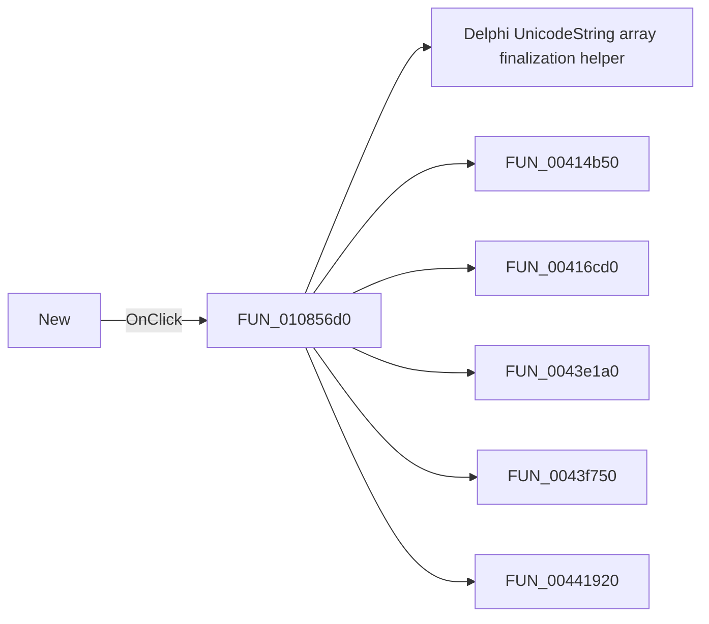

# New

> Analysis status: Pending individual source review.

## Control

| Property | Recovered value |
| --- | --- |
| Form | MCUProjectForm |
| Component path | MCUProjectForm.MainMenu.mnFile.mnMainNew |
| Control class | TMenuItem |
| Caption | New |
| Hint | Not present in the recovered resource. |
| Text | Not present in the recovered resource. |
| Handler name | mnNewClick |
| Handler address | 010856d0 |
| Graph node | `resource:dfm:MCUProjectForm/MCUProjectForm.MainMenu.mnFile.mnMainNew` |
| Handler node | `function:010856d0` |
| Graph layer | UI |

## What happens when clicked

Pending individual analysis. An agent must read the recovered handler source and its relevant callees before it replaces this text.

## Click flow

## Handler evidence

- Source: [DecompiledSources/Tina16/functions/00000000010856D0__FUN_010856d0.c](../../../DecompiledSources/Tina16/functions/00000000010856D0__FUN_010856d0.c)
- Recovered role: Not present in the recovered resource.
- Current graph summary: Handles 3 Delphi UI events: MCUProjectForm.pnToolbar.sbAddNewFile.OnClick, MCUProjectForm.pmAddToProject.mnNew.OnClick, MCUProjectForm.MainMenu.mnFile.mnMainNew.OnClick.
- Current graph behavior: Not present in the recovered resource.
- Current graph evidence: Not present in the recovered resource.
- Complexity: complex
- Distinct outgoing calls: 14

## Direct calls

- `function:00414560` — Delphi UnicodeString array finalization helper
- `function:00414b50` — FUN_00414b50
- `function:00416cd0` — FUN_00416cd0
- `function:0043e1a0` — FUN_0043e1a0
- `function:0043f750` — FUN_0043f750
- `function:00441920` — FUN_00441920
- `function:010792a0` — FUN_010792a0
- `function:0107a0c0` — FUN_0107a0c0
- `function:01085110` — FUN_01085110
- `function:010b04f0` — FUN_010b04f0
- `function:010b13a0` — FUN_010b13a0
- `function:010b2cf0` — FUN_010b2cf0
- `function:010b3a20` — FUN_010b3a20
- `function:0160ee50` — FUN_0160ee50

## Resource evidence

- Kind: Not present in the recovered resource.
- Modal result: Not present in the recovered resource.
- Checked state: Not present in the recovered resource.
- List items: Not present in the recovered resource.
- Image reference: Not present in the recovered resource.
- Extracted glyph: None.

## Nearby label candidates

Nearby labels are layout candidates only. They are not proof of behavior.

- No same-parent label candidate is available.

## Analysis limits

- Do not infer behavior from the control class, caption, hint, glyph, or nearby label alone.
- Do not replace the pending status until the handler source and relevant call path provide enough evidence.
