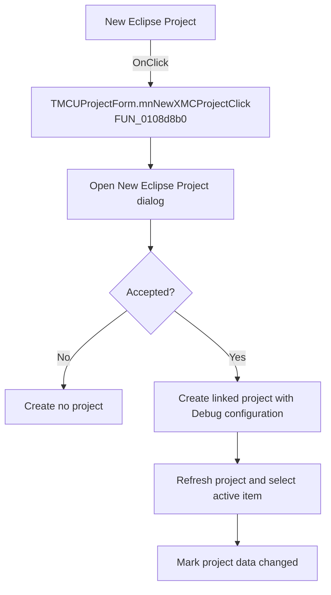

# New Eclipse Project

> Analysis status: Recovered handler and relevant call path reviewed for mnNewXMCProjectClick.

## Control

| Property | Recovered value |
| --- | --- |
| Form | MCUProjectForm |
| Component path | MCUProjectForm.MainMenu.mnFile.mnNewXMCProject |
| Control class | TMenuItem |
| Caption | New Eclipse Project |
| Hint | Not present in the recovered resource. |
| Text | Not present in the recovered resource. |
| Handler name | mnNewXMCProjectClick |
| Handler address | 0108d8b0 |
| Graph node | `resource:dfm:MCUProjectForm/MCUProjectForm.MainMenu.mnFile.mnNewXMCProject` |
| Handler node | `function:0108d8b0` |
| Graph layer | UI |

## What happens when clicked

The handler opens the new Eclipse project dialog. Canceling frees the dialog and changes nothing. On acceptance it supplies a recovered default `Debug` configuration and the two accepted dialog values to the external-project creation routine. It then refreshes the MCU project view, resolves and selects the active item when present, marks project data changed, and clears a transient flag.

## Click flow

## Handler evidence

- Source: [DecompiledSources/Tina16/functions/000000000108D8B0__FUN_0108d8b0.c](../../../DecompiledSources/Tina16/functions/000000000108D8B0__FUN_0108d8b0.c)
- Recovered role: Not present in the recovered resource.
- Current graph summary: Handles 1 Delphi UI event: MCUProjectForm.MainMenu.mnFile.mnNewXMCProject.OnClick.
- Current graph behavior: Not present in the recovered resource.
- Current graph evidence: Not present in the recovered resource.
- Complexity: complex
- Distinct outgoing calls: 7

## Direct calls

- `function:00410f20` — Nil-safe Delphi object destruction helper
- `function:007fc180` — FUN_007fc180
- `function:010792a0` — FUN_010792a0
- `function:0107a0c0` — FUN_0107a0c0
- `function:01081ce0` — FUN_01081ce0
- `function:01085110` — FUN_01085110
- `function:01606940` — FUN_01606940

## Resource evidence

- Kind: Not present in the recovered resource.
- Modal result: Not present in the recovered resource.
- Checked state: Not present in the recovered resource.
- List items: Not present in the recovered resource.
- Image reference: Not present in the recovered resource.
- Extracted glyph: None.

## Nearby label candidates

Nearby labels are layout candidates only. They are not proof of behavior.

- No same-parent label candidate is available.

## Reviewed boundaries

- The explanation comes from the recovered handler and the named call path. The caption, hint, and glyph are supporting UI evidence only.
- Unnamed virtual calls are described only by the values passed at this call site and by the state that this handler reads or writes.
- The handler has no local exception recovery unless the behavior section states otherwise.
