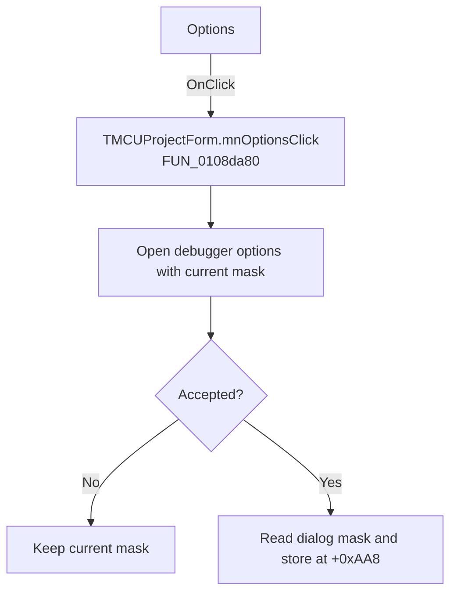

# Options

> Analysis status: Recovered handler and relevant call path reviewed for mnOptionsClick.

## Control

| Property | Recovered value |
| --- | --- |
| Form | MCUProjectForm |
| Component path | MCUProjectForm.MainMenu.mnRun.mnOptions |
| Control class | TMenuItem |
| Caption | Options |
| Hint | Not present in the recovered resource. |
| Text | Not present in the recovered resource. |
| Handler name | mnOptionsClick |
| Handler address | 0108da80 |
| Graph node | `resource:dfm:MCUProjectForm/MCUProjectForm.MainMenu.mnRun.mnOptions` |
| Handler node | `function:0108da80` |
| Graph layer | UI |

## What happens when clicked

The handler creates the debugger-options dialog and initializes it from form field `+0xAA8`. The initializer stores the full mask and reflects bits 0 and 1 in the recovered check boxes. Canceling leaves the form mask unchanged. On acceptance the handler reads the dialog-local mask and stores it back at `+0xAA8`, then frees the dialog.

## Click flow

## Handler evidence

- Source: [DecompiledSources/Tina16/functions/000000000108DA80__FUN_0108da80.c](../../../DecompiledSources/Tina16/functions/000000000108DA80__FUN_0108da80.c)
- Recovered role: Not present in the recovered resource.
- Current graph summary: Handles 1 Delphi UI event: MCUProjectForm.MainMenu.mnRun.mnOptions.OnClick.
- Current graph behavior: Not present in the recovered resource.
- Current graph evidence: Not present in the recovered resource.
- Complexity: complex
- Distinct outgoing calls: 4

## Direct calls

- `function:00410f20` — Nil-safe Delphi object destruction helper
- `function:007fc180` — FUN_007fc180
- `function:01073870` — FUN_01073870
- `function:01073900` — FUN_01073900

## Resource evidence

- Kind: Not present in the recovered resource.
- Modal result: Not present in the recovered resource.
- Checked state: Not present in the recovered resource.
- List items: Not present in the recovered resource.
- Image reference: Not present in the recovered resource.
- Extracted glyph: None.

## Nearby label candidates

Nearby labels are layout candidates only. They are not proof of behavior.

- No same-parent label candidate is available.

## Reviewed boundaries

- The explanation comes from the recovered handler and the named call path. The caption, hint, and glyph are supporting UI evidence only.
- Unnamed virtual calls are described only by the values passed at this call site and by the state that this handler reads or writes.
- The handler has no local exception recovery unless the behavior section states otherwise.
