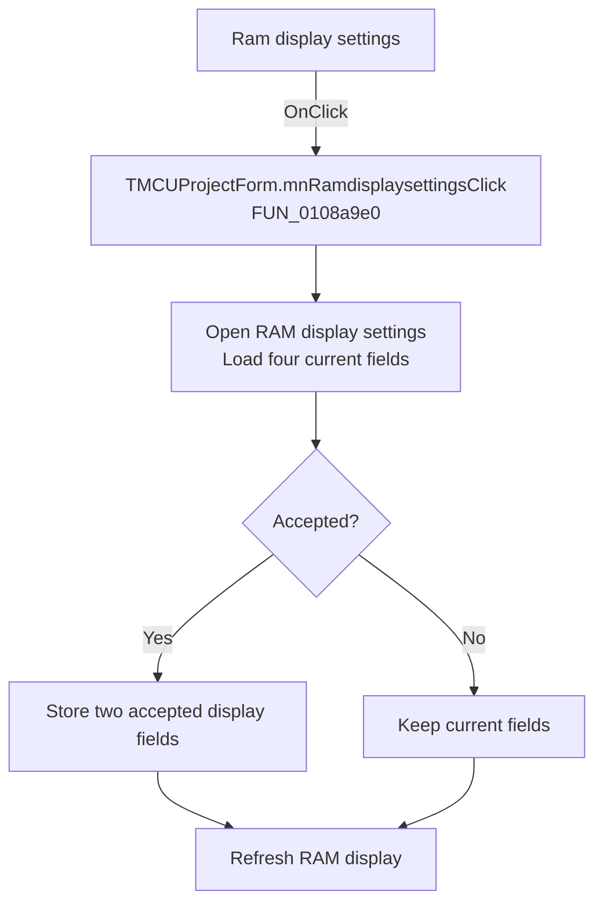

# Ram display settings

> Analysis status: Recovered handler and relevant call path reviewed for mnRamdisplaysettingsClick.

## Control

| Property | Recovered value |
| --- | --- |
| Form | MCUProjectForm |
| Component path | MCUProjectForm.mnPopupMenuMemory.mnRamdisplaysettings |
| Control class | TMenuItem |
| Caption | Ram display settings |
| Hint | Not present in the recovered resource. |
| Text | Not present in the recovered resource. |
| Handler name | mnRamdisplaysettingsClick |
| Handler address | 0108a9e0 |
| Graph node | `resource:dfm:MCUProjectForm/MCUProjectForm.mnPopupMenuMemory.mnRamdisplaysettings` |
| Handler node | `function:0108a9e0` |
| Graph layer | UI |

## What happens when clicked

The handler creates the RAM display settings dialog and copies four current display fields into it. Canceling keeps those fields unchanged. On acceptance it copies back the two fields at dialog offsets `+0x700` and `+0x704`; the other two inputs are not copied back by this handler. It then frees the dialog and refreshes the RAM display in both the accepted and canceled paths.

## Click flow

## Handler evidence

- Source: [DecompiledSources/Tina16/functions/000000000108A9E0__FUN_0108a9e0.c](../../../DecompiledSources/Tina16/functions/000000000108A9E0__FUN_0108a9e0.c)
- Recovered role: Not present in the recovered resource.
- Current graph summary: Handles 1 Delphi UI event: MCUProjectForm.mnPopupMenuMemory.mnRamdisplaysettings.OnClick.
- Current graph behavior: Not present in the recovered resource.
- Current graph evidence: Not present in the recovered resource.
- Complexity: complex
- Distinct outgoing calls: 3

## Direct calls

- `function:00410f20` — Nil-safe Delphi object destruction helper
- `function:007fc180` — FUN_007fc180
- `function:010892f0` — FUN_010892f0

## Resource evidence

- Kind: Not present in the recovered resource.
- Modal result: Not present in the recovered resource.
- Checked state: Not present in the recovered resource.
- List items: Not present in the recovered resource.
- Image reference: Not present in the recovered resource.
- Extracted glyph: None.

## Nearby label candidates

Nearby labels are layout candidates only. They are not proof of behavior.

- No same-parent label candidate is available.

## Reviewed boundaries

- The explanation comes from the recovered handler and the named call path. The caption, hint, and glyph are supporting UI evidence only.
- Unnamed virtual calls are described only by the values passed at this call site and by the state that this handler reads or writes.
- The handler has no local exception recovery unless the behavior section states otherwise.
