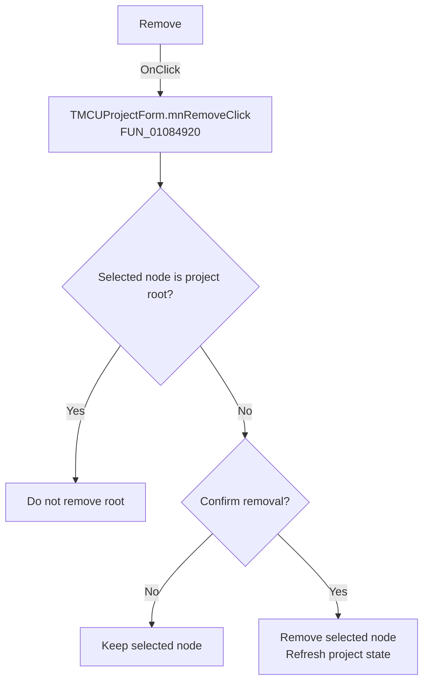

# Remove

> Analysis status: Recovered handler and relevant call path reviewed for mnRemoveClick.

## Control

| Property | Recovered value |
| --- | --- |
| Form | MCUProjectForm |
| Component path | MCUProjectForm.pmFileProperties.mnRemove |
| Control class | TMenuItem |
| Caption | Remove |
| Hint | Not present in the recovered resource. |
| Text | Not present in the recovered resource. |
| Handler name | mnRemoveClick |
| Handler address | 01084920 |
| Graph node | `resource:dfm:MCUProjectForm/MCUProjectForm.pmFileProperties.mnRemove` |
| Handler node | `function:01084920` |
| Graph layer | UI |

## What happens when clicked

The handler compares the selected project node at `+0xAB0` with the project root at `+0xC00`. Selecting the root is a no-op. For another node it loads `HDLStrings.Msg_RemoveFromProject` and requests confirmation. Only a positive answer calls the shared removal routine; cancellation or rejection preserves the selection and project content.

## Click flow

## Handler evidence

- Source: [DecompiledSources/Tina16/functions/0000000001084920__FUN_01084920.c](../../../DecompiledSources/Tina16/functions/0000000001084920__FUN_01084920.c)
- Recovered role: Not present in the recovered resource.
- Current graph summary: Handles 2 Delphi UI events: MCUProjectForm.pnToolbar.sbRemoveFromProject.OnClick, MCUProjectForm.pmFileProperties.mnRemove.OnClick.
- Current graph behavior: Not present in the recovered resource.
- Current graph evidence: Not present in the recovered resource.
- Complexity: complex
- Distinct outgoing calls: 7

## Direct calls

- `function:00414560` — Delphi UnicodeString array finalization helper
- `function:0041ddd0` — FUN_0041ddd0
- `function:00b89270` — FUN_00b89270
- `function:00b8e650` — FUN_00b8e650
- `function:01079230` — FUN_01079230
- `function:0107a3b0` — FUN_0107a3b0
- `function:01084690` — FUN_01084690

## Resource evidence

- Kind: Not present in the recovered resource.
- Modal result: Not present in the recovered resource.
- Checked state: Not present in the recovered resource.
- List items: Not present in the recovered resource.
- Image reference: Not present in the recovered resource.
- Extracted glyph: None.

## Nearby label candidates

Nearby labels are layout candidates only. They are not proof of behavior.

- No same-parent label candidate is available.

## Reviewed boundaries

- The explanation comes from the recovered handler and the named call path. The caption, hint, and glyph are supporting UI evidence only.
- Unnamed virtual calls are described only by the values passed at this call site and by the state that this handler reads or writes.
- The handler has no local exception recovery unless the behavior section states otherwise.
