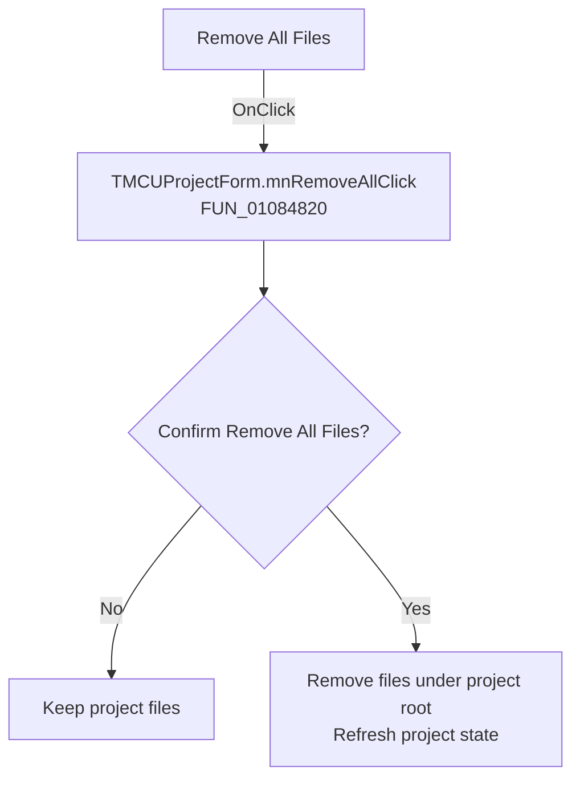

# Remove All Files

> Analysis status: Recovered handler and relevant call path reviewed for mnRemoveAllClick.

## Control

| Property | Recovered value |
| --- | --- |
| Form | MCUProjectForm |
| Component path | MCUProjectForm.pmProjectProperties.mnRemoveAll |
| Control class | TMenuItem |
| Caption | Remove All Files |
| Hint | Not present in the recovered resource. |
| Text | Not present in the recovered resource. |
| Handler name | mnRemoveAllClick |
| Handler address | 01084820 |
| Graph node | `resource:dfm:MCUProjectForm/MCUProjectForm.pmProjectProperties.mnRemoveAll` |
| Handler node | `function:01084820` |
| Graph layer | UI |

## What happens when clicked

The handler loads `HDLStrings.Msg_RemoveAllFiles` and shows a yes-or-no confirmation. A negative answer is a no-op. A positive answer passes the project root node at form field `+0xC00` to the shared recursive removal routine, which processes the contained files and refreshes the project and editor state.

## Click flow

## Handler evidence

- Source: [DecompiledSources/Tina16/functions/0000000001084820__FUN_01084820.c](../../../DecompiledSources/Tina16/functions/0000000001084820__FUN_01084820.c)
- Recovered role: Not present in the recovered resource.
- Current graph summary: Handles 1 Delphi UI event: MCUProjectForm.pmProjectProperties.mnRemoveAll.OnClick.
- Current graph behavior: Not present in the recovered resource.
- Current graph evidence: Not present in the recovered resource.
- Complexity: complex
- Distinct outgoing calls: 6

## Direct calls

- `function:00414560` — Delphi UnicodeString array finalization helper
- `function:0041ddd0` — FUN_0041ddd0
- `function:00b89270` — FUN_00b89270
- `function:00b8e650` — FUN_00b8e650
- `function:01079230` — FUN_01079230
- `function:01084690` — FUN_01084690

## Resource evidence

- Kind: Not present in the recovered resource.
- Modal result: Not present in the recovered resource.
- Checked state: Not present in the recovered resource.
- List items: Not present in the recovered resource.
- Image reference: Not present in the recovered resource.
- Extracted glyph: None.

## Nearby label candidates

Nearby labels are layout candidates only. They are not proof of behavior.

- No same-parent label candidate is available.

## Reviewed boundaries

- The explanation comes from the recovered handler and the named call path. The caption, hint, and glyph are supporting UI evidence only.
- Unnamed virtual calls are described only by the values passed at this call site and by the state that this handler reads or writes.
- The handler has no local exception recovery unless the behavior section states otherwise.
