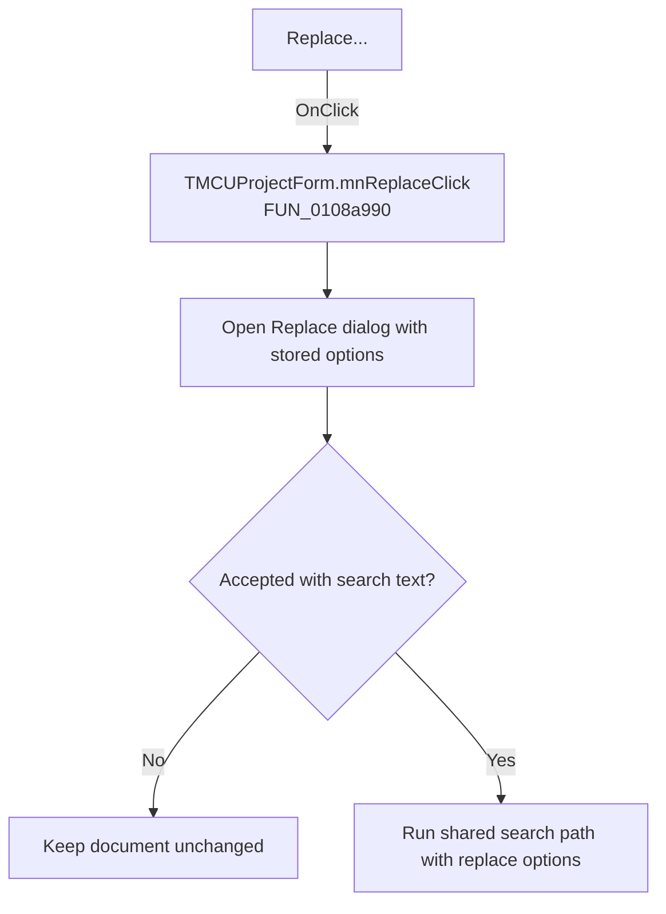

# Replace...

> Analysis status: Recovered handler and relevant call path reviewed for mnReplaceClick.

## Control

| Property | Recovered value |
| --- | --- |
| Form | MCUProjectForm |
| Component path | MCUProjectForm.MainMenu.mnEdit.mnReplace |
| Control class | TMenuItem |
| Caption | Replace... |
| Hint | Not present in the recovered resource. |
| Text | Not present in the recovered resource. |
| Handler name | mnReplaceClick |
| Handler address | 0108a990 |
| Graph node | `resource:dfm:MCUProjectForm/MCUProjectForm.MainMenu.mnEdit.mnReplace` |
| Handler node | `function:0108a990` |
| Graph layer | UI |

## What happens when clicked

The handler opens the shared search dialog with replace mode enabled. It initializes the dialog from stored find and replace values and the active selection. Canceling is a no-op. On acceptance it persists the options and, when search text is present, runs the shared search path with replace flags. The exact replace-one versus replace-all choice is supplied by the dialog fields and remains inside the shared search routine.

## Click flow

## Handler evidence

- Source: [DecompiledSources/Tina16/functions/000000000108A990__FUN_0108a990.c](../../../DecompiledSources/Tina16/functions/000000000108A990__FUN_0108a990.c)
- Recovered role: Not present in the recovered resource.
- Current graph summary: Handles 1 Delphi UI event: MCUProjectForm.MainMenu.mnEdit.mnReplace.OnClick.
- Current graph behavior: Not present in the recovered resource.
- Current graph evidence: Not present in the recovered resource.
- Complexity: simple
- Distinct outgoing calls: 1

## Direct calls

- `function:0108fc80` — FUN_0108fc80

## Resource evidence

- Kind: Not present in the recovered resource.
- Modal result: Not present in the recovered resource.
- Checked state: Not present in the recovered resource.
- List items: Not present in the recovered resource.
- Image reference: Not present in the recovered resource.
- Extracted glyph: None.

## Nearby label candidates

Nearby labels are layout candidates only. They are not proof of behavior.

- No same-parent label candidate is available.

## Reviewed boundaries

- The explanation comes from the recovered handler and the named call path. The caption, hint, and glyph are supporting UI evidence only.
- Unnamed virtual calls are described only by the values passed at this call site and by the state that this handler reads or writes.
- The handler has no local exception recovery unless the behavior section states otherwise.
