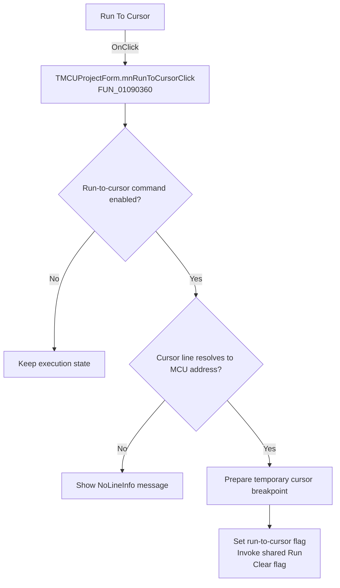

# Run To Cursor

> Analysis status: Recovered handler and relevant call path reviewed for mnRunToCursorClick.

## Control

| Property | Recovered value |
| --- | --- |
| Form | MCUProjectForm |
| Component path | MCUProjectForm.pmEditor.mnRunToCursor |
| Control class | TMenuItem |
| Caption | Run To Cursor |
| Hint | Not present in the recovered resource. |
| Text | Not present in the recovered resource. |
| Handler name | mnRunToCursorClick |
| Handler address | 01090360 |
| Graph node | `resource:dfm:MCUProjectForm/MCUProjectForm.pmEditor.mnRunToCursor` |
| Handler node | `function:01090360` |
| Graph layer | UI |

## What happens when clicked

The handler first rejects the command while form flag `+0xB52` is set. It resolves the current editor line to an MCU address. Failure shows `HDLStrings.Msg_NoLineInfo` and does not start execution. On success it disables current run state, clears the MCU aborted flag and auxiliary marker, prepares or updates the temporary cursor breakpoint, sets the run-to-cursor flag around the shared run handler, and clears that flag after the run request returns.

## Click flow

## Handler evidence

- Source: [DecompiledSources/Tina16/functions/0000000001090360__FUN_01090360.c](../../../DecompiledSources/Tina16/functions/0000000001090360__FUN_01090360.c)
- Recovered role: Not present in the recovered resource.
- Current graph summary: Handles 1 Delphi UI event: MCUProjectForm.pmEditor.mnRunToCursor.OnClick.
- Current graph behavior: Not present in the recovered resource.
- Current graph evidence: Not present in the recovered resource.
- Complexity: complex
- Distinct outgoing calls: 11

## Direct calls

- `function:00414560` — Delphi UnicodeString array finalization helper
- `function:0041ddd0` — FUN_0041ddd0
- `function:0072d730` — FUN_0072d730
- `function:00b89270` — FUN_00b89270
- `function:00b8e650` — FUN_00b8e650
- `function:00e03be0` — Calls the VHDL_DLL2.DLL export _MCU_SetAborted.
- `function:01087a10` — Handles 1 Delphi UI event: MCUProjectForm.pnToolbar.sbRun.OnClick.
- `function:01088e80` — FUN_01088e80
- `function:01089060` — FUN_01089060
- `function:01089170` — FUN_01089170
- `function:0108f9d0` — FUN_0108f9d0

## Resource evidence

- Kind: Not present in the recovered resource.
- Modal result: Not present in the recovered resource.
- Checked state: Not present in the recovered resource.
- List items: Not present in the recovered resource.
- Image reference: Not present in the recovered resource.
- Extracted glyph: None.

## Nearby label candidates

Nearby labels are layout candidates only. They are not proof of behavior.

- No same-parent label candidate is available.

## Reviewed boundaries

- The explanation comes from the recovered handler and the named call path. The caption, hint, and glyph are supporting UI evidence only.
- Unnamed virtual calls are described only by the values passed at this call site and by the state that this handler reads or writes.
- The handler has no local exception recovery unless the behavior section states otherwise.
