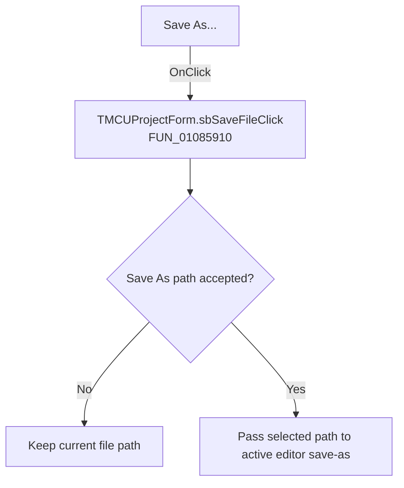

# Save As...

> Analysis status: Recovered handler and relevant call path reviewed for sbSaveFileClick.

## Control

| Property | Recovered value |
| --- | --- |
| Form | MCUProjectForm |
| Component path | MCUProjectForm.MainMenu.mnFile.mnSaveAs |
| Control class | TMenuItem |
| Caption | Save As... |
| Hint | Not present in the recovered resource. |
| Text | Not present in the recovered resource. |
| Handler name | sbSaveFileClick |
| Handler address | 01085910 |
| Graph node | `resource:dfm:MCUProjectForm/MCUProjectForm.MainMenu.mnFile.mnSaveAs` |
| Handler node | `function:01085910` |
| Graph layer | UI |

## What happens when clicked

The handler opens the save dialog stored at form field `+0x770`. Canceling the dialog is a no-op. On acceptance it reads the selected path and dispatches the active editor's virtual save-as operation with that path. The handler has no local validation, success message, or exception recovery, so errors from the dialog or editor propagate to their existing handlers.

## Click flow

## Handler evidence

- Source: [DecompiledSources/Tina16/functions/0000000001085910__FUN_01085910.c](../../../DecompiledSources/Tina16/functions/0000000001085910__FUN_01085910.c)
- Recovered role: Not present in the recovered resource.
- Current graph summary: Handles 2 Delphi UI events: MCUProjectForm.pnToolbar.sbSaveFile.OnClick, MCUProjectForm.MainMenu.mnFile.mnSaveAs.OnClick.
- Current graph behavior: Not present in the recovered resource.
- Current graph evidence: Not present in the recovered resource.
- Complexity: moderate
- Distinct outgoing calls: 2

## Direct calls

- `function:00414480` — Delphi UnicodeString clear and finalization helper
- `function:00724270` — FUN_00724270

## Resource evidence

- Kind: Not present in the recovered resource.
- Modal result: Not present in the recovered resource.
- Checked state: Not present in the recovered resource.
- List items: Not present in the recovered resource.
- Image reference: Not present in the recovered resource.
- Extracted glyph: None.

## Nearby label candidates

Nearby labels are layout candidates only. They are not proof of behavior.

- No same-parent label candidate is available.

## Reviewed boundaries

- The explanation comes from the recovered handler and the named call path. The caption, hint, and glyph are supporting UI evidence only.
- Unnamed virtual calls are described only by the values passed at this call site and by the state that this handler reads or writes.
- The handler has no local exception recovery unless the behavior section states otherwise.
