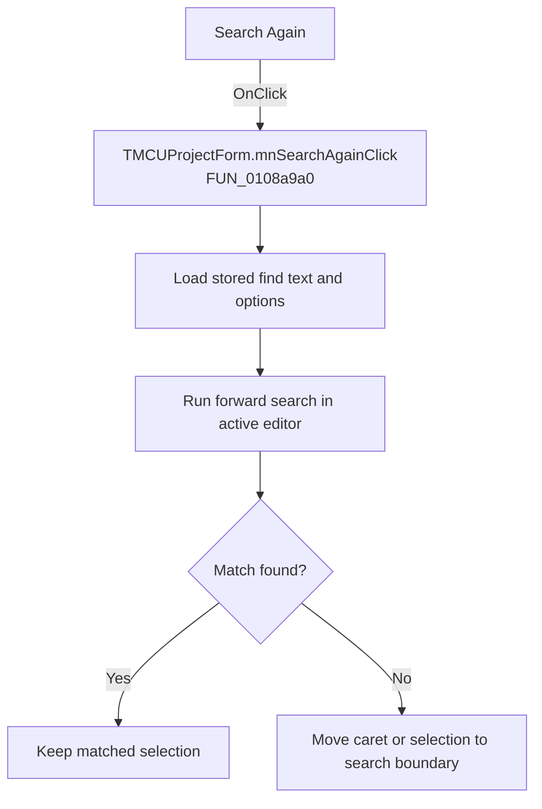

# Search Again

> Analysis status: Recovered handler and relevant call path reviewed for mnSearchAgainClick.

## Control

| Property | Recovered value |
| --- | --- |
| Form | MCUProjectForm |
| Component path | MCUProjectForm.MainMenu.mnEdit.mnSearchAgain |
| Control class | TMenuItem |
| Caption | Search Again |
| Hint | Not present in the recovered resource. |
| Text | Not present in the recovered resource. |
| Handler name | mnSearchAgainClick |
| Handler address | 0108a9a0 |
| Graph node | `resource:dfm:MCUProjectForm/MCUProjectForm.MainMenu.mnEdit.mnSearchAgain` |
| Handler node | `function:0108a9a0` |
| Graph layer | UI |

## What happens when clicked

The handler calls the shared search routine in find mode with the recovered direction flag cleared. The routine builds its option mask from stored search settings and searches for the stored text. When no match is found it adjusts the caret or selection to the appropriate boundary and returns focus to the editor. If no stored search text exists, the downstream search routine controls the no-op behavior; this wrapper has no dialog or error message.

## Click flow

## Handler evidence

- Source: [DecompiledSources/Tina16/functions/000000000108A9A0__FUN_0108a9a0.c](../../../DecompiledSources/Tina16/functions/000000000108A9A0__FUN_0108a9a0.c)
- Recovered role: Not present in the recovered resource.
- Current graph summary: Handles 1 Delphi UI event: MCUProjectForm.MainMenu.mnEdit.mnSearchAgain.OnClick.
- Current graph behavior: Not present in the recovered resource.
- Current graph evidence: Not present in the recovered resource.
- Complexity: simple
- Distinct outgoing calls: 1

## Direct calls

- `function:01090040` — FUN_01090040

## Resource evidence

- Kind: Not present in the recovered resource.
- Modal result: Not present in the recovered resource.
- Checked state: Not present in the recovered resource.
- List items: Not present in the recovered resource.
- Image reference: Not present in the recovered resource.
- Extracted glyph: None.

## Nearby label candidates

Nearby labels are layout candidates only. They are not proof of behavior.

- No same-parent label candidate is available.

## Reviewed boundaries

- The explanation comes from the recovered handler and the named call path. The caption, hint, and glyph are supporting UI evidence only.
- Unnamed virtual calls are described only by the values passed at this call site and by the state that this handler reads or writes.
- The handler has no local exception recovery unless the behavior section states otherwise.
