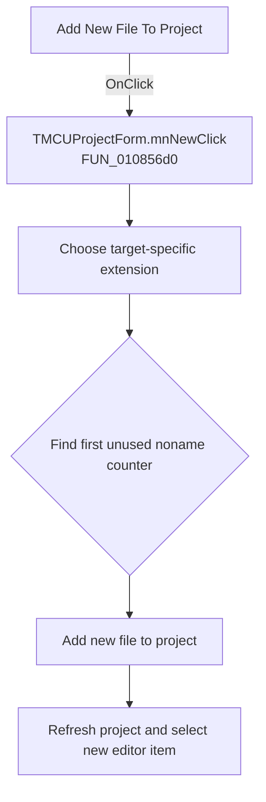

# Add New File To Project

> Analysis status: Recovered handler and relevant call path reviewed for mnNewClick.

## Control

| Property | Recovered value |
| --- | --- |
| Form | MCUProjectForm |
| Component path | MCUProjectForm.pnToolbar.sbAddNewFile |
| Control class | TSpeedButton |
| Caption | Not present in the recovered resource. |
| Hint | Add New File To Project |
| Text | Not present in the recovered resource. |
| Handler name | mnNewClick |
| Handler address | 010856d0 |
| Graph node | `resource:dfm:MCUProjectForm/MCUProjectForm.pnToolbar.sbAddNewFile` |
| Handler node | `function:010856d0` |
| Graph layer | UI |

## What happens when clicked

The shared handler chooses the default extension from the target and current project data. It searches names from `noname<counter>` through at most 1,001 candidates and stops at the first unused path. It then adds the new file to the project, opens or selects it, refreshes the project view, and selects the new editor item when one exists. The handler does not use `Sender`, so the main menu, popup menu, and toolbar entries use the same path.

## Click flow

## Handler evidence

- Source: [DecompiledSources/Tina16/functions/00000000010856D0__FUN_010856d0.c](../../../DecompiledSources/Tina16/functions/00000000010856D0__FUN_010856d0.c)
- Recovered role: Not present in the recovered resource.
- Current graph summary: Handles 3 Delphi UI events: MCUProjectForm.pnToolbar.sbAddNewFile.OnClick, MCUProjectForm.pmAddToProject.mnNew.OnClick, MCUProjectForm.MainMenu.mnFile.mnMainNew.OnClick.
- Current graph behavior: Not present in the recovered resource.
- Current graph evidence: Not present in the recovered resource.
- Complexity: complex
- Distinct outgoing calls: 14

## Direct calls

- `function:00414560` — Delphi UnicodeString array finalization helper
- `function:00414b50` — FUN_00414b50
- `function:00416cd0` — FUN_00416cd0
- `function:0043e1a0` — FUN_0043e1a0
- `function:0043f750` — FUN_0043f750
- `function:00441920` — FUN_00441920
- `function:010792a0` — FUN_010792a0
- `function:0107a0c0` — FUN_0107a0c0
- `function:01085110` — FUN_01085110
- `function:010b04f0` — FUN_010b04f0
- `function:010b13a0` — FUN_010b13a0
- `function:010b2cf0` — FUN_010b2cf0
- `function:010b3a20` — FUN_010b3a20
- `function:0160ee50` — FUN_0160ee50

## Resource evidence

- Kind: Not present in the recovered resource.
- Modal result: Not present in the recovered resource.
- Checked state: Not present in the recovered resource.
- List items: Not present in the recovered resource.
- Image reference: Not present in the recovered resource.
- Extracted glyph: [`0269_MCUProjectForm_MCUProjectForm_pnToolbar_sbAddNewFile_Glyph_Data.png`](../../../glyph/0269_MCUProjectForm_MCUProjectForm_pnToolbar_sbAddNewFile_Glyph_Data.png)

## Nearby label candidates

Nearby labels are layout candidates only. They are not proof of behavior.

- No same-parent label candidate is available.

## Reviewed boundaries

- The explanation comes from the recovered handler and the named call path. The caption, hint, and glyph are supporting UI evidence only.
- Unnamed virtual calls are described only by the values passed at this call site and by the state that this handler reads or writes.
- The handler has no local exception recovery unless the behavior section states otherwise.
