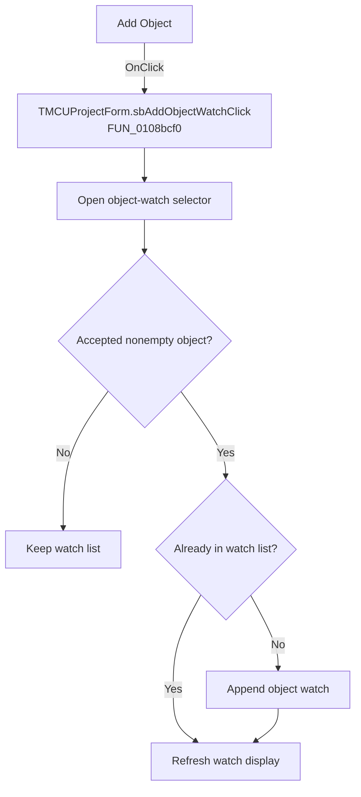

# Add Object

> Analysis status: Recovered handler and relevant call path reviewed for sbAddObjectWatchClick.

## Control

| Property | Recovered value |
| --- | --- |
| Form | MCUProjectForm |
| Component path | MCUProjectForm.pnMessagesClient.pcMessages.tsWatches.Panel1.pnWatchButtons.pnWatchButtonsRight.sbAddObjectWatch |
| Control class | TSpeedButton |
| Caption | Add Object |
| Hint | Not present in the recovered resource. |
| Text | Not present in the recovered resource. |
| Handler name | sbAddObjectWatchClick |
| Handler address | 0108bcf0 |
| Graph node | `resource:dfm:MCUProjectForm/MCUProjectForm.pnMessagesClient.pcMessages.tsWatches.Panel1.pnWatchButtons.pnWatchButtonsRight.sbAddObjectWatch` |
| Handler node | `function:0108bcf0` |
| Graph layer | UI |

## What happens when clicked

The handler forwards to the object-watch workflow. That routine opens a modal selector. Canceling or accepting an empty value preserves the watch list. For a nonempty accepted value it checks whether the item already exists, adds it only when absent, and refreshes the watch display. The duplicate path also refreshes without adding a second item.

## Click flow

## Handler evidence

- Source: [DecompiledSources/Tina16/functions/000000000108BCF0__FUN_0108bcf0.c](../../../DecompiledSources/Tina16/functions/000000000108BCF0__FUN_0108bcf0.c)
- Recovered role: Not present in the recovered resource.
- Current graph summary: Handles 1 Delphi UI event: MCUProjectForm.pnMessagesClient.pcMessages.tsWatches.Panel1.pnWatchButtons.pnWatchButtonsRight.sbAddObjectWatch.OnClick.
- Current graph behavior: Not present in the recovered resource.
- Current graph evidence: Not present in the recovered resource.
- Complexity: simple
- Distinct outgoing calls: 1

## Direct calls

- `function:0108bc10` — FUN_0108bc10

## Resource evidence

- Kind: Not present in the recovered resource.
- Modal result: Not present in the recovered resource.
- Checked state: Not present in the recovered resource.
- List items: Not present in the recovered resource.
- Image reference: Not present in the recovered resource.
- Extracted glyph: [`0272_MCUProjectForm_MCUProjectForm_pnMessagesClient_pcMessages_tsWatches_Panel1_pnWatchButtons_pnWatchButtonsRight_s_Glyph_Data.png`](../../../glyph/0272_MCUProjectForm_MCUProjectForm_pnMessagesClient_pcMessages_tsWatches_Panel1_pnWatchButtons_pnWatchButtonsRight_s_Glyph_Data.png)

## Nearby label candidates

Nearby labels are layout candidates only. They are not proof of behavior.

- No same-parent label candidate is available.

## Reviewed boundaries

- The explanation comes from the recovered handler and the named call path. The caption, hint, and glyph are supporting UI evidence only.
- Unnamed virtual calls are described only by the values passed at this call site and by the state that this handler reads or writes.
- The handler has no local exception recovery unless the behavior section states otherwise.
