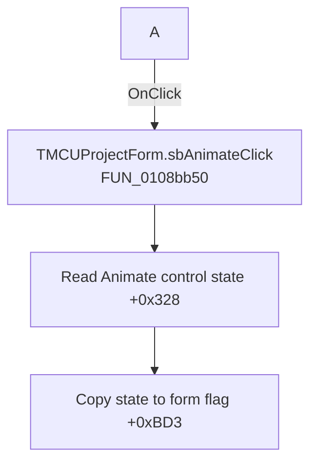

# A

> Analysis status: Recovered handler and relevant call path reviewed for sbAnimateClick.

## Control

| Property | Recovered value |
| --- | --- |
| Form | MCUProjectForm |
| Component path | MCUProjectForm.pnToolbar.sbAnimate |
| Control class | TSpeedButton |
| Caption | A |
| Hint | Animate |
| Text | Not present in the recovered resource. |
| Handler name | sbAnimateClick |
| Handler address | 0108bb50 |
| Graph node | `resource:dfm:MCUProjectForm/MCUProjectForm.pnToolbar.sbAnimate` |
| Handler node | `function:0108bb50` |
| Graph layer | UI |

## What happens when clicked

The handler reads byte `+0x328` from the form-owned Animate control at `+0x950` and copies it to form byte `+0xBD3`. It does not use `Sender`, call another function, or update the backend in this recovered body. Repeated clicks that do not change the control state only rewrite the same byte.

## Click flow

## Handler evidence

- Source: [DecompiledSources/Tina16/functions/000000000108BB50__FUN_0108bb50.c](../../../DecompiledSources/Tina16/functions/000000000108BB50__FUN_0108bb50.c)
- Recovered role: Not present in the recovered resource.
- Current graph summary: Handles 1 Delphi UI event: MCUProjectForm.pnToolbar.sbAnimate.OnClick.
- Current graph behavior: Not present in the recovered resource.
- Current graph evidence: Not present in the recovered resource.
- Complexity: simple
- Distinct outgoing calls: 0

## Direct calls

- No direct call edge is present in the recovered graph.

## Resource evidence

- Kind: Not present in the recovered resource.
- Modal result: Not present in the recovered resource.
- Checked state: Not present in the recovered resource.
- List items: Not present in the recovered resource.
- Image reference: Not present in the recovered resource.
- Extracted glyph: None.

## Nearby label candidates

Nearby labels are layout candidates only. They are not proof of behavior.

- No same-parent label candidate is available.

## Reviewed boundaries

- The explanation comes from the recovered handler and the named call path. The caption, hint, and glyph are supporting UI evidence only.
- Unnamed virtual calls are described only by the values passed at this call site and by the state that this handler reads or writes.
- The handler has no local exception recovery unless the behavior section states otherwise.
