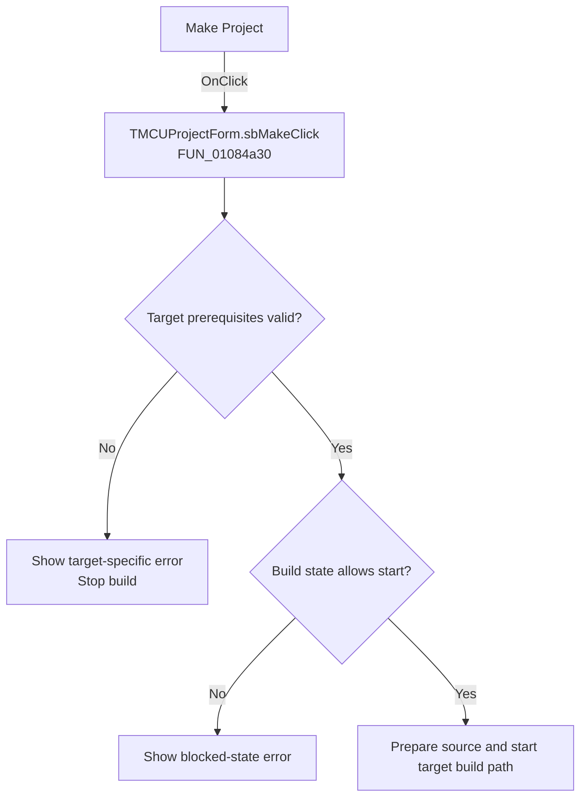

# Make Project

> Analysis status: Recovered handler and relevant call path reviewed for sbMakeClick.

## Control

| Property | Recovered value |
| --- | --- |
| Form | MCUProjectForm |
| Component path | MCUProjectForm.pnToolbar.sbMake |
| Control class | TSpeedButton |
| Caption | Not present in the recovered resource. |
| Hint | Make Project |
| Text | Not present in the recovered resource. |
| Handler name | sbMakeClick |
| Handler address | 01084a30 |
| Graph node | `resource:dfm:MCUProjectForm/MCUProjectForm.pnToolbar.sbMake` |
| Handler node | `function:01084a30` |
| Graph layer | UI |

## What happens when clicked

The handler checks the active target type and runs the matching prerequisite validation. It shows a recovered target-specific error and stops when that check fails. It also stops with an error when the project is already in a blocked build state. Otherwise it prepares the active source for supported targets and starts the applicable build path: an external build object for one target or the alternate internal build routine for another. The handler has no retry branch.

## Click flow

## Handler evidence

- Source: [DecompiledSources/Tina16/functions/0000000001084A30__FUN_01084a30.c](../../../DecompiledSources/Tina16/functions/0000000001084A30__FUN_01084a30.c)
- Recovered role: Not present in the recovered resource.
- Current graph summary: Handles 1 Delphi UI event: MCUProjectForm.pnToolbar.sbMake.OnClick.
- Current graph behavior: Not present in the recovered resource.
- Current graph evidence: Not present in the recovered resource.
- Complexity: complex
- Distinct outgoing calls: 18

## Direct calls

- `function:00410f20` — Nil-safe Delphi object destruction helper
- `function:00414560` — Delphi UnicodeString array finalization helper
- `function:0041ddd0` — FUN_0041ddd0
- `function:007fc180` — FUN_007fc180
- `function:01055ef0` — FUN_01055ef0
- `function:0105fed0` — FUN_0105fed0
- `function:0107fa70` — FUN_0107fa70
- `function:0108bf10` — FUN_0108bf10
- `function:010add60` — FUN_010add60
- `function:010ae170` — FUN_010ae170
- `function:010b3a20` — FUN_010b3a20
- `function:010b3a70` — FUN_010b3a70
- `function:010b3a90` — FUN_010b3a90
- `function:010b3ad0` — FUN_010b3ad0
- `function:010b3af0` — FUN_010b3af0
- `function:010b3b20` — FUN_010b3b20
- `function:015ff190` — FUN_015ff190
- `function:016fd940` — FUN_016fd940

## Resource evidence

- Kind: Not present in the recovered resource.
- Modal result: Not present in the recovered resource.
- Checked state: Not present in the recovered resource.
- List items: Not present in the recovered resource.
- Image reference: Not present in the recovered resource.
- Extracted glyph: [`0261_MCUProjectForm_MCUProjectForm_pnToolbar_sbMake_Glyph_Data.png`](../../../glyph/0261_MCUProjectForm_MCUProjectForm_pnToolbar_sbMake_Glyph_Data.png)

## Nearby label candidates

Nearby labels are layout candidates only. They are not proof of behavior.

- No same-parent label candidate is available.

## Reviewed boundaries

- The explanation comes from the recovered handler and the named call path. The caption, hint, and glyph are supporting UI evidence only.
- Unnamed virtual calls are described only by the values passed at this call site and by the state that this handler reads or writes.
- The handler has no local exception recovery unless the behavior section states otherwise.
