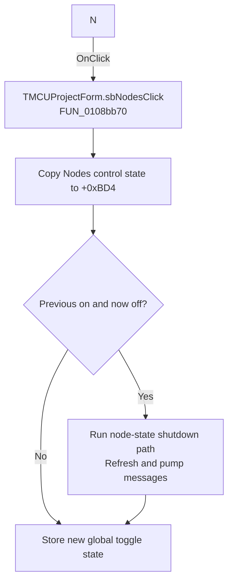

# N

> Analysis status: Recovered handler and relevant call path reviewed for sbNodesClick.

## Control

| Property | Recovered value |
| --- | --- |
| Form | MCUProjectForm |
| Component path | MCUProjectForm.pnToolbar.sbNodes |
| Control class | TSpeedButton |
| Caption | N |
| Hint | Show node states |
| Text | Not present in the recovered resource. |
| Handler name | sbNodesClick |
| Handler address | 0108bb70 |
| Graph node | `resource:dfm:MCUProjectForm/MCUProjectForm.pnToolbar.sbNodes` |
| Handler node | `function:0108bb70` |
| Graph layer | UI |

## What happens when clicked

The handler copies byte `+0x328` from the Nodes control at `+0x958` to form byte `+0xBD4`. It compares that value with a retained global state. Only a transition from previously on to now off runs the recovered node-state shutdown path, performs a global refresh call, and pumps pending messages. It then stores the new toggle state globally. Other transitions only update the two state bytes.

## Click flow

## Handler evidence

- Source: [DecompiledSources/Tina16/functions/000000000108BB70__FUN_0108bb70.c](../../../DecompiledSources/Tina16/functions/000000000108BB70__FUN_0108bb70.c)
- Recovered role: Not present in the recovered resource.
- Current graph summary: Handles 1 Delphi UI event: MCUProjectForm.pnToolbar.sbNodes.OnClick.
- Current graph behavior: Not present in the recovered resource.
- Current graph evidence: Not present in the recovered resource.
- Complexity: complex
- Distinct outgoing calls: 3

## Direct calls

- `function:0080cc70` — FUN_0080cc70
- `function:0199ded0` — FUN_0199ded0
- `function:01ca2aa0` — FUN_01ca2aa0

## Resource evidence

- Kind: Not present in the recovered resource.
- Modal result: Not present in the recovered resource.
- Checked state: Not present in the recovered resource.
- List items: Not present in the recovered resource.
- Image reference: Not present in the recovered resource.
- Extracted glyph: None.

## Nearby label candidates

Nearby labels are layout candidates only. They are not proof of behavior.

- No same-parent label candidate is available.

## Reviewed boundaries

- The explanation comes from the recovered handler and the named call path. The caption, hint, and glyph are supporting UI evidence only.
- Unnamed virtual calls are described only by the values passed at this call site and by the state that this handler reads or writes.
- The handler has no local exception recovery unless the behavior section states otherwise.
