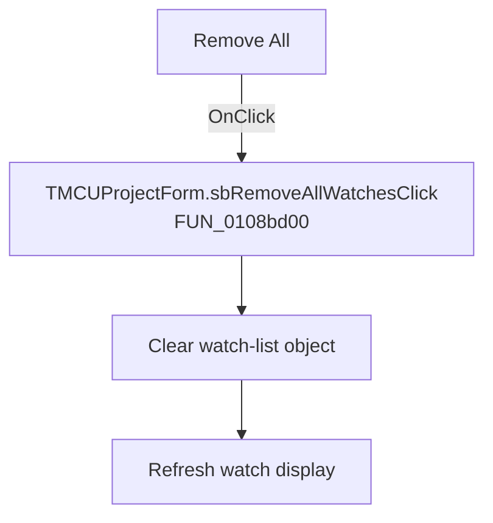

# Remove All

> Analysis status: Recovered handler and relevant call path reviewed for sbRemoveAllWatchesClick.

## Control

| Property | Recovered value |
| --- | --- |
| Form | MCUProjectForm |
| Component path | MCUProjectForm.pnMessagesClient.pcMessages.tsWatches.Panel1.pnWatchButtons.pnWatchButtonsRight.sbRemoveAllWatches |
| Control class | TSpeedButton |
| Caption | Remove All |
| Hint | Not present in the recovered resource. |
| Text | Not present in the recovered resource. |
| Handler name | sbRemoveAllWatchesClick |
| Handler address | 0108bd00 |
| Graph node | `resource:dfm:MCUProjectForm/MCUProjectForm.pnMessagesClient.pcMessages.tsWatches.Panel1.pnWatchButtons.pnWatchButtonsRight.sbRemoveAllWatches` |
| Handler node | `function:0108bd00` |
| Graph layer | UI |

## What happens when clicked

The handler dispatches the clear operation on the watch-list object at form field `+3000`, then refreshes the active messages display. It has no confirmation, selection check, or local error message. Clicking it on an empty list still runs the clear and refresh calls.

## Click flow

## Handler evidence

- Source: [DecompiledSources/Tina16/functions/000000000108BD00__FUN_0108bd00.c](../../../DecompiledSources/Tina16/functions/000000000108BD00__FUN_0108bd00.c)
- Recovered role: Not present in the recovered resource.
- Current graph summary: Handles 1 Delphi UI event: MCUProjectForm.pnMessagesClient.pcMessages.tsWatches.Panel1.pnWatchButtons.pnWatchButtonsRight.sbRemoveAllWatches.OnClick.
- Current graph behavior: Not present in the recovered resource.
- Current graph evidence: Not present in the recovered resource.
- Complexity: simple
- Distinct outgoing calls: 1

## Direct calls

- `function:010892f0` — FUN_010892f0

## Resource evidence

- Kind: Not present in the recovered resource.
- Modal result: Not present in the recovered resource.
- Checked state: Not present in the recovered resource.
- List items: Not present in the recovered resource.
- Image reference: Not present in the recovered resource.
- Extracted glyph: [`0273_MCUProjectForm_MCUProjectForm_pnMessagesClient_pcMessages_tsWatches_Panel1_pnWatchButtons_pnWatchButtonsRight_s_Glyph_Data.png`](../../../glyph/0273_MCUProjectForm_MCUProjectForm_pnMessagesClient_pcMessages_tsWatches_Panel1_pnWatchButtons_pnWatchButtonsRight_s_Glyph_Data.png)

## Nearby label candidates

Nearby labels are layout candidates only. They are not proof of behavior.

- No same-parent label candidate is available.

## Reviewed boundaries

- The explanation comes from the recovered handler and the named call path. The caption, hint, and glyph are supporting UI evidence only.
- Unnamed virtual calls are described only by the values passed at this call site and by the state that this handler reads or writes.
- The handler has no local exception recovery unless the behavior section states otherwise.
