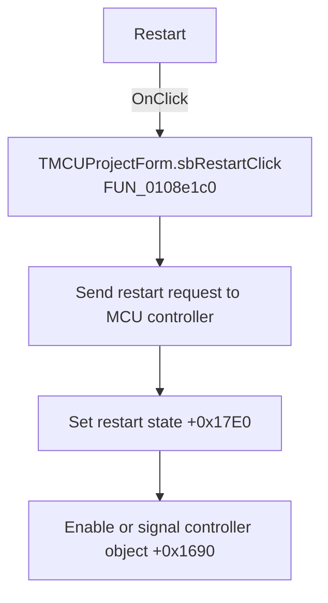

# Restart

> Analysis status: Recovered handler and relevant call path reviewed for sbRestartClick.

## Control

| Property | Recovered value |
| --- | --- |
| Form | MCUProjectForm |
| Component path | MCUProjectForm.pnToolbar.sbRestart |
| Control class | TSpeedButton |
| Caption | Not present in the recovered resource. |
| Hint | Restart |
| Text | Not present in the recovered resource. |
| Handler name | sbRestartClick |
| Handler address | 0108e1c0 |
| Graph node | `resource:dfm:MCUProjectForm/MCUProjectForm.pnToolbar.sbRestart` |
| Handler node | `function:0108e1c0` |
| Graph layer | UI |

## What happens when clicked

The handler forwards the restart command to the global MCU execution controller. The callee sets controller field `+0x17E0` to 1 and enables or signals its object at `+0x1690`. The handler has no confirmation, state guard, local error message, or direct debugger call.

## Click flow

## Handler evidence

- Source: [DecompiledSources/Tina16/functions/000000000108E1C0__FUN_0108e1c0.c](../../../DecompiledSources/Tina16/functions/000000000108E1C0__FUN_0108e1c0.c)
- Recovered role: Not present in the recovered resource.
- Current graph summary: Handles 1 Delphi UI event: MCUProjectForm.pnToolbar.sbRestart.OnClick.
- Current graph behavior: Not present in the recovered resource.
- Current graph evidence: Not present in the recovered resource.
- Complexity: simple
- Distinct outgoing calls: 1

## Direct calls

- `function:01ca40e0` — FUN_01ca40e0

## Resource evidence

- Kind: Not present in the recovered resource.
- Modal result: Not present in the recovered resource.
- Checked state: Not present in the recovered resource.
- List items: Not present in the recovered resource.
- Image reference: Not present in the recovered resource.
- Extracted glyph: [`0270_MCUProjectForm_MCUProjectForm_pnToolbar_sbRestart_Glyph_Data.png`](../../../glyph/0270_MCUProjectForm_MCUProjectForm_pnToolbar_sbRestart_Glyph_Data.png)

## Nearby label candidates

Nearby labels are layout candidates only. They are not proof of behavior.

- No same-parent label candidate is available.

## Reviewed boundaries

- The explanation comes from the recovered handler and the named call path. The caption, hint, and glyph are supporting UI evidence only.
- Unnamed virtual calls are described only by the values passed at this call site and by the state that this handler reads or writes.
- The handler has no local exception recovery unless the behavior section states otherwise.
