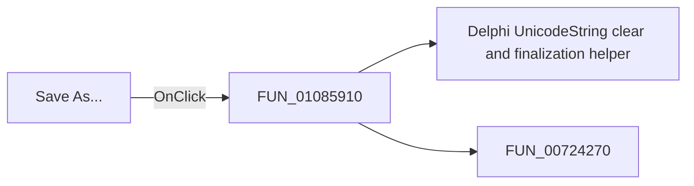

# Save As...

> Analysis status: Pending individual source review.

## Control

| Property | Recovered value |
| --- | --- |
| Form | MCUProjectForm |
| Component path | MCUProjectForm.pnToolbar.sbSaveFile |
| Control class | TSpeedButton |
| Caption | Not present in the recovered resource. |
| Hint | Save As... |
| Text | Not present in the recovered resource. |
| Handler name | sbSaveFileClick |
| Handler address | 01085910 |
| Graph node | `resource:dfm:MCUProjectForm/MCUProjectForm.pnToolbar.sbSaveFile` |
| Handler node | `function:01085910` |
| Graph layer | UI |

## What happens when clicked

Pending individual analysis. An agent must read the recovered handler source and its relevant callees before it replaces this text.

## Click flow

## Handler evidence

- Source: [DecompiledSources/Tina16/functions/0000000001085910__FUN_01085910.c](../../../DecompiledSources/Tina16/functions/0000000001085910__FUN_01085910.c)
- Recovered role: Not present in the recovered resource.
- Current graph summary: Handles 2 Delphi UI events: MCUProjectForm.pnToolbar.sbSaveFile.OnClick, MCUProjectForm.MainMenu.mnFile.mnSaveAs.OnClick.
- Current graph behavior: Not present in the recovered resource.
- Current graph evidence: Not present in the recovered resource.
- Complexity: moderate
- Distinct outgoing calls: 2

## Direct calls

- `function:00414480` — Delphi UnicodeString clear and finalization helper
- `function:00724270` — FUN_00724270

## Resource evidence

- Kind: Not present in the recovered resource.
- Modal result: Not present in the recovered resource.
- Checked state: Not present in the recovered resource.
- List items: Not present in the recovered resource.
- Image reference: Not present in the recovered resource.
- Extracted glyph: [`0259_MCUProjectForm_MCUProjectForm_pnToolbar_sbSaveFile_Glyph_Data.png`](../../../glyph/0259_MCUProjectForm_MCUProjectForm_pnToolbar_sbSaveFile_Glyph_Data.png)

## Nearby label candidates

Nearby labels are layout candidates only. They are not proof of behavior.

- No same-parent label candidate is available.

## Analysis limits

- Do not infer behavior from the control class, caption, hint, glyph, or nearby label alone.
- Do not replace the pending status until the handler source and relevant call path provide enough evidence.
