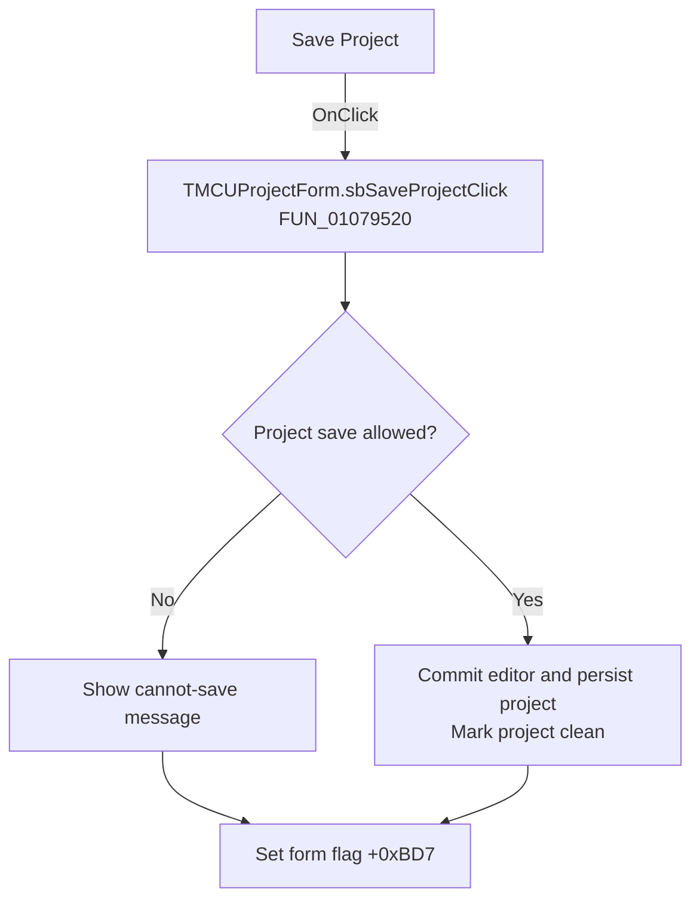

# Save Project

> Analysis status: Recovered handler and relevant call path reviewed for sbSaveProjectClick.

## Control

| Property | Recovered value |
| --- | --- |
| Form | MCUProjectForm |
| Component path | MCUProjectForm.pnToolbar.sbSaveProject |
| Control class | TSpeedButton |
| Caption | Not present in the recovered resource. |
| Hint | Save Project |
| Text | Not present in the recovered resource. |
| Handler name | sbSaveProjectClick |
| Handler address | 01079520 |
| Graph node | `resource:dfm:MCUProjectForm/MCUProjectForm.pnToolbar.sbSaveProject` |
| Handler node | `function:01079520` |
| Graph layer | UI |

## What happens when clicked

The handler calls the project-save routine. That routine first checks the project busy flag. When saving is allowed, it commits the active editor, updates target-specific project data, writes the project through its persistence object, and marks the project clean. When saving is blocked, it shows the recovered `HDLStrings.Msg_CIDECannotSave` message. The click handler then sets form flag `+0xBD7` to 1 even when the save routine reports failure.

## Click flow

## Handler evidence

- Source: [DecompiledSources/Tina16/functions/0000000001079520__FUN_01079520.c](../../../DecompiledSources/Tina16/functions/0000000001079520__FUN_01079520.c)
- Recovered role: Not present in the recovered resource.
- Current graph summary: Handles 1 Delphi UI event: MCUProjectForm.pnToolbar.sbSaveProject.OnClick.
- Current graph behavior: Not present in the recovered resource.
- Current graph evidence: Not present in the recovered resource.
- Complexity: simple
- Distinct outgoing calls: 1

## Direct calls

- `function:010793a0` — FUN_010793a0

## Resource evidence

- Kind: Not present in the recovered resource.
- Modal result: Not present in the recovered resource.
- Checked state: Not present in the recovered resource.
- List items: Not present in the recovered resource.
- Image reference: Not present in the recovered resource.
- Extracted glyph: [`0260_MCUProjectForm_MCUProjectForm_pnToolbar_sbSaveProject_Glyph_Data.png`](../../../glyph/0260_MCUProjectForm_MCUProjectForm_pnToolbar_sbSaveProject_Glyph_Data.png)

## Nearby label candidates

Nearby labels are layout candidates only. They are not proof of behavior.

- No same-parent label candidate is available.

## Reviewed boundaries

- The explanation comes from the recovered handler and the named call path. The caption, hint, and glyph are supporting UI evidence only.
- Unnamed virtual calls are described only by the values passed at this call site and by the state that this handler reads or writes.
- The handler has no local exception recovery unless the behavior section states otherwise.
