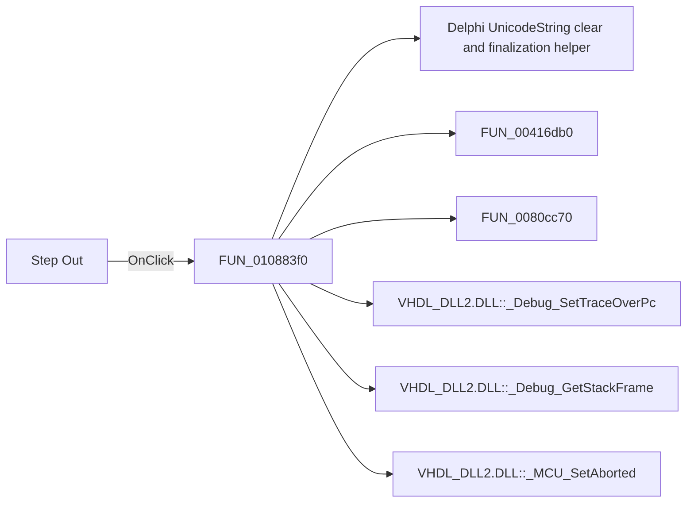

# Step Out

> Analysis status: Pending individual source review.

## Control

| Property | Recovered value |
| --- | --- |
| Form | MCUProjectForm |
| Component path | MCUProjectForm.pnToolbar.sbStepOut |
| Control class | TSpeedButton |
| Caption | Not present in the recovered resource. |
| Hint | Step Out |
| Text | Not present in the recovered resource. |
| Handler name | sbStepOutClick |
| Handler address | 010883f0 |
| Graph node | `resource:dfm:MCUProjectForm/MCUProjectForm.pnToolbar.sbStepOut` |
| Handler node | `function:010883f0` |
| Graph layer | UI |

## What happens when clicked

Pending individual analysis. An agent must read the recovered handler source and its relevant callees before it replaces this text.

## Click flow

## Handler evidence

- Source: [DecompiledSources/Tina16/functions/00000000010883F0__FUN_010883f0.c](../../../DecompiledSources/Tina16/functions/00000000010883F0__FUN_010883f0.c)
- Recovered role: Not present in the recovered resource.
- Current graph summary: Handles 1 Delphi UI event: MCUProjectForm.pnToolbar.sbStepOut.OnClick.
- Current graph behavior: Not present in the recovered resource.
- Current graph evidence: Not present in the recovered resource.
- Complexity: complex
- Distinct outgoing calls: 15

## Direct calls

- `function:00414480` — Delphi UnicodeString clear and finalization helper
- `function:00416db0` — FUN_00416db0
- `function:0080cc70` — FUN_0080cc70
- `function:00e02f20` — Calls the VHDL_DLL2.DLL export _Debug_SetTraceOverPc.
- `function:00e02f40` — Calls the VHDL_DLL2.DLL export _Debug_GetStackFrame.
- `function:00e03be0` — Calls the VHDL_DLL2.DLL export _MCU_SetAborted.
- `function:00e03f40` — Calls the VHDL_DLL2.DLL export _Debug_Unwind_GetReturnAddr.
- `function:01085d30` — FUN_01085d30
- `function:01085d60` — FUN_01085d60
- `function:01087460` — FUN_01087460
- `function:010874a0` — FUN_010874a0
- `function:01087620` — FUN_01087620
- `function:01087910` — Handles 1 Delphi UI event: MCUProjectForm.pnToolbar.sbTraceInto.OnClick.
- `function:01088320` — FUN_01088320
- `function:0108b840` — FUN_0108b840

## Resource evidence

- Kind: Not present in the recovered resource.
- Modal result: Not present in the recovered resource.
- Checked state: Not present in the recovered resource.
- List items: Not present in the recovered resource.
- Image reference: Not present in the recovered resource.
- Extracted glyph: [`0271_MCUProjectForm_MCUProjectForm_pnToolbar_sbStepOut_Glyph_Data.png`](../../../glyph/0271_MCUProjectForm_MCUProjectForm_pnToolbar_sbStepOut_Glyph_Data.png)

## Nearby label candidates

Nearby labels are layout candidates only. They are not proof of behavior.

- No same-parent label candidate is available.

## Analysis limits

- Do not infer behavior from the control class, caption, hint, glyph, or nearby label alone.
- Do not replace the pending status until the handler source and relevant call path provide enough evidence.
