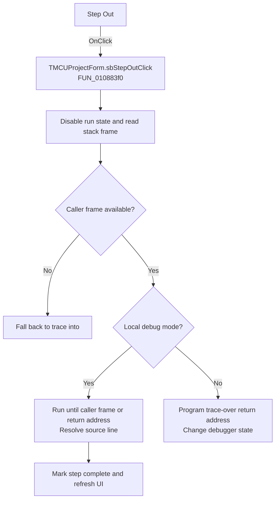

# Step Out

> Analysis status: Recovered handler and relevant call path reviewed for sbStepOutClick.

## Control

| Property | Recovered value |
| --- | --- |
| Form | MCUProjectForm |
| Component path | MCUProjectForm.pnToolbar.sbStepOut |
| Control class | TSpeedButton |
| Caption | Not present in the recovered resource. |
| Hint | Step Out |
| Text | Not present in the recovered resource. |
| Handler name | sbStepOutClick |
| Handler address | 010883f0 |
| Graph node | `resource:dfm:MCUProjectForm/MCUProjectForm.pnToolbar.sbStepOut` |
| Handler node | `function:010883f0` |
| Graph layer | UI |

## What happens when clicked

The handler disables the run-control state, clears the aborted flag, and reads the current debugger stack frame. In local mode it either falls back to trace-into when no frame is available or runs until the caller frame or return address is reached, with periodic message pumping and bounded address lookup retries. In alternate mode it programs the trace-over return address and changes debugger state. The final local path records the resolved line, marks the step complete, and refreshes the debugger display.

## Click flow

## Handler evidence

- Source: [DecompiledSources/Tina16/functions/00000000010883F0__FUN_010883f0.c](../../../DecompiledSources/Tina16/functions/00000000010883F0__FUN_010883f0.c)
- Recovered role: Not present in the recovered resource.
- Current graph summary: Handles 1 Delphi UI event: MCUProjectForm.pnToolbar.sbStepOut.OnClick.
- Current graph behavior: Not present in the recovered resource.
- Current graph evidence: Not present in the recovered resource.
- Complexity: complex
- Distinct outgoing calls: 15

## Direct calls

- `function:00414480` — Delphi UnicodeString clear and finalization helper
- `function:00416db0` — FUN_00416db0
- `function:0080cc70` — FUN_0080cc70
- `function:00e02f20` — Calls the VHDL_DLL2.DLL export _Debug_SetTraceOverPc.
- `function:00e02f40` — Calls the VHDL_DLL2.DLL export _Debug_GetStackFrame.
- `function:00e03be0` — Calls the VHDL_DLL2.DLL export _MCU_SetAborted.
- `function:00e03f40` — Calls the VHDL_DLL2.DLL export _Debug_Unwind_GetReturnAddr.
- `function:01085d30` — FUN_01085d30
- `function:01085d60` — FUN_01085d60
- `function:01087460` — FUN_01087460
- `function:010874a0` — FUN_010874a0
- `function:01087620` — FUN_01087620
- `function:01087910` — Handles 1 Delphi UI event: MCUProjectForm.pnToolbar.sbTraceInto.OnClick.
- `function:01088320` — FUN_01088320
- `function:0108b840` — FUN_0108b840

## Resource evidence

- Kind: Not present in the recovered resource.
- Modal result: Not present in the recovered resource.
- Checked state: Not present in the recovered resource.
- List items: Not present in the recovered resource.
- Image reference: Not present in the recovered resource.
- Extracted glyph: [`0271_MCUProjectForm_MCUProjectForm_pnToolbar_sbStepOut_Glyph_Data.png`](../../../glyph/0271_MCUProjectForm_MCUProjectForm_pnToolbar_sbStepOut_Glyph_Data.png)

## Nearby label candidates

Nearby labels are layout candidates only. They are not proof of behavior.

- No same-parent label candidate is available.

## Reviewed boundaries

- The explanation comes from the recovered handler and the named call path. The caption, hint, and glyph are supporting UI evidence only.
- Unnamed virtual calls are described only by the values passed at this call site and by the state that this handler reads or writes.
- The handler has no local exception recovery unless the behavior section states otherwise.
