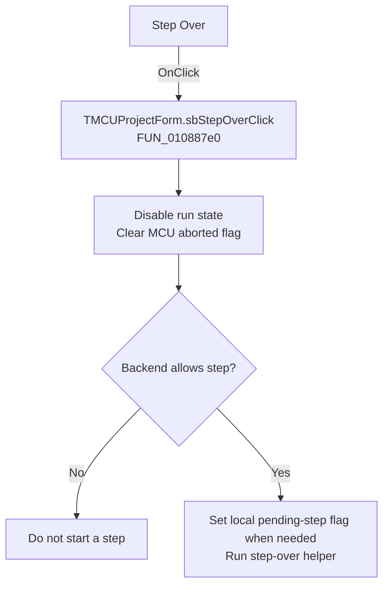

# Step Over

> Analysis status: Recovered handler and relevant call path reviewed for sbStepOverClick.

## Control

| Property | Recovered value |
| --- | --- |
| Form | MCUProjectForm |
| Component path | MCUProjectForm.pnToolbar.sbStepOver |
| Control class | TSpeedButton |
| Caption | Not present in the recovered resource. |
| Hint | Step Over |
| Text | Not present in the recovered resource. |
| Handler name | sbStepOverClick |
| Handler address | 010887e0 |
| Graph node | `resource:dfm:MCUProjectForm/MCUProjectForm.pnToolbar.sbStepOver` |
| Handler node | `function:010887e0` |
| Graph layer | UI |

## What happens when clicked

The handler disables the current run-control state, clears the MCU aborted flag, and clears the auxiliary execution marker. If the backend reports that stepping is unavailable, local mode sets the pending-step flag and calls the step-over helper. The helper receives the original event argument, so any sender-sensitive detail is inside that callee and is not recovered here. A busy or disallowed backend produces no step.

## Click flow

## Handler evidence

- Source: [DecompiledSources/Tina16/functions/00000000010887E0__FUN_010887e0.c](../../../DecompiledSources/Tina16/functions/00000000010887E0__FUN_010887e0.c)
- Recovered role: Not present in the recovered resource.
- Current graph summary: Handles 1 Delphi UI event: MCUProjectForm.pnToolbar.sbStepOver.OnClick.
- Current graph behavior: Not present in the recovered resource.
- Current graph evidence: Not present in the recovered resource.
- Complexity: complex
- Distinct outgoing calls: 3

## Direct calls

- `function:00e03be0` — Calls the VHDL_DLL2.DLL export _MCU_SetAborted.
- `function:00f81d20` — FUN_00f81d20
- `function:01088180` — FUN_01088180

## Resource evidence

- Kind: Not present in the recovered resource.
- Modal result: Not present in the recovered resource.
- Checked state: Not present in the recovered resource.
- List items: Not present in the recovered resource.
- Image reference: Not present in the recovered resource.
- Extracted glyph: [`0266_MCUProjectForm_MCUProjectForm_pnToolbar_sbStepOver_Glyph_Data.png`](../../../glyph/0266_MCUProjectForm_MCUProjectForm_pnToolbar_sbStepOver_Glyph_Data.png)

## Nearby label candidates

Nearby labels are layout candidates only. They are not proof of behavior.

- No same-parent label candidate is available.

## Reviewed boundaries

- The explanation comes from the recovered handler and the named call path. The caption, hint, and glyph are supporting UI evidence only.
- Unnamed virtual calls are described only by the values passed at this call site and by the state that this handler reads or writes.
- The handler has no local exception recovery unless the behavior section states otherwise.
