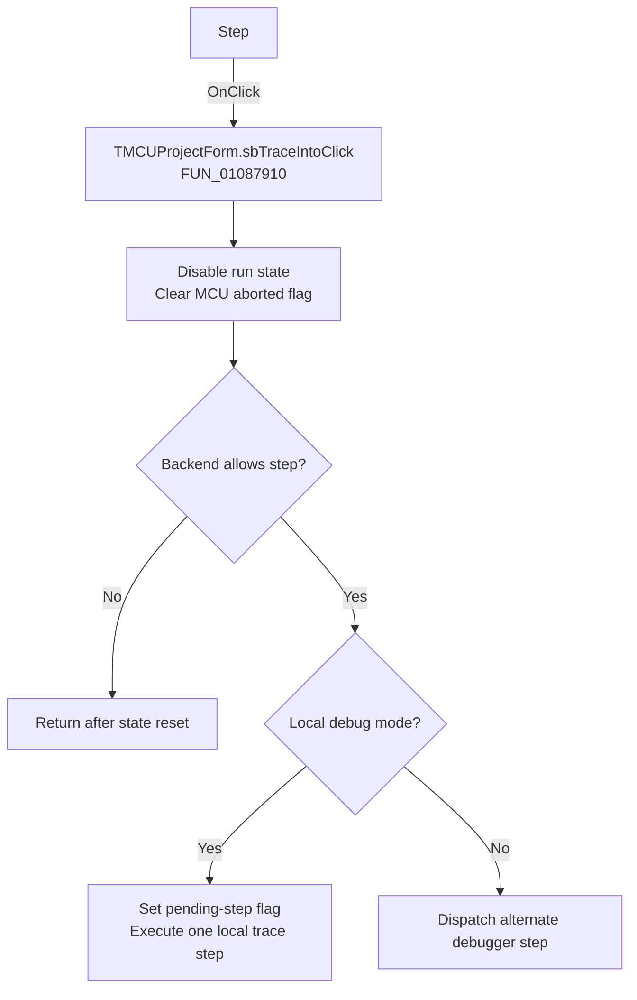

# Step

> Analysis status: Recovered handler and relevant call path reviewed for sbTraceIntoClick.

## Control

| Property | Recovered value |
| --- | --- |
| Form | MCUProjectForm |
| Component path | MCUProjectForm.pnToolbar.sbTraceInto |
| Control class | TSpeedButton |
| Caption | Not present in the recovered resource. |
| Hint | Step |
| Text | Not present in the recovered resource. |
| Handler name | sbTraceIntoClick |
| Handler address | 01087910 |
| Graph node | `resource:dfm:MCUProjectForm/MCUProjectForm.pnToolbar.sbTraceInto` |
| Handler node | `function:01087910` |
| Graph layer | UI |

## What happens when clicked

The handler disables the current run-control state, clears the MCU aborted flag, and clears the auxiliary execution marker when present. If the backend reports that stepping is unavailable, it prepares a step request. In local mode it sets the pending-step flag and executes the local trace helper; in the alternate mode it dispatches the debugger mode callback. If the backend reports a busy or disallowed state, it returns after the initial state reset.

## Click flow

## Handler evidence

- Source: [DecompiledSources/Tina16/functions/0000000001087910__FUN_01087910.c](../../../DecompiledSources/Tina16/functions/0000000001087910__FUN_01087910.c)
- Recovered role: Not present in the recovered resource.
- Current graph summary: Handles 1 Delphi UI event: MCUProjectForm.pnToolbar.sbTraceInto.OnClick.
- Current graph behavior: Not present in the recovered resource.
- Current graph evidence: Not present in the recovered resource.
- Complexity: complex
- Distinct outgoing calls: 3

## Direct calls

- `function:00e03be0` — Calls the VHDL_DLL2.DLL export _MCU_SetAborted.
- `function:00f81d20` — FUN_00f81d20
- `function:010878b0` — FUN_010878b0

## Resource evidence

- Kind: Not present in the recovered resource.
- Modal result: Not present in the recovered resource.
- Checked state: Not present in the recovered resource.
- List items: Not present in the recovered resource.
- Image reference: Not present in the recovered resource.
- Extracted glyph: [`0263_MCUProjectForm_MCUProjectForm_pnToolbar_sbTraceInto_Glyph_Data.png`](../../../glyph/0263_MCUProjectForm_MCUProjectForm_pnToolbar_sbTraceInto_Glyph_Data.png)

## Nearby label candidates

Nearby labels are layout candidates only. They are not proof of behavior.

- No same-parent label candidate is available.

## Reviewed boundaries

- The explanation comes from the recovered handler and the named call path. The caption, hint, and glyph are supporting UI evidence only.
- Unnamed virtual calls are described only by the values passed at this call site and by the state that this handler reads or writes.
- The handler has no local exception recovery unless the behavior section states otherwise.
