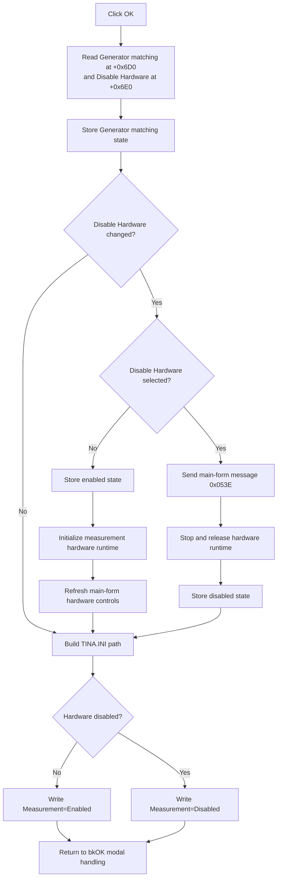

# Apply T&M options

> Analysis status: Complete. The recovered handler, form initialization, runtime branches, profile write, and UI resource establish the behavior.

## Control

| Property | Recovered value |
| --- | --- |
| Form | MeasOptionDlg |
| Form caption | T&M Options |
| Component path | MeasOptionDlg.OKBtn |
| Control class | TBitBtn |
| Kind | bkOK |
| Handler name | OKBtnClick |
| Handler address | 01b71000 |
| Inputs | Generator matching and Disable Hardware check boxes |
| Graph node | `resource:dfm:MeasOptionDlg/MeasOptionDlg.OKBtn` |
| Handler node | `function:01b71000` |
| Graph layer | UI |

## What happens when clicked

The command applies both choices in the **T&M Options** dialog. It updates live generator-matching state, changes the hardware runtime only when the Disable Hardware choice changed, and writes the final hardware-enabled state to `TINA.INI`.

The form's recovered component order and `FormCreate` establish the input fields:

- Form field `+0x6D0` is `CheckBox`, captioned **Generator matching**.
- Form field `+0x6E0` is `CheckBox1`, captioned **Disable Hardware**.

`FormCreate` loads both check boxes from the same global values that `OKBtnClick` updates. This proves that the first value is generator-matching state and the second value is the hardware-disabled state.

## Applied state and runtime branches

The handler first writes the current Generator matching check state to its global byte. This write occurs on every click.

It then compares Disable Hardware with the current global hardware-disabled flag:

| Disable Hardware choice | Runtime action when the choice changed |
| --- | --- |
| Cleared | Store the enabled state, call `FUN_010db7e0` to initialize or attach the measurement hardware runtime, then call `FUN_01c8f340` to refresh hardware-related controls on the main form. |
| Selected | Send custom window message `0x053E` to the main form, call `FUN_010db950` to stop and release active hardware state, then store the disabled state. |
| Unchanged | Skip hardware initialization, shutdown, and main-form refresh. |

The enabled branch ignores the byte returned by `FUN_010db7e0`. The handler therefore continues to persistence even when the lower-level initialization cannot establish active hardware. The disabled branch also has no returned status to inspect.

## TINA.INI persistence

After the runtime branch, the handler constructs a profile-file path that ends in `TINA.INI`. It writes this entry:

| INI section | Key | Value |
| --- | --- | --- |
| `Schematic Editor` | `Measurement` | `Enabled` when the hardware-disabled flag is clear; otherwise `Disabled` |

This profile write runs even when the Disable Hardware choice did not change. The handler does not check the profile writer's result. It has no retry, warning, or rollback if the file cannot be updated.

The recovered click path does not write Generator matching to `TINA.INI`. It only updates the live global generator-matching byte in this handler.

## Dialog result and failure behavior

- The button kind is `bkOK`. The VCL button framework supplies the normal OK modal-result behavior after the click processing. The recovered handler does not call `Close` or set a modal result itself.
- The handler has no validation branch. Both check-box values are accepted as Boolean state.
- There is no local exception handler. A runtime, native-message, or profile-write exception has no local recovery.
- State changes are not transactional. For example, the enabled flag is stored before hardware initialization. A later failure does not restore the previous flag.
- Temporary Delphi strings are finalized before a normal return.

## Click flow

## Handler and call-path evidence

- [OKBtnClick source](../../../DecompiledSources/Tina16/functions/0000000001B71000__FUN_01b71000.c) reads both check boxes, performs the changed-state branches, and writes the profile entry.
- [FormCreate source](../../../DecompiledSources/Tina16/functions/0000000001B70FA0__FUN_01b70fa0.c) loads `+0x6D0` from the generator-matching global and `+0x6E0` from the hardware-disabled global.
- [Hardware initialization source](../../../DecompiledSources/Tina16/functions/00000000010DB7E0__FUN_010db7e0.c) tries to initialize the hardware adapter and measurement runtime when hardware is enabled.
- [Hardware shutdown source](../../../DecompiledSources/Tina16/functions/00000000010DB950__FUN_010db950.c) releases active measurement state and finishes the hardware adapter while the disabled flag is still clear.
- [Main-form refresh source](../../../DecompiledSources/Tina16/functions/0000000001C8F340__FUN_01c8f340.c) queries available hardware functions and updates related controls.
- [Recovered UI evidence](../../../DecompiledSources/Tina16/resources/dfm/ui-evidence.json) supplies the form caption, check-box captions, component order, `bkOK` kind, and event binding.
- The read-only graph confirms the resource-to-handler `triggers` edge and all 11 recovered direct call edges.
- Complexity: complex; 11 distinct outgoing calls.

## Direct calls

- `function:010db7e0` - initialize or attach measurement hardware runtime state.
- `function:010db950` - stop and release active measurement hardware state.
- `function:01c8f340` - refresh hardware-dependent main-form controls.
- `function:0065b870` - ensure and get the main form's native handle before message `0x053E`.
- `function:00409da0`, `function:00416910`, `function:004169a0`, `function:00441640`, `function:00416cd0`, and `function:00442620` - obtain, convert, combine, and prepare path strings for the `TINA.INI` profile call.
- `function:00414560` - finalize the temporary Delphi UnicodeString array.

## Resource evidence

- `OKBtn` is a `TBitBtn` with built-in kind `bkOK` and `OnClick = OKBtnClick` at `01b71000`.
- `CheckBox` is **Generator matching** and appears before `SetupBtn` in the recovered form component order.
- `CheckBox1` is **Disable Hardware** and is the final recovered form component.
- The OK button has no recovered caption, hint, action, image reference, or extracted glyph. Its `bkOK` kind is direct semantic evidence.

## Analysis limits

- The custom main-form message `0x053E` has no recovered symbolic name. The source proves that it is sent before hardware shutdown, but it does not prove its internal receiver behavior.
- The low-level hardware adapter and profile writer can perform work outside the recovered functions. The handler does not read back either result.
- The source proves that Generator matching changes live global state. It does not show where or when another path persists that option.
