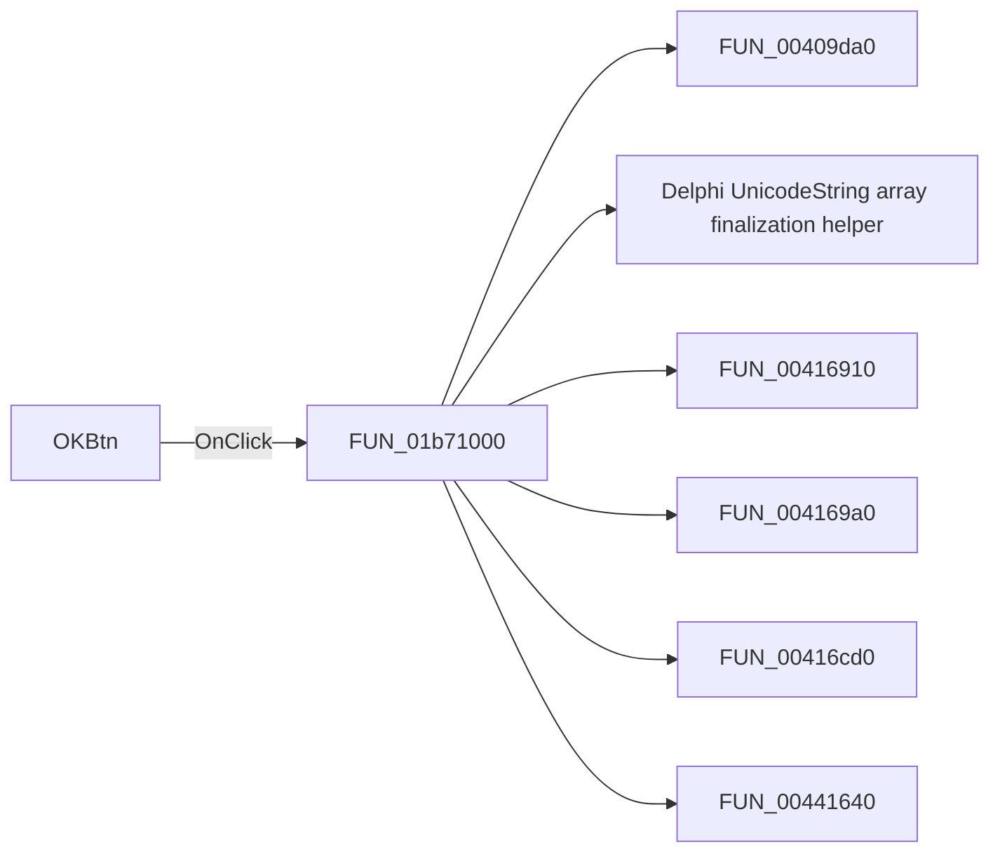

# OKBtn

> Analysis status: Pending individual source review.

## Control

| Property | Recovered value |
| --- | --- |
| Form | MeasOptionDlg |
| Component path | MeasOptionDlg.OKBtn |
| Control class | TBitBtn |
| Caption | Not present in the recovered resource. |
| Hint | Not present in the recovered resource. |
| Text | Not present in the recovered resource. |
| Handler name | OKBtnClick |
| Handler address | 01b71000 |
| Graph node | `resource:dfm:MeasOptionDlg/MeasOptionDlg.OKBtn` |
| Handler node | `function:01b71000` |
| Graph layer | UI |

## What happens when clicked

Pending individual analysis. An agent must read the recovered handler source and its relevant callees before it replaces this text.

## Click flow

## Handler evidence

- Source: [DecompiledSources/Tina16/functions/0000000001B71000__FUN_01b71000.c](../../../DecompiledSources/Tina16/functions/0000000001B71000__FUN_01b71000.c)
- Recovered role: Not present in the recovered resource.
- Current graph summary: Handles 1 Delphi UI event: MeasOptionDlg.OKBtn.OnClick.
- Current graph behavior: Not present in the recovered resource.
- Current graph evidence: Not present in the recovered resource.
- Complexity: complex
- Distinct outgoing calls: 11

## Direct calls

- `function:00409da0` — FUN_00409da0
- `function:00414560` — Delphi UnicodeString array finalization helper
- `function:00416910` — FUN_00416910
- `function:004169a0` — FUN_004169a0
- `function:00416cd0` — FUN_00416cd0
- `function:00441640` — FUN_00441640
- `function:00442620` — FUN_00442620
- `function:0065b870` — FUN_0065b870
- `function:010db7e0` — FUN_010db7e0
- `function:010db950` — FUN_010db950
- `function:01c8f340` — FUN_01c8f340

## Resource evidence

- Kind: bkOK
- Modal result: Not present in the recovered resource.
- Checked state: Not present in the recovered resource.
- List items: Not present in the recovered resource.
- Image reference: Not present in the recovered resource.
- Extracted glyph: None.

## Nearby label candidates

Nearby labels are layout candidates only. They are not proof of behavior.

- No same-parent label candidate is available.

## Analysis limits

- Do not infer behavior from the control class, caption, hint, glyph, or nearby label alone.
- Do not replace the pending status until the handler source and relevant call path provide enough evidence.
