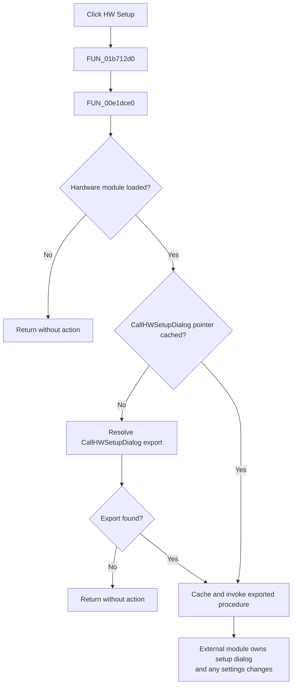

# Open hardware setup

> Analysis status: Complete. The recovered handler, dynamic export wrapper, and UI resource establish the dispatch behavior and explicit no-op cases.

## Control

| Property | Recovered value |
| --- | --- |
| Form | MeasOptionDlg |
| Form caption | T&M Options |
| Component path | MeasOptionDlg.SetupBtn |
| Control class | TBitBtn |
| Caption | &HW Setup... |
| Handler name | SetupBtnClick |
| Handler address | 01b712d0 |
| Graph node | `resource:dfm:MeasOptionDlg/MeasOptionDlg.SetupBtn` |
| Handler node | `function:01b712d0` |
| Graph layer | UI |

## What happens when clicked

The command asks the loaded hardware-interface module to open its hardware setup dialog. The application handler does not construct that dialog itself.

`FUN_01b712d0` calls only `FUN_00e1dce0`. The helper follows this guarded dispatch path:

1. It checks whether the hardware-interface module handle is available.
2. If the cached procedure pointer is null, it resolves the export named `CallHWSetupDialog` from that module.
3. If resolution succeeds, it caches and calls the procedure with no arguments.
4. If the module is unavailable or the export cannot be resolved, it returns without opening a dialog or changing application state.

After the first successful lookup, later clicks reuse the cached procedure pointer. A failed lookup leaves the pointer null, so a later click can try the lookup again while the module remains loaded.

## Result and failure behavior

- The wrapper does not inspect a return value from `CallHWSetupDialog`.
- The recovered application code does not receive an accepted or canceled result and does not copy settings after the call.
- A missing module or export is a silent no-op. There is no warning, retry loop within one click, or fallback setup form.
- The handler does not close `MeasOptionDlg`, set its modal result, or change either option check box.
- There is no local exception handler around the external call. A fault raised by the resolved procedure has no local recovery in this click path.

The exported procedure owns the actual hardware setup UI and any settings changes. Its body is outside the recovered `tina.exe` source, so those details remain unknown.

## Click flow

## Handler and call-path evidence

- [SetupBtnClick source](../../../DecompiledSources/Tina16/functions/0000000001B712D0__FUN_01b712d0.c) is a one-call wrapper around `FUN_00e1dce0`.
- [Hardware setup adapter source](../../../DecompiledSources/Tina16/functions/0000000000E1DCE0__FUN_00e1dce0.c) checks the module handle, caches the procedure pointer, resolves the literal export name `CallHWSetupDialog`, and calls it only when non-null.
- [Dynamic procedure resolver source](../../../DecompiledSources/Tina16/functions/0000000000427C10__FUN_00427c10.c) converts a Unicode procedure name when needed and performs the module export lookup.
- [Recovered UI evidence](../../../DecompiledSources/Tina16/resources/dfm/ui-evidence.json) supplies the form caption, button caption, layout, two-glyph metadata, and event binding.
- The read-only graph confirms the `triggers` edge to `FUN_01b712d0`, its call to `FUN_00e1dce0`, and the adapter's call to `FUN_00427c10`.
- Complexity: simple; one distinct outgoing call.

## Direct calls

- `function:00e1dce0` - guarded adapter that resolves, caches, and invokes the hardware module's `CallHWSetupDialog` export.

## Relevant descendant call

- `function:00427c10` - resolves a named procedure from a loaded module and returns a null pointer when it is unavailable.

## Resource evidence

- `SetupBtn` is a `TBitBtn` on the **T&M Options** form, with caption `&HW Setup...` and `OnClick = SetupBtnClick` at `01b712d0`.
- The button is beside the Generator matching option and has `NumGlyphs = 2`.
- The extracted resource contains no `Glyph.Data`, image reference, or extracted glyph file. The glyph count alone does not prove the setup behavior.
- The button has no recovered hint, action, kind, or modal result.

## Analysis limits

- The recovered executable exposes only the adapter. It does not contain the body of `CallHWSetupDialog`, so the setup fields, validation, persistence, and cancel behavior cannot be documented from this call path.
- The module filename and the symbolic name of its cached module-handle global are not recovered here. The neighboring adapters resolve hardware exports through the same handle, which establishes its hardware-interface role.
