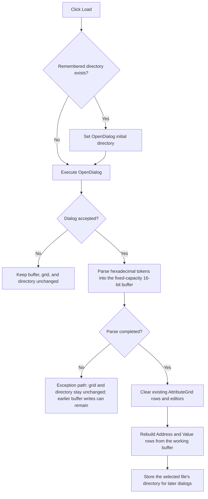

# Load hexadecimal memory values from a text file

> Analysis status: Reviewed from the recovered handler, text-file parser, grid reset and rebuild paths, dialog helpers, form initialization, and resource state.

## Control

| Property | Recovered value |
| --- | --- |
| Form | MemoryEditor |
| Component path | MemoryEditor.bLoad |
| Control class | TButton |
| Caption | Load |
| Initial DFM state | Hidden and disabled |
| Handler name | bLoadClick |
| Handler address | 0140a3f0 |
| Graph node | `resource:dfm:MemoryEditor/MemoryEditor.bLoad` |
| Handler node | `function:0140a3f0` |
| Graph layer | UI |

## What happens when clicked

`TMemoryEditor.bLoadClick` optionally applies the last used directory from form string `+0x740` to the form's `TOpenDialog`. It then executes the dialog. Canceling the dialog makes no change to the memory values, grid, or remembered directory.

After an accepted selection, the handler loads hexadecimal tokens from the selected text file into the 16-bit working buffer described by form fields `+0x718` and `+0x720`. The loader uses `+0x718` as the configured word capacity and writes words to the buffer at `+0x720`.

The parser accepts nonempty lines with hexadecimal tokens separated by spaces, tabs, or a vertical bar. It continues to parse tokens after the fixed-capacity buffer is full but does not store the surplus. If the file contains fewer words than the capacity, untouched trailing words keep their prior values.

After a successful parse, the handler clears the current `AttributeGrid` contents and rebuilds all memory rows from the working buffer. It then extracts the selected file's directory and stores it at `+0x740` for the next Load or Save dialog.

Load changes only the working buffer and grid. It does not copy the loaded words to the backing memory block referenced at `+0x708`. A later successful OK or the normal-mode commit step in Save performs that copy.

## Click flow

## Handler and parser evidence

- [FUN_0140a3f0](../../../DecompiledSources/Tina16/functions/000000000140A3F0__FUN_0140a3f0.c) contains the dialog, load, grid reset, rebuild, and remembered-directory sequence.
- [FUN_013a67f0](../../../DecompiledSources/Tina16/functions/00000000013A67F0__FUN_013a67f0.c) checks file existence, loads text lines, parses hexadecimal tokens, enforces capacity for writes, and raises file-specific or line-specific errors.
- [FUN_00b0b020](../../../DecompiledSources/Tina16/functions/0000000000B0B020__FUN_00b0b020.c) destroys existing grid cell objects and resets selection state.
- [FUN_01409ca0](../../../DecompiledSources/Tina16/functions/0000000001409CA0__FUN_01409ca0.c) recreates the `Address` and `Value` columns and one row for each configured memory word.
- [FUN_00724270](../../../DecompiledSources/Tina16/functions/0000000000724270__FUN_00724270.c) reads the selected file name.
- [FUN_00724420](../../../DecompiledSources/Tina16/functions/0000000000724420__FUN_00724420.c) applies the remembered directory to the dialog.
- [FUN_00441640](../../../DecompiledSources/Tina16/functions/0000000000441640__FUN_00441640.c) extracts the directory portion of the accepted path.

## Resource evidence

- The form contains `AttributeGrid`, one `TOpenDialog`, one `TSaveDialog`, and Load and Save buttons.
- The DFM marks `bLoad` hidden and disabled. [FUN_01409a10](../../../DecompiledSources/Tina16/functions/0000000001409A10__FUN_01409a10.c) makes both Load and Save enabled and visible when the form is created.
- The form creation path assigns the text-file filter `Text file (*.txt)|*.txt` to both dialogs.
- The Load button has no hint, image, extracted glyph, or nearby label.

## Error and partial-state behavior

- A missing path raises an error that includes the path.
- A line without a required hexadecimal token raises an error that includes the line number.
- The handler has no local exception catch. A parse error can leave words written before the error in the working buffer. Grid rebuild and remembered-directory update occur only after the parser returns.
- A short valid file preserves the old tail of the working buffer. The loader does not clear it before parsing.
- Canceling the dialog is a full no-op because parsing and all later writes are inside the accepted branch.

## Analysis limits

- The loader does not pass an explicit text encoding.
- The recovered path does not show a bit-width range check before a token is stored as a 16-bit word.
- This article does not identify the external owner of the backing memory block.

