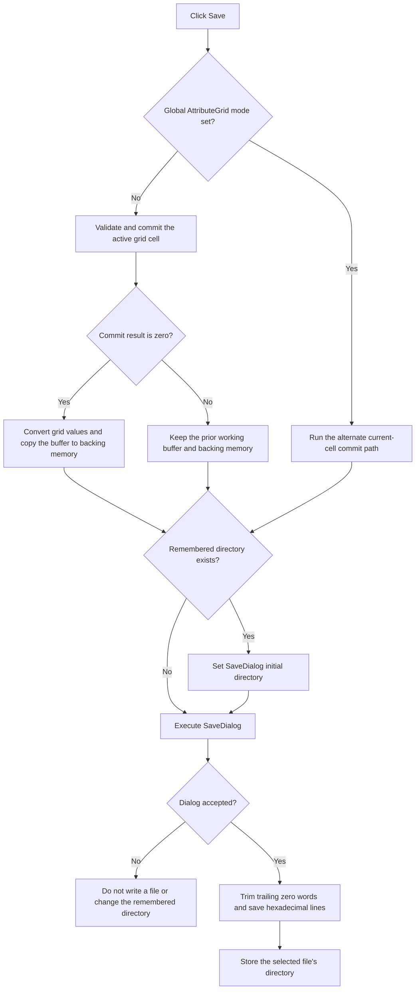

# Save the edited memory values as hexadecimal text

> Analysis status: Reviewed from the recovered handler, AttributeGrid commit paths, buffer conversion, hexadecimal file writer, dialog helpers, form initialization, and resource state.

## Control

| Property | Recovered value |
| --- | --- |
| Form | MemoryEditor |
| Component path | MemoryEditor.bSave |
| Control class | TButton |
| Caption | Save |
| Initial DFM state | Hidden and disabled |
| Handler name | bSaveClick |
| Handler address | 0140a230 |
| Graph node | `resource:dfm:MemoryEditor/MemoryEditor.bSave` |
| Handler node | `function:0140a230` |
| Graph layer | UI |

## What happens when clicked

`TMemoryEditor.bSaveClick` first applies the same current-edit commit logic as OK. In the normal recovered mode, it validates the active `AttributeGrid` cell and stores the result in error byte `+0x710`. When the result is zero, it converts all grid values to 16-bit words in the working buffer and copies the complete buffer to the backing memory block at `+0x708`.

Unlike OK, Save does not stop when normal-mode cell validation returns nonzero. It skips the grid-to-buffer and backing-memory copy, but it still opens the save dialog. An accepted dialog can therefore write the prior working buffer after a rejected active edit.

In the alternate global grid mode, Save calls the alternate current-cell commit helper. It does not explicitly rebuild or copy the working buffer in this branch. The product meaning of this mode is not recovered.

After the commit step, the handler optionally applies remembered directory `+0x740` to the `TSaveDialog` and executes the dialog. If accepted, it writes the working 16-bit buffer to the selected path as hexadecimal text. The writer removes trailing zero words, formats retained values in groups of up to eight per line, and saves the line list. The handler then stores the selected file's directory at `+0x740`.

## Click flow

## Handler and writer evidence

- [FUN_0140a230](../../../DecompiledSources/Tina16/functions/000000000140A230__FUN_0140a230.c) contains the pre-save commit, mode decision, dialog, writer call, and directory update.
- [FUN_00b0a890](../../../DecompiledSources/Tina16/functions/0000000000B0A890__FUN_00b0a890.c) returns the active cell's validation and commit result.
- [FUN_01408bc0](../../../DecompiledSources/Tina16/functions/0000000001408BC0__FUN_01408bc0.c) converts all grid values into the 16-bit working buffer.
- [FUN_00b0a960](../../../DecompiledSources/Tina16/functions/0000000000B0A960__FUN_00b0a960.c) provides the alternate current-cell commit path.
- [FUN_013a6b20](../../../DecompiledSources/Tina16/functions/00000000013A6B20__FUN_013a6b20.c) trims the trailing zeros, formats the retained words, groups output lines, and saves the text file.
- [FUN_00724270](../../../DecompiledSources/Tina16/functions/0000000000724270__FUN_00724270.c) reads the selected save path.
- [FUN_00724420](../../../DecompiledSources/Tina16/functions/0000000000724420__FUN_00724420.c) applies the remembered directory.
- [FUN_00441640](../../../DecompiledSources/Tina16/functions/0000000000441640__FUN_00441640.c) extracts the directory from the accepted path.

## Resource evidence

- The form has one `TSaveDialog`, one `TOpenDialog`, and one `AttributeGrid`.
- The DFM marks `bSave` hidden and disabled. [FUN_01409a10](../../../DecompiledSources/Tina16/functions/0000000001409A10__FUN_01409a10.c) enables and shows both file buttons and assigns the text-file filter during form creation.
- The Save button has no hint, image, extracted glyph, or nearby label.

## Error and partial-state behavior

- Canceling the save dialog prevents the file write and directory update. It does not undo a successful grid-to-buffer or backing-memory commit that occurred before the dialog opened.
- A rejected active edit leaves the prior buffer in place, but the save dialog still opens and can write that prior data.
- The file writer has no local error return. A file-system exception propagates through the handler, and the remembered directory is not updated because that write occurs later.
- Trimming removes only zero words at the end. Zero words before the final nonzero word remain in the output.

## Analysis limits

- The exact token separator and numeric formatting strings are recovered only as data addresses. The grouping and hexadecimal conversion are explicit in the writer's control flow.
- The source does not identify the product meaning of the alternate global grid mode.
- No recovered caller establishes how the backing-memory changes persist after the form closes.
