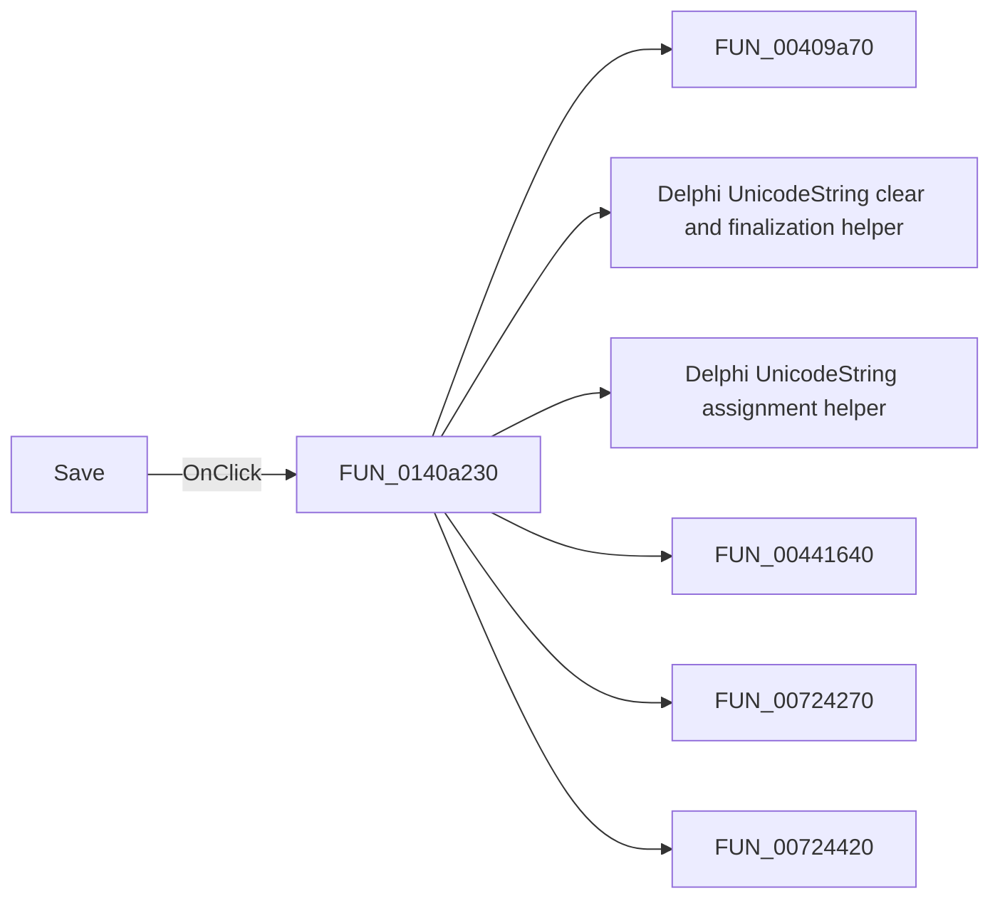

# Save

> Analysis status: Pending individual source review.

## Control

| Property | Recovered value |
| --- | --- |
| Form | MemoryEditor |
| Component path | MemoryEditor.bSave |
| Control class | TButton |
| Caption | Save |
| Hint | Not present in the recovered resource. |
| Text | Not present in the recovered resource. |
| Handler name | bSaveClick |
| Handler address | 0140a230 |
| Graph node | `resource:dfm:MemoryEditor/MemoryEditor.bSave` |
| Handler node | `function:0140a230` |
| Graph layer | UI |

## What happens when clicked

Pending individual analysis. An agent must read the recovered handler source and its relevant callees before it replaces this text.

## Click flow

## Handler evidence

- Source: [DecompiledSources/Tina16/functions/000000000140A230__FUN_0140a230.c](../../../DecompiledSources/Tina16/functions/000000000140A230__FUN_0140a230.c)
- Recovered role: Not present in the recovered resource.
- Current graph summary: Handles 1 Delphi UI event: MemoryEditor.bSave.OnClick.
- Current graph behavior: Not present in the recovered resource.
- Current graph evidence: Not present in the recovered resource.
- Complexity: complex
- Distinct outgoing calls: 10

## Direct calls

- `function:00409a70` — FUN_00409a70
- `function:00414480` — Delphi UnicodeString clear and finalization helper
- `function:00414ad0` — Delphi UnicodeString assignment helper
- `function:00441640` — FUN_00441640
- `function:00724270` — FUN_00724270
- `function:00724420` — FUN_00724420
- `function:00b0a890` — FUN_00b0a890
- `function:00b0a960` — FUN_00b0a960
- `function:013a6b20` — FUN_013a6b20
- `function:01408bc0` — FUN_01408bc0

## Resource evidence

- Kind: Not present in the recovered resource.
- Modal result: Not present in the recovered resource.
- Checked state: Not present in the recovered resource.
- List items: Not present in the recovered resource.
- Image reference: Not present in the recovered resource.
- Extracted glyph: None.

## Nearby label candidates

Nearby labels are layout candidates only. They are not proof of behavior.

- No same-parent label candidate is available.

## Analysis limits

- Do not infer behavior from the control class, caption, hint, glyph, or nearby label alone.
- Do not replace the pending status until the handler source and relevant call path provide enough evidence.
