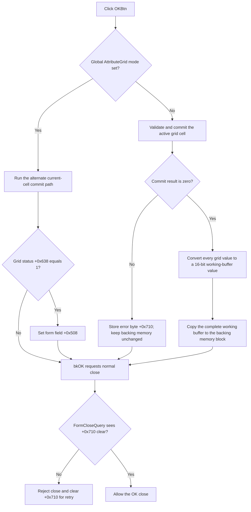

# Validate and commit the edited memory values

> Analysis status: Reviewed from the recovered handler, AttributeGrid commit helpers, value-conversion helper, form creation, form close query, and built-in button kind.

## Control

| Property | Recovered value |
| --- | --- |
| Form | MemoryEditor |
| Form caption | Memory Editor |
| Component path | MemoryEditor.OKBtn |
| Control class | TBitBtn |
| Kind | bkOK |
| Handler name | OKBtnClick |
| Handler address | 0140a000 |
| Graph node | `resource:dfm:MemoryEditor/MemoryEditor.OKBtn` |
| Handler node | `function:0140a000` |
| Graph layer | UI |

## What happens when clicked

In the normal recovered mode, `TMemoryEditor.OKBtnClick` first asks `AttributeGrid` to validate and commit its active cell editor. The helper returns zero if no editor is active or if the active edit is accepted. It returns nonzero when the active edit cannot be committed. The handler stores this result in form error byte `+0x710`.

When the result is zero, the handler converts every grid value to the current numeric mode and writes the resulting 16-bit words to the working buffer at `+0x720`. It then copies the complete working buffer to the backing memory block referenced by structure pointer `+0x708`. The copy length is the structure's word count multiplied by two bytes.

When validation returns nonzero, the handler skips both the grid-to-buffer conversion and the backing-memory copy. The button has kind `bkOK`, so the VCL still requests a normal OK close. `FormCloseQuery` rejects that close while `+0x710` is nonzero and then clears the byte for a later retry.

## Alternate grid mode

When global mode byte `PTR_DAT_020039a8` is nonzero, the handler uses the AttributeGrid's alternate current-cell commit path. It does not run the explicit grid-to-buffer conversion or backing-memory copy in this branch. If grid status field `+0x638` becomes `1`, it sets form field `+0x508` to `1`.

The recovered source does not identify the product meaning of this global mode or field `+0x508`. This article records the separate state path without assigning unsupported names to them.

## Click flow

## Handler and state evidence

- [FUN_0140a000](../../../DecompiledSources/Tina16/functions/000000000140A000__FUN_0140a000.c) contains the mode decision, validation-result write, working-buffer conversion, backing-memory copy, and alternate status mark.
- [FUN_00b0a890](../../../DecompiledSources/Tina16/functions/0000000000B0A890__FUN_00b0a890.c) returns zero when no active cell editor exists and otherwise returns the active editor's commit result.
- [FUN_00b0a150](../../../DecompiledSources/Tina16/functions/0000000000B0A150__FUN_00b0a150.c) accepts the editor text, updates the cell and grid state, and returns zero only after its validation gate succeeds.
- [FUN_01408bc0](../../../DecompiledSources/Tina16/functions/0000000001408BC0__FUN_01408bc0.c) walks all value objects and fills the 16-bit working buffer.
- [FUN_01408880](../../../DecompiledSources/Tina16/functions/0000000001408880__FUN_01408880.c) converts one value according to form mode `+0x738`.
- [FUN_00b0a960](../../../DecompiledSources/Tina16/functions/0000000000B0A960__FUN_00b0a960.c) implements the alternate current-cell path and writes grid status `+0x638`.
- [FUN_01409fe0](../../../DecompiledSources/Tina16/functions/0000000001409FE0__FUN_01409fe0.c) sets `CanClose` from the inverse of `+0x710` and clears that byte.
- [FUN_01409a10](../../../DecompiledSources/Tina16/functions/0000000001409A10__FUN_01409a10.c) allocates the working buffer, copies the backing words into it, and builds the initial grid.

## Resource evidence

- `OKBtn` is a `TBitBtn` with kind `bkOK` and `NumGlyphs = 2`.
- The graph contains no extracted glyph bytes for this control and no same-parent label candidate.
- `AttributeGrid` is the form's only editable data control. Source data flow, not the button kind alone, proves the memory commit.

## Error and no-op behavior

- If no cell editor is active, validation returns zero and the handler still rebuilds and copies the complete buffer.
- A rejected active edit leaves the prior working buffer and backing memory unchanged on the normal path.
- The rejected OK close clears the error byte in `FormCloseQuery`, so the next attempt starts without the stale blocker.
- The handler has no local exception handler or rollback after the backing-memory copy begins.

## Analysis limits

- The source does not recover the product meaning of the global mode byte or form field `+0x508`.
- The caller that owns the backing memory block is not established here. Persistence after the modal dialog returns is unknown.
- The exact numeric modes behind values `0`, `1`, and `2` are not named in the recovered resource.

