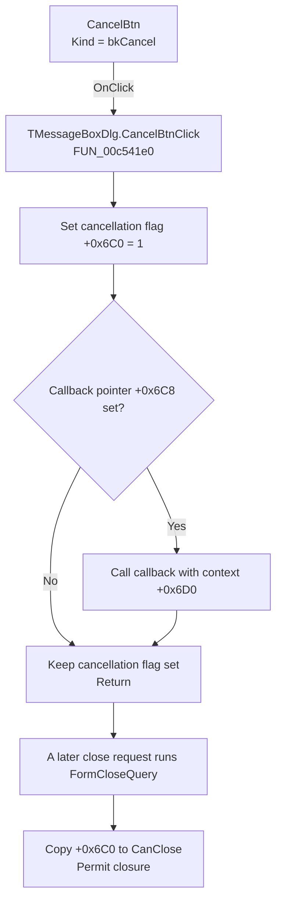

# CancelBtn

> Analysis status: Recovered control, click handler, callback dispatch, and close-query interaction reviewed.

## Control

| Property | Recovered value |
| --- | --- |
| Form | MessageBoxDlg |
| Component path | MessageBoxDlg.CancelBtn |
| Control class | TBitBtn |
| Caption | Not present in the recovered resource. |
| Hint | Not present in the recovered resource. |
| Text | Not present in the recovered resource. |
| Handler name | CancelBtnClick |
| Handler address | 00c541e0 |
| Graph node | `resource:dfm:MessageBoxDlg/MessageBoxDlg.CancelBtn` |
| Handler node | `function:00c541e0` |
| Graph layer | UI |

## What happens when clicked

`TMessageBoxDlg.CancelBtnClick` unconditionally writes `1` to form byte
`+0x6C0`. The form's recovered close-query handler reads this same byte and
copies it to the VCL `CanClose` output. The click therefore records a
cancellation request and makes a later close query return true.

The handler then reads the code pointer at form field `+0x6C8`. When it is
nonzero, the handler calls it indirectly and passes the stored value at
`+0x6D0` as the only recovered argument. The callback target is assigned at
run time, so the static call graph has no direct edge and does not recover its
exact implementation. The data flow supports an optional cancellation
notification, but not a more specific target or cleanup claim.

When the callback pointer is zero, the handler skips the call. The cancellation
flag remains set. The handler does not inspect `Sender`, clear progress data,
write a modal result, call the VCL close routine, hide the form, wait for the
background operation, or show an error.

## Cancellation and close behavior

`TMessageBoxDlg.FormCloseQuery` has one operation: it copies form byte
`+0x6C0` to the caller's `CanClose` byte. The click handler sets this byte to
`1` before it dispatches the optional callback. If the callback itself or
another owner later requests closure, the recovered close query permits it.

The click handler does not request closure. The DFM identifies the control as
`bkCancel`, but it does not contain an explicit `ModalResult`. The recovered
source does not prove whether inherited `TBitBtn` behavior or an external
owner closes this instance. This article therefore keeps the final close
trigger explicit as unknown.

## Click flow

## Handler evidence

- Source: [DecompiledSources/Tina16/functions/0000000000C541E0__FUN_00c541e0.c](../../../DecompiledSources/Tina16/functions/0000000000C541E0__FUN_00c541e0.c)
- Recovered role: Sets the MessageBoxDlg cancellation flag and invokes an optional callback.
- Current graph summary: Handles 1 Delphi UI event: MessageBoxDlg.CancelBtn.OnClick.
- Current graph behavior: The handler writes `1` to form byte `+0x6C0`. It calls the code pointer at `+0x6C8` with context `+0x6D0` only when that pointer is nonzero.
- Current graph evidence: `FUN_00c541e0` contains the flag write, pointer test, and indirect call. `FUN_00c542f0` copies the same flag to the close-query output.
- Complexity: simple
- Distinct outgoing calls: 0

### Related lifecycle source

- Close-query handler: [FUN_00c542f0](../../../DecompiledSources/Tina16/functions/0000000000C542F0__FUN_00c542f0.c)
- Form-show handler: [FUN_00c54210](../../../DecompiledSources/Tina16/functions/0000000000C54210__FUN_00c54210.c)
- Form-hide handler: [FUN_00c542c0](../../../DecompiledSources/Tina16/functions/0000000000C542C0__FUN_00c542c0.c)
- Form-create handler: [FUN_00c54300](../../../DecompiledSources/Tina16/functions/0000000000C54300__FUN_00c54300.c)
- Recovered DFM evidence: [ui-evidence.json](../../../DecompiledSources/Tina16/resources/dfm/ui-evidence.json)

## Direct calls

- No direct call edge is present in the recovered graph.

## Resource evidence

- Kind: bkCancel
- Modal result: Not present in the recovered resource.
- Checked state: Not present in the recovered resource.
- List items: Not present in the recovered resource.
- Image reference: Not present in the recovered resource.
- Extracted glyph: None.

## Nearby label candidates

Nearby labels are layout candidates only. They are not proof of behavior.

- Rank 1: Calculating... at distance 125.

## Reviewed boundaries

- The caption `Calculating...` is only nearby label and form-resource evidence.
  It does not identify the canceled operation.
- The indirect callback target is not statically recovered. Its exact side
  effects, thread behavior, error handling, and completion timing remain
  unknown.
- The handler has no local exception recovery. An exception from the indirect
  callback is not handled in this recovered body.
- A repeated click rewrites the same flag and can invoke the callback again;
  the handler has no one-shot guard.
