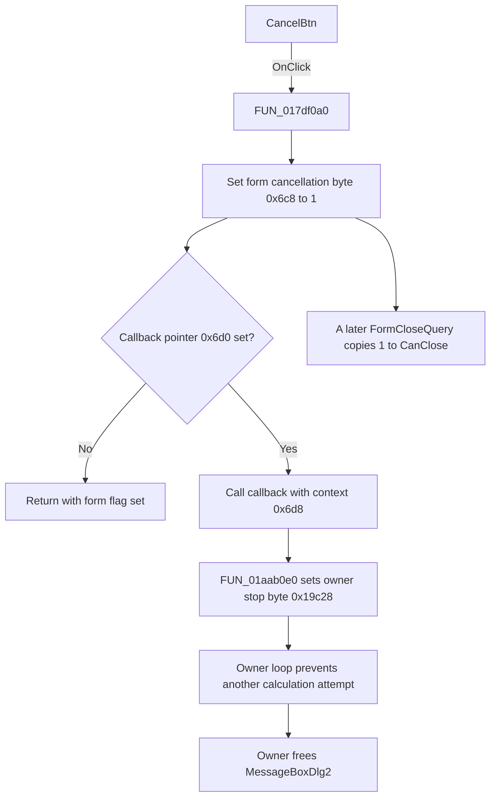

# CancelBtn

> Analysis status: Recovered control, handler, callback, owner-loop, and close-query evidence reviewed.

## Control

| Property | Recovered value |
| --- | --- |
| Form | MessageBoxDlg2 |
| Component path | MessageBoxDlg2.CancelBtn |
| Control class | TBitBtn |
| Button kind | bkCancel |
| Caption | Not present in the recovered resource. |
| Hint | Not present in the recovered resource. |
| Text | Not present in the recovered resource. |
| Handler name | CancelBtnClick |
| Handler address | 017df0a0 |
| Graph node | `resource:dfm:MessageBoxDlg2/MessageBoxDlg2.CancelBtn` |
| Handler node | `function:017df0a0` |
| Graph layer | UI |

## What happens when clicked

The click records a cancellation request and notifies the owner when the owner supplied a callback.

The recovered `TMessageBoxDlg2.CancelBtnClick` handler first writes `1` to the byte at form offset `+0x6c8`. [`FUN_017df1b0`](../../../DecompiledSources/Tina16/functions/00000000017DF1B0__FUN_017df1b0.c), the form's recovered `OnCloseQuery` handler, copies this byte to the VCL `CanClose` output. Thus, a later close query permits closure after the click.

The click handler then tests the callback code pointer at `+0x6d0`. If the pointer is nonzero, it calls the callback and passes the stored context at `+0x6d8`. If the pointer is zero, it skips this call and returns with only the form flag set. The call is indirect, so the static graph has no direct call edge.

The recovered owner path resolves the callback for the inspected calculation workflow:

- [`FUN_01aab210`](../../../DecompiledSources/Tina16/functions/0000000001AAB210__FUN_01aab210.c) creates and shows `MessageBoxDlg2`. It stores `FUN_01aab0e0` at `+0x6d0` and its calculation object at `+0x6d8`.
- [`FUN_01aab0e0`](../../../DecompiledSources/Tina16/functions/0000000001AAB0E0__FUN_01aab0e0.c) writes `1` to the calculation object's byte at `+0x19c28`.
- The owner loop dispatches Windows messages after each recovered calculation attempt. Its loop condition then tests `+0x19c28`. A click delivered during message dispatch makes the condition false, prevents another attempt, and leads to form cleanup.

The handler does not interrupt the calculation attempt that runs before message dispatch. If that attempt already produced a successful result, the owner keeps its success result even when the click is delivered in the same iteration. If the attempt did not succeed, cancellation ends the loop with its failure result unchanged. Cancellation therefore controls another attempt; it does not overwrite a result that the current attempt already produced.

The handler does not directly close, hide, or destroy the form. The inspected owner frees the form after its loop ends. The `bkCancel` resource value supports the control's purpose, but the flag, callback data flow, and owner loop prove the behavior.

## Click flow

## Handler evidence

- Source: [DecompiledSources/Tina16/functions/00000000017DF0A0__FUN_017df0a0.c](../../../DecompiledSources/Tina16/functions/00000000017DF0A0__FUN_017df0a0.c)
- Recovered role: Sets the MessageBoxDlg2 cancellation flag and invokes an optional owner callback.
- Current graph summary: Handles 1 Delphi UI event: MessageBoxDlg2.CancelBtn.OnClick.
- Current graph behavior: The handler writes `1` to form offset `+0x6c8`. It calls the code pointer at `+0x6d0` with context `+0x6d8` only when the pointer is nonzero.
- Current graph evidence: `FUN_017df0a0` contains the flag write, pointer test, and indirect call. `FUN_017df1b0` copies the same flag to `CanClose`. `FUN_01aab210` installs the recovered owner callback and tests its stop byte after message dispatch.
- Complexity: simple
- Distinct outgoing calls: 0

## Direct calls

- No direct call edge is present in the recovered graph.

The handler invokes its callback through a form field. For the inspected owner, this indirect target is `FUN_01aab0e0`.

## Resource evidence

- Kind: bkCancel
- Modal result: Not present in the recovered resource.
- Checked state: Not present in the recovered resource.
- List items: Not present in the recovered resource.
- Image reference: Not present in the recovered resource.
- Extracted glyph: None.

## Nearby label candidates

Nearby labels are layout candidates only. They are not proof of behavior.

- Rank 1: Calculating... at distance 145.

## No-op and error behavior

- A null callback pointer skips owner notification. The form cancellation byte remains set.
- A repeated click writes the same form byte again and can invoke the callback again. The recovered callback also writes the same owner stop byte again.
- The handler has no validation, confirmation, status message, or local exception recovery.
- The recovered callback contains only one byte write. An alternative callback could have other behavior, but no alternative owner is established here.

## Analysis limits

- The nearby `Calculating...` label supports the progress context, but it does not identify the calculated object or algorithm.
- The source proves cancellation only at the owner loop boundary after one calculation attempt. It does not show a cancellation test inside that attempt.
- The handler makes a later close query succeed. It does not itself call the VCL close routine. The inspected owner performs cleanup after its loop ends.
- `bkCancel` does not prove the custom callback protocol. The handler, callback assignment, callback body, and owner loop provide that proof.
