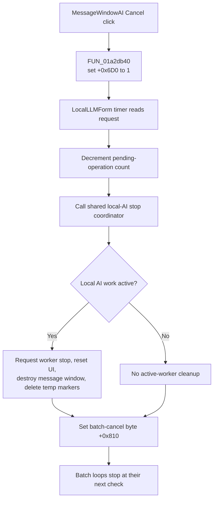

# bCancel

## Control

| Property | Recovered value |
| --- | --- |
| Form | MessageWindowAI |
| Component path | MessageWindowAI.bCancel |
| Control class | TBitBtn |
| Caption | Not present in the recovered resource. |
| Hint | Not present in the recovered resource. |
| Text | Not present in the recovered resource. |
| Handler name | bCancelClick |
| Handler address | 01a2db40 |
| Graph node | `resource:dfm:MessageWindowAI/MessageWindowAI.bCancel` |
| Handler node | `function:01a2db40` |
| Graph layer | UI |

## What happens when clicked

The handler sets the `MessageWindowAI` byte at `+0x6D0` to `1` and returns. It does not close the form or stop a worker directly. `FormCreate` initializes the same byte to `0`, so it is a cancel-request flag for this message-window instance.

The `LocalLLMForm` timer creates or reuses `MessageWindowAI` while a local AI task is running. It updates the status label and progress bar, shows the modeless window, and pumps application messages. On a later timer pass, it reads byte `+0x6D0`. When the byte is set, the timer:

1. decrements the current pending-operation count;
2. calls the same stop coordinator as `LocalLLMForm.sbStop`;
3. pumps application messages; and
4. sets `LocalLLMForm` byte `+0x810` to stop a wider batch loop.

When local AI work is active, the stop coordinator requests worker termination, resets the running state and UI, clears transient answer lists, destroys the global `MessageWindowAI` instance, and removes temporary `answer_done.txt` and `errors.txt` files. The message-window pointer is then set to zero.

The click is therefore asynchronous. It records a request that the owner timer consumes. Repeating the click before the timer runs writes the same value. The handler has no branch, direct call, error dialog, or local rollback.

## Click flow

## Handler evidence

- Source: [DecompiledSources/Tina16/functions/0000000001A2DB40__FUN_01a2db40.c](../../../DecompiledSources/Tina16/functions/0000000001A2DB40__FUN_01a2db40.c)
- Recovered role: Request cancellation of the active local-AI progress operation.
- Current graph summary: Handles 1 Delphi UI event: MessageWindowAI.bCancel.OnClick.
- Current graph behavior: Sets the message-window cancel-request byte. The owner timer consumes the request and invokes the shared local-AI stop and cleanup path.
- Current graph evidence: `FUN_01a2db40` writes byte `1` at `+0x6D0`; `FUN_01a2db50` clears it at form creation; `FUN_01a45e10` tests it before calling `FUN_01a43000` and setting batch-cancel byte `+0x810`.
- Complexity: simple
- Distinct outgoing calls: 0

## Direct calls

- No direct call edge is present in the recovered graph.

## Resource evidence

- Kind: bkCancel
- Modal result: Not present in the recovered resource.
- Checked state: Not present in the recovered resource.
- List items: Not present in the recovered resource.
- Image reference: Not present in the recovered resource.
- Extracted glyph: None.

## Nearby label candidates

Nearby labels are layout candidates only. They are not proof of behavior.

- Rank 1: t at distance 204.

## Analysis limits

- [Cancel handler `FUN_01a2db40`](../../../DecompiledSources/Tina16/functions/0000000001A2DB40__FUN_01a2db40.c) proves the single cancel-request write.
- [Form creation `FUN_01a2db50`](../../../DecompiledSources/Tina16/functions/0000000001A2DB50__FUN_01a2db50.c) proves that the request starts clear and that the status label starts empty.
- [Status-label updater `FUN_01a2db80`](../../../DecompiledSources/Tina16/functions/0000000001A2DB80__FUN_01a2db80.c) and [progress updater `FUN_01a2de30`](../../../DecompiledSources/Tina16/functions/0000000001A2DE30__FUN_01a2de30.c) prove the progress-window role.
- [Owner timer `FUN_01a45e10`](../../../DecompiledSources/Tina16/functions/0000000001A45E10__FUN_01a45e10.c) proves the deferred request read, pending-count change, stop call, and batch-cancel write.
- [Shared stop coordinator `FUN_01a42e10`](../../../DecompiledSources/Tina16/functions/0000000001A42E10__FUN_01a42e10.c) proves worker-stop coordination, UI reset, list clearing, and temporary-file removal.
- [Message-window cleanup `FUN_01a42d80`](../../../DecompiledSources/Tina16/functions/0000000001A42D80__FUN_01a42d80.c) proves destruction of the global form and pointer clear.
- [Batch runner `FUN_01a5bd40`](../../../DecompiledSources/Tina16/functions/0000000001A5BD40__FUN_01a5bd40.c) proves that byte `+0x810` stops later batch iterations.
- The nearby label caption `t` is a DFM placeholder. The run-time updater replaces and centers it, so the caption does not identify the canceled task.
