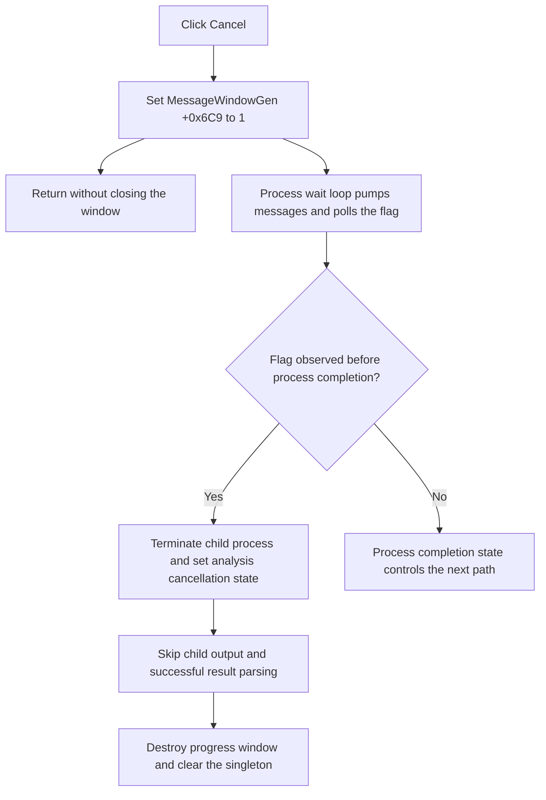

# Request cancellation of the Harmonic Balance run

> Analysis status: Source and call path reviewed.

## Control

| Property | Recovered value |
| --- | --- |
| Form | MessageWindowGen |
| Component path | MessageWindowGen.bCancel |
| Control class | TBitBtn |
| Kind | bkCancel |
| Caption | Not present in the recovered resource. |
| Hint | Not present in the recovered resource. |
| Handler name | bCancelClick |
| Handler address | 01054bc0 |
| Graph node | `resource:dfm:MessageWindowGen/MessageWindowGen.bCancel` |
| Handler node | `function:01054bc0` |
| Graph layer | UI |

## What happens when clicked

The click handler sets byte `+0x6C9` in the current `MessageWindowGen` object to `1`. The form-create handler sets the same byte to `0`. Thus, this byte is a cancellation-request flag for the lifetime of the progress window.

The handler then returns. It has no call, branch, or error path. It does not close or hide the window, terminate a process, or change Harmonic Balance input values. A repeated click writes the same value and does not cause an additional handler-side action.

## Downstream cancellation path

The discrete Harmonic Balance command creates the global `MessageWindowGen` object, sets its label to `Harmonic Balance Analysis is running...`, and shows it as a modeless progress window. The external-process runner pumps application messages while it waits for the analysis process in 300 ms intervals. This message processing lets the Cancel click run during the wait.

After each wait interval, `FUN_01056590` tests the global progress-window pointer and byte `+0x6C9`. When it reads the set flag, the process runner:

- terminates the child process with exit code `0`;
- sets the caller's cancellation byte to `1`;
- stops the wait loop; and
- skips the child-output pipe read.

The caller supplies its Harmonic Balance state byte `+0x147D` as that cancellation byte. The higher-level analysis path checks the byte before it reads the generated log and before it parses or presents a successful result. On cancellation, it cleans up its support object, destroys the progress-window singleton, clears the global pointer, and pumps the application messages again.

The recovered code does not show a message that confirms cancellation. It also does not show a handler-local recovery action if the downstream poll does not observe the flag before the process finishes.

## Click flow

## Handler evidence

- [Click handler source](../../../DecompiledSources/Tina16/functions/0000000001054BC0__FUN_01054bc0.c): writes `1` to `param_1 + 0x6C9` and returns.
- [Form-create source](../../../DecompiledSources/Tina16/functions/0000000001054BD0__FUN_01054bd0.c): clears bytes `+0x6C9` and `+0x6C8` when the form is created.
- [Progress-text setter](../../../DecompiledSources/Tina16/functions/0000000001054C00__FUN_01054c00.c): assigns and centers the status label.
- [Cancellation poll](../../../DecompiledSources/Tina16/functions/0000000001056590__FUN_01056590.c): returns true only when the global form exists and byte `+0x6C9` is set.
- [External-process runner](../../../DecompiledSources/Tina16/functions/00000000010565C0__FUN_010565c0.c): pumps messages, polls the flag, terminates the child, sets the caller's cancellation byte, and skips output reading after cancellation.
- [Harmonic Balance process coordinator](../../../DecompiledSources/Tina16/functions/0000000001B4C9A0__FUN_01b4c9a0.c): passes state byte `+0x147D` to the runner and does not read the result log when it is set.
- [Harmonic Balance runner](../../../DecompiledSources/Tina16/functions/0000000001B4F420__FUN_01b4f420.c): parses generated results only when state byte `+0x147D` remains clear.
- [Discrete Harmonic Balance handler](../../../DecompiledSources/Tina16/functions/0000000001B53580__FUN_01b53580.c): creates, labels, and shows the progress window before it starts the run; it selects the cancellation cleanup path when the state byte is set.
- [Cancellation cleanup](../../../DecompiledSources/Tina16/functions/0000000001B53E60__FUN_01b53e60.c): destroys the progress-window singleton, clears its global pointer, and pumps messages.

## Direct calls

- The click handler has no direct call edge.
- Its downstream effect uses the shared form byte `+0x6C9` and the polling helper `FUN_01056590`.

## Resource evidence

- Kind: `bkCancel`.
- Modal result: Not present in the recovered resource.
- Checked state: Not present in the recovered resource.
- List items: Not present in the recovered resource.
- Image reference: Not present in the recovered resource.
- Extracted glyph: None.
- UI evidence: [Recovered DFM resource data](../../../DecompiledSources/Tina16/resources/dfm/ui-evidence.json).

The `bkCancel` kind agrees with the source-backed role. The kind alone does not prove the process-cancellation path or an immediate modal close.

## Nearby label candidates

The only nearby label candidate is `t` at distance 180. This layout evidence does not identify the control behavior. The runtime text and the source trace provide the behavior evidence.

## Analysis limits

- The source proves a cancellation request and its known Harmonic Balance consumer. It does not prove that all possible callers use this progress window in the same way.
- The exact result of a late click, after the final poll but before the window is removed, depends on downstream timing that is not explicit in the handler.
- The handler has no local error handling because it only writes one byte.
