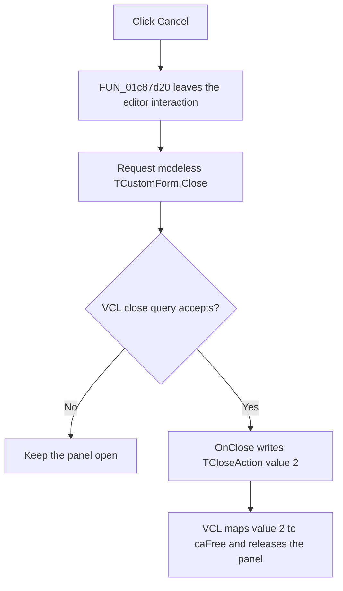

# End mixed-digital step control and close the panel

> Analysis status: Evidence-backed source review complete.

## Control

| Property | Recovered value |
| --- | --- |
| Form | MixedDigitalStepByStep |
| Component path | MixedDigitalStepByStep.CancelBtn |
| Control class | TBitBtn |
| Caption | Supplied by the built-in button kind. |
| Kind | bkCancel |
| Handler name | CancelBtnClick |
| Handler address | 0133bc00 |
| Graph node | `resource:dfm:MixedDigitalStepByStep/MixedDigitalStepByStep.CancelBtn` |
| Handler node | `function:0133bc00` |
| Graph layer | UI |

## What happens when clicked

`FUN_0133bc00` first calls `FUN_01c87d20` on the global Schematic Editor. That
helper unchecks the editor's active interactive-tool button and invokes the
shared interaction-change event path. It also clears the related mixed-mode
panel selection when that optional panel is active. The Cancel handler ignores
the Boolean result from this shutdown helper.

The handler then calls the canonical VCL `TCustomForm.Close` routine. The
recovered opener in `FUN_01349310` constructs one global
`TMixedDigitalStepByStep` instance when needed, supplies its digital-node
context, and calls the modeless Show path. This is not a modal `ShowModal`
dialog flow.

The form's `OnClose` handler `FUN_0133bd20` writes `TCloseAction` value `2`.
Recovered Delphi RTTI orders the values as `caNone`, `caHide`, `caFree`, and
`caMinimize`, so value `2` is `caFree`. After the normal modeless close query
accepts closure, `TCustomForm.Close` dispatches `OnClose` and selects the VCL
release path. The panel is released rather than only hidden.

## Analysis and model boundary

Cancel leaves the editor interaction before it asks VCL to close the panel. It
does not call the panel's Stop handler, reset the grid to time zero, or
reactivate digital step-by-step mode. It also does not copy a result, edit the
circuit, save a file, write a preference, or mark a document as changed.

The `bkCancel` resource supports the Cancel label and standard visual form.
The recovered event resource has no modal-result value, and the custom handler
does not write one. The close effect comes from the explicit modeless Close
call and the form's `caFree` close action.

## No-op and error behavior

- There is no confirmation prompt or local close-veto rule in the recovered
  form events. The common VCL close query still runs before `OnClose`.
- The interaction shutdown helper can report false when two editor-state bytes
  are not both clear, but the handler ignores this result and still requests
  Close.
- The handler has no exception handler, retry, cleanup block, or rollback. If
  the shutdown call raises, the Close call is not reached.

## Cancel flow

## Recovered evidence

- Cancel handler and call order:
  [FUN_0133bc00](../../../DecompiledSources/Tina16/functions/000000000133BC00__FUN_0133bc00.c)
- Editor interactive-command shutdown:
  [FUN_01c87d20](../../../DecompiledSources/Tina16/functions/0000000001C87D20__FUN_01c87d20.c)
- Shared editor interaction-change path:
  [FUN_01c87e40](../../../DecompiledSources/Tina16/functions/0000000001C87E40__FUN_01c87e40.c)
- Canonical VCL close-query and close-action pipeline:
  [FUN_00805200](../../../DecompiledSources/Tina16/functions/0000000000805200__FUN_00805200.c)
- Modeless form construction and Show call:
  [FUN_01349310](../../../DecompiledSources/Tina16/functions/0000000001349310__FUN_01349310.c)
  and
  [FUN_008059a0](../../../DecompiledSources/Tina16/functions/00000000008059A0__FUN_008059a0.c)
- `caFree` close action:
  [FUN_0133bd20](../../../DecompiledSources/Tina16/functions/000000000133BD20__FUN_0133bd20.c)
  and recovered `TCloseAction` RTTI in
  [FUN_018ea7e0](../../../DecompiledSources/Tina16/functions/00000000018EA7E0__FUN_018ea7e0.c)
- Recovered form and event resources:
  [ui-evidence.json](../../../DecompiledSources/Tina16/resources/dfm/ui-evidence.json)

## Analysis limits

- The original Delphi names of editor fields used by `FUN_01c87d20` are not
  recovered. Their interactive-tool behavior is established by the checked
  button setter, the common event path, and the same helper's callers.
- The recovered source does not show a user-facing cleanup failure path.
- No same-parent label or extracted glyph is available for Cancel.
