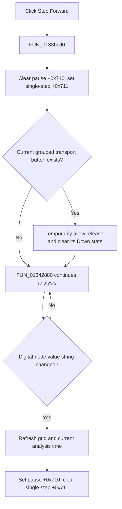

# Advance to the next mixed-digital value change

> Analysis status: Evidence-backed source review complete.

## Control

| Property | Recovered value |
| --- | --- |
| Form | MixedDigitalStepByStep |
| Component path | MixedDigitalStepByStep.Panel2.sbNext |
| Control class | TSpeedButton |
| Caption | Not present in the recovered resource. |
| Hint | Step Forward\| |
| Handler name | sbNextClick |
| Handler address | 0133bcd0 |
| Graph node | `resource:dfm:MixedDigitalStepByStep/MixedDigitalStepByStep.Panel2.sbNext` |
| Handler node | `function:0133bcd0` |
| Graph layer | UI |

## What happens when clicked

`FUN_0133bcd0` requests one visible mixed-digital step. It clears the pause byte
at form offset `+0x710` and sets the single-step byte at `+0x711`. If the
current-transport pointer at `+0x700` is non-null, it temporarily permits the
grouped speed button to be released, clears that button's Down state, and then
restores the normal group rule. This removes the Play, Pause, or Stop selection
while the one-step request is active.

The click handler does not call a simulator step routine. `FUN_01342880`
consumes the two bytes in the running analysis loop. Clearing `+0x710` releases
the message-pumped pause gate. The loop continues until its recovered
digital-node value string differs from the cached string. It then updates the
grid with the current analysis time. If `+0x711` is set, the same block sets
`+0x710` back to one and clears `+0x711`.

Thus the proven boundary is the next detected change in the digital-node value
string, not necessarily one solver iteration or one fixed time increment. If
an iteration does not change that string, the loop continues. The recovered
source does not provide a separate timeout for a circuit that produces no next
digital change.

## Initial, repeat, and null-selection behavior

- The request works when `+0x700` is null. The handler still clears Pause and
  sets the single-step byte; it only skips the grouped-button release.
- A second Step Forward click before the first request is consumed writes the
  same two bytes again. It does not queue a second counted step.
- After a detected value change, the loop clears the single-step byte. A later
  click can request another step.
- Stop or panel initialization also clears `+0x711`. Stop rebuilds the panel at
  time zero; Step Forward does not.

## Errors and persistence

The handler has no validation, error message, exception handler, retry counter,
or rollback. It changes transient transport state only. It does not edit the
circuit, save a file, persist the displayed time, or mark a document changed.

## Click flow

## Recovered evidence

- Step Forward state and grouped-button release:
  [FUN_0133bcd0](../../../DecompiledSources/Tina16/functions/000000000133BCD0__FUN_0133bcd0.c)
- Speed-button grouped Down-state setter:
  [FUN_0082a6c0](../../../DecompiledSources/Tina16/functions/000000000082A6C0__FUN_0082a6c0.c)
- Temporary group-release property setter:
  [FUN_0082a890](../../../DecompiledSources/Tina16/functions/000000000082A890__FUN_0082a890.c)
- Analysis-loop pause release, value-change test, grid refresh, and automatic
  re-pause:
  [FUN_01342880](../../../DecompiledSources/Tina16/functions/0000000001342880__FUN_01342880.c)
- Digital-value comparison and cache update:
  [FUN_0133bad0](../../../DecompiledSources/Tina16/functions/000000000133BAD0__FUN_0133bad0.c)
- Recovered form and event resources:
  [ui-evidence.json](../../../DecompiledSources/Tina16/resources/dfm/ui-evidence.json)

## Resource and analysis limits

- The control has hint **Step Forward|**, no caption, action, checked-state
  evidence, or same-parent label candidate.
- [The extracted glyph](../../../glyph/0276_MixedDigitalStepByStep_MixedDigitalStepByStep_Panel2_sbNext_Glyph_Data.png)
  shows a right-pointing triangle and a vertical step boundary. It supports the
  direction only; the handler and loop establish the change-detection rule.
- The original Delphi field and setter names are not recovered. The VCL helper
  bodies prove the temporary grouped-button release sequence.
- The source does not prove that one request always reaches a later digital
  change. Stop, Cancel, an analysis end, or an error can end the wait first.
