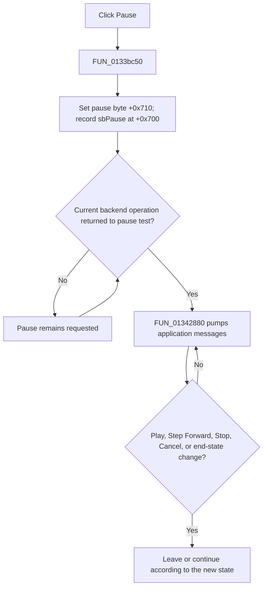

# Pause mixed-digital step-by-step analysis

> Analysis status: Evidence-backed source review complete.

## Control

| Property | Recovered value |
| --- | --- |
| Form | MixedDigitalStepByStep |
| Component path | MixedDigitalStepByStep.Panel2.sbPause |
| Control class | TSpeedButton |
| Caption | Not present in the recovered resource. |
| Hint | Pause\| |
| Handler name | sbPauseClick |
| Handler address | 0133bc50 |
| Graph node | `resource:dfm:MixedDigitalStepByStep/MixedDigitalStepByStep.Panel2.sbPause` |
| Handler node | `function:0133bc50` |
| Graph layer | UI |

## What happens when clicked

`FUN_0133bc50` requests a cooperative pause. It sets form byte `+0x710` to one
and records the `sbPause` control pointer at `+0x700`. It makes no direct call
and does not tear down the simulation.

The active analysis loop in `FUN_01342880` reads `+0x710`. When mixed-mode
step control is active and the byte is set, the loop repeatedly drains pending
application messages. It does not begin another analysis iteration while it
remains in that pause gate. This message pump permits Play, Step Forward, Stop,
and Cancel handlers to run while the analysis routine is still active.

Pause preserves the current simulator state, current analysis time, cached
digital-node string, and displayed grid. Play clears the pause byte and lets
the same analysis loop continue. Step Forward also clears it, but arms a
separate byte that asks the loop to pause again after the next detected digital
value change.

## Timing, repeat, and no-op behavior

- The request is cooperative. A backend operation that is already running must
  return to the pause test before the loop begins pumping messages there.
- A repeated Pause click sets the same byte and pointer again. The nested
  message pump remains active, and no additional simulation work is started.
- If no analysis loop is active, the handler still stores paused transport
  state, but there is no running loop for the byte to hold.
- The click does not reset the current time. Stop is the separate operation
  that rebuilds the stopped panel state at time zero.

## Errors and persistence

The handler has no validation, error message, exception handler, retry, or
rollback. It changes only transient form state. It does not edit or save the
circuit, persist the current time, or mark a document as changed.

## Click flow

## Recovered evidence

- Pause handler field writes:
  [FUN_0133bc50](../../../DecompiledSources/Tina16/functions/000000000133BC50__FUN_0133bc50.c)
- Analysis-loop pause gate and application message drain:
  [FUN_01342880](../../../DecompiledSources/Tina16/functions/0000000001342880__FUN_01342880.c)
- Play and Step Forward state contrast:
  [FUN_0133bc30](../../../DecompiledSources/Tina16/functions/000000000133BC30__FUN_0133bc30.c)
  and
  [FUN_0133bcd0](../../../DecompiledSources/Tina16/functions/000000000133BCD0__FUN_0133bcd0.c)
- Stopped-state initialization:
  [FUN_0133b9b0](../../../DecompiledSources/Tina16/functions/000000000133B9B0__FUN_0133b9b0.c)
- Recovered form and event resources:
  [ui-evidence.json](../../../DecompiledSources/Tina16/resources/dfm/ui-evidence.json)

## Resource and analysis limits

- The control has hint **Pause|**, no caption, action, checked-state evidence,
  or same-parent label candidate.
- [The extracted glyph](../../../glyph/0275_MixedDigitalStepByStep_MixedDigitalStepByStep_Panel2_sbPause_Glyph_Data.png)
  shows two vertical pause bars. The handler and loop prove the pause effect.
- The original Delphi names of fields `+0x700` and `+0x710` are not recovered.
  The source proves their transport-pointer and pause-gate behavior.
- The exact maximum latency between the click and the next pause test is not
  recovered. The loop contains no forced cancellation for a backend call that
  does not return.
