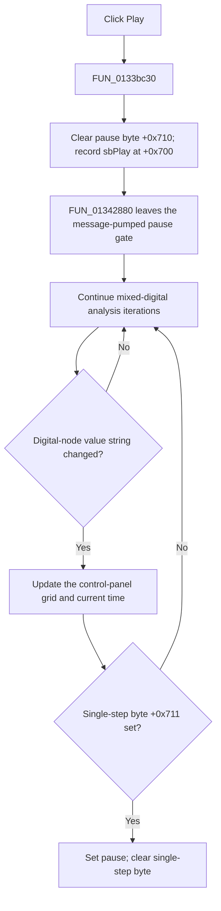

# Resume mixed-digital step-by-step analysis

> Analysis status: Evidence-backed source review complete.

## Control

| Property | Recovered value |
| --- | --- |
| Form | MixedDigitalStepByStep |
| Component path | MixedDigitalStepByStep.Panel2.sbPlay |
| Control class | TSpeedButton |
| Caption | Not present in the recovered resource. |
| Hint | Play\| |
| Handler name | sbPlayClick |
| Handler address | 0133bc30 |
| Graph node | `resource:dfm:MixedDigitalStepByStep/MixedDigitalStepByStep.Panel2.sbPlay` |
| Handler node | `function:0133bc30` |
| Graph layer | UI |

## What happens when clicked

`FUN_0133bc30` resumes the mixed-digital step-by-step analysis. It clears the
pause byte at form offset `+0x710` and records the `sbPlay` control pointer in
the current-transport field at `+0x700`. It makes no direct function call and
does not initialize, reset, or advance the simulation in the click handler.

The active analysis loop in `FUN_01342880` supplies the effect. When mixed-mode
step control is active, that loop repeatedly pumps application messages while
`+0x710` is nonzero. Clearing the byte lets the loop leave this pause gate and
continue its normal analysis iterations. The same loop compares the current
digital-node value string with a cached value. When the value changes, it
updates the panel grid with the current analysis time.

Play does not clear the separate single-step byte at `+0x711`. Normal panel
initialization and a completed Step Forward operation clear that byte. The
recovered UI path therefore assumes the panel is in one of those normal states.
If another path left `+0x711` set, the next detected digital-value change would
make the analysis loop set `+0x710` again and return to Pause.

## Pause and repeat behavior

- Pause sets `+0x710` to one. The analysis loop then pumps messages without
  starting another iteration until Play, Step Forward, Stop, Cancel, or an
  analysis-end path changes the surrounding state.
- A repeated Play click writes the same two fields again. It does not restart
  the simulation or reset the displayed time.
- The current-transport pointer is used by the transport handlers to track and
  release the selected grouped button. The Play handler does not read it.
- Resume is cooperative. A running backend operation must return to the
  recovered pause gate before a prior Pause request can hold the loop there.

## Errors and persistence

The handler has no validation, error message, exception handler, retry, or
rollback. It only changes transient form state. It does not edit the circuit,
mark a document as changed, save a file, or write a preference.

## Click flow

## Recovered evidence

- Play handler field writes:
  [FUN_0133bc30](../../../DecompiledSources/Tina16/functions/000000000133BC30__FUN_0133bc30.c)
- Analysis-loop pause gate, digital-value comparison, grid refresh, and
  single-step consumption:
  [FUN_01342880](../../../DecompiledSources/Tina16/functions/0000000001342880__FUN_01342880.c)
- Digital-value comparison and cache update:
  [FUN_0133bad0](../../../DecompiledSources/Tina16/functions/000000000133BAD0__FUN_0133bad0.c)
- Grid time update:
  [FUN_0133ba00](../../../DecompiledSources/Tina16/functions/000000000133BA00__FUN_0133ba00.c)
- Panel initialization of the pause and single-step bytes:
  [FUN_0133b9b0](../../../DecompiledSources/Tina16/functions/000000000133B9B0__FUN_0133b9b0.c)
- Recovered form and event resources:
  [ui-evidence.json](../../../DecompiledSources/Tina16/resources/dfm/ui-evidence.json)

## Resource and analysis limits

- The control has hint **Play|**, no caption, action, checked-state evidence,
  or same-parent label candidate.
- [The extracted glyph](../../../glyph/0274_MixedDigitalStepByStep_MixedDigitalStepByStep_Panel2_sbPlay_Glyph_Data.png)
  is a right-pointing triangle. It supports Play direction only. The handler
  and loop establish the resume behavior.
- The original Delphi names of form fields `+0x700`, `+0x710`, and `+0x711`
  are not recovered. Their names in this article describe proven readers and
  writers.
- This bead owns the canonical annotation for the shared analysis-loop role
  relevant to the five transport controls. The sibling articles cite that role.
