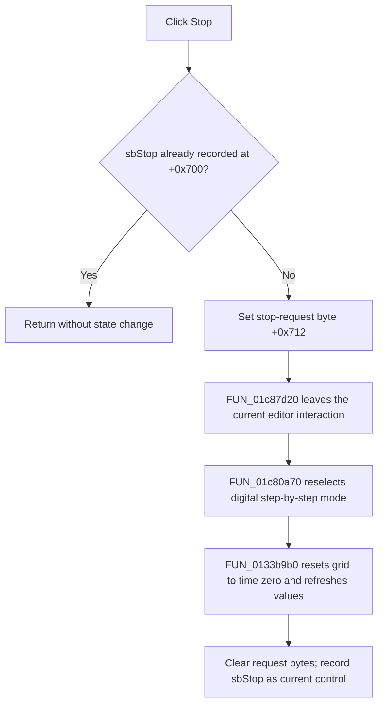

# Stop and reset mixed-digital step-by-step analysis

> Analysis status: Evidence-backed source review complete.

## Control

| Property | Recovered value |
| --- | --- |
| Form | MixedDigitalStepByStep |
| Component path | MixedDigitalStepByStep.Panel2.sbStop |
| Control class | TSpeedButton |
| Caption | Not present in the recovered resource. |
| Hint | Stop\| |
| Handler name | sbStopClick |
| Handler address | 0133bc70 |
| Graph node | `resource:dfm:MixedDigitalStepByStep/MixedDigitalStepByStep.Panel2.sbStop` |
| Handler node | `function:0133bc70` |
| Graph layer | UI |

## What happens when clicked

`FUN_0133bc70` returns immediately when the current-transport pointer at
`+0x700` already equals the form's `sbStop` pointer at `+0x6f0`. A repeated
click in the stopped state is therefore a silent no-op.

For an accepted click, the handler:

1. sets transient stop-request byte `+0x712`;
2. calls `FUN_01c87d20` to uncheck and leave the current Schematic Editor
   interactive command;
3. calls `FUN_01c80a70` to select interaction mode `2`, check the main
   interactive tool button, and invoke its common event path;
4. calls `FUN_0133b9b0` to reset the panel; and
5. records `sbStop` as the current transport control.

The role of `FUN_01c80a70` is established by its other caller
`FUN_01c80750`, whose recovered trace label is `mnDigitalStepbyStepClick` and
whose user-facing error text says to enable VHDL mixed mode to run digital
step-by-step. Stop therefore ends and reselects that same editor command. It
does not only set a local Pause byte.

## Panel reset

`FUN_0133b9b0` performs the visible stopped-state reset. It writes time zero to
the panel grid, sets Pause (`+0x710`) to one, clears the single-step byte
`+0x711`, clears stop-request byte `+0x712`, and refreshes the cached digital
node-value string. The handler then selects `sbStop` at `+0x700`.

The source proves a command reactivation and a panel reset. It does not expose
the original Delphi name or an independent reader for the short-lived
`+0x712` value before the reset clears it. This article therefore does not
claim an additional asynchronous cancellation effect for that byte.

## Timing, errors, and persistence

- The editor-command transition is synchronous in the recovered handler. There
  is no deferred polling loop or forced backend termination in this function.
- If any callee raises, later reset steps do not run. The handler has no local
  exception handler, retry, cleanup block, or rollback.
- The click shows no confirmation and returns no status to the user.
- It resets transient analysis and panel state. It does not edit the circuit,
  save a file, persist the stopped time, or mark a document as changed.

## Click flow

## Recovered evidence

- Stop guard, request, command transition, reset, and final selection:
  [FUN_0133bc70](../../../DecompiledSources/Tina16/functions/000000000133BC70__FUN_0133bc70.c)
- Editor interactive-command shutdown:
  [FUN_01c87d20](../../../DecompiledSources/Tina16/functions/0000000001C87D20__FUN_01c87d20.c)
- Digital step-by-step command activation:
  [FUN_01c80a70](../../../DecompiledSources/Tina16/functions/0000000001C80A70__FUN_01c80a70.c)
- Menu caller and mixed-mode diagnostic text:
  [FUN_01c80750](../../../DecompiledSources/Tina16/functions/0000000001C80750__FUN_01c80750.c)
- Shared interactive-command event path:
  [FUN_01c87e40](../../../DecompiledSources/Tina16/functions/0000000001C87E40__FUN_01c87e40.c)
- Panel reset, grid update, and digital-value cache refresh:
  [FUN_0133b9b0](../../../DecompiledSources/Tina16/functions/000000000133B9B0__FUN_0133b9b0.c),
  [FUN_0133ba00](../../../DecompiledSources/Tina16/functions/000000000133BA00__FUN_0133ba00.c),
  and
  [FUN_0133bb70](../../../DecompiledSources/Tina16/functions/000000000133BB70__FUN_0133bb70.c)
- Recovered form and event resources:
  [ui-evidence.json](../../../DecompiledSources/Tina16/resources/dfm/ui-evidence.json)

## Resource and analysis limits

- The control has hint **Stop|**, no caption, action, checked-state evidence,
  or same-parent label candidate.
- [The extracted glyph](../../../glyph/0277_MixedDigitalStepByStep_MixedDigitalStepByStep_Panel2_sbStop_Glyph_Data.png)
  is a black square. The handler and call path establish the reset behavior.
- The original Delphi names of the form bytes and editor mode value `2` are
  not recovered. The menu caller proves that this activation path belongs to
  digital step-by-step mode.
