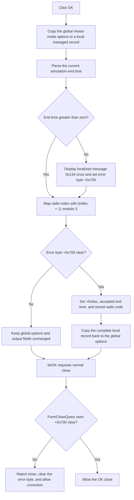

# Validate and commit the mixed-mode transient options

> Analysis status: Reviewed from the recovered OK handler, form loader, float-edit getter and error event, error reporter, record-copy helpers, form close query, and UI resource.

## Control

| Property | Recovered value |
| --- | --- |
| Form | MixedOptions2 |
| Form caption | Mixed Mode Options |
| Component path | MixedOptions2.OK |
| Control class | TBitBtn |
| Kind | bkOK |
| Handler name | OKClick |
| Handler address | 01ba03e0 |
| Graph node | `resource:dfm:MixedOptions2/MixedOptions2.OK` |
| Handler node | `function:01ba03e0` |
| Graph layer | UI |

## What happens when clicked

`TMixedOptions2.OKClick` first creates a managed local copy of the global mixed-mode options record at `PTR_DAT_02004010`. It then reads the current `eEditEndVal` text as a floating-point value and writes that value to the local record's field at offset `+0x2b8`.

The end time must be greater than zero. A value at or below zero loads localized message `0x134` and sends it to the form error reporter. The reporter displays only the first error while form error byte `+0x700` is clear, then sets that byte.

The handler also reads the selected index from `rgTRControls`, adds one, and takes the result modulo three. It writes the resulting code to the local record at offset `+0x2ad`.

| Radio index | Recovered item | Stored code |
| --- | --- | --- |
| `0` | Calculate operating point | `1` |
| `1` | Use initial conditions | `2` |
| `2` | Zero initial values | `0` |

If error byte `+0x700` remains clear, the handler performs four commits:

1. Set form field `+0x6ec` to `-1`.
2. Store the accepted end time in form field `+0x6f0`.
3. Store the transformed radio code in form byte `+0x6f8`.
4. Copy the complete local options record, including fields `+0x2ad` and `+0x2b8`, back to the global record.

If the error byte is set, none of these four commits occurs. The temporary record is finalized on both normal paths.

## Modal close and retry behavior

The button has kind `bkOK`, so the VCL requests a normal OK close after the click handler. `FormCloseQuery` permits closure only when error byte `+0x700` is clear. It then clears the byte in both cases.

An invalid end time therefore keeps the form open and resets the blocker for a later retry. The global record and the three form output fields keep their prior values. The edit itself still contains the user's invalid text until the user changes it.

## Click flow

## Handler and state evidence

- [FUN_01ba03e0](../../../DecompiledSources/Tina16/functions/0000000001BA03E0__FUN_01ba03e0.c) contains the record snapshot, end-time read, positive-value rule, radio mapping, error gate, output-field writes, and global-record commit.
- [FUN_01ba0360](../../../DecompiledSources/Tina16/functions/0000000001BA0360__FUN_01ba0360.c) loads global record field `+0x2b8` into `eEditEndVal` and maps stored code `+0x2ad` back to the displayed radio index with `(code + 2) modulo 3`.
- [FUN_00b90090](../../../DecompiledSources/Tina16/functions/0000000000B90090__FUN_00b90090.c) parses the current float-edit text, enforces its generic `-1e50` through `1e50` range, and invokes an optional edit-specific validator when present.
- [FUN_01ba02e0](../../../DecompiledSources/Tina16/functions/0000000001BA02E0__FUN_01ba02e0.c) routes a message to the form's error byte and common reporter.
- [FUN_01b1cf30](../../../DecompiledSources/Tina16/functions/0000000001B1CF30__FUN_01b1cf30.c) displays a message only while the byte is clear and then sets it.
- [FUN_01ba0340](../../../DecompiledSources/Tina16/functions/0000000001BA0340__FUN_01ba0340.c) forwards `eEditEndVal.OnError` text to the same reporter.
- [FUN_01ba03c0](../../../DecompiledSources/Tina16/functions/0000000001BA03C0__FUN_01ba03c0.c) sets `CanClose` to the inverse of error byte `+0x700` and clears that byte.
- [FUN_00417c40](../../../DecompiledSources/Tina16/functions/0000000000417C40__FUN_00417c40.c) performs the managed-record copies used for the snapshot and final commit.

## Resource evidence

- The `Transient Analysis` group contains `eEditEndVal` beside `Simulation end time:`.
- `rgTRControls` contains the three items shown in the mapping table.
- `OK` is a `TBitBtn` with kind `bkOK`. It has no recovered caption, hint, image, extracted glyph, or same-parent nearby label.
- The form has a separate built-in `bkCancel` button. Cancel does not call this handler.

## Error and no-op behavior

- A nonnumeric, out-of-range, or edit-validator failure follows the float-edit error path. The error event uses the same form flag and message suppression.
- An end time of zero or less completes the explicit handler path but skips all output and global-record commits.
- If an earlier error already set `+0x700`, the reporter suppresses additional messages until `FormCloseQuery` clears the flag.
- The handler has no local exception catch or rollback. Managed-record finalization is explicit on its recovered normal path.

## Analysis limits

- Localized message `0x134` is not present as plain text in the UI resource. This article does not invent its wording.
- The purpose of output field `+0x6ec = -1` is not recovered.
- No recovered modal caller establishes how fields `+0x6ec`, `+0x6f0`, and `+0x6f8` are used after the dialog closes.
