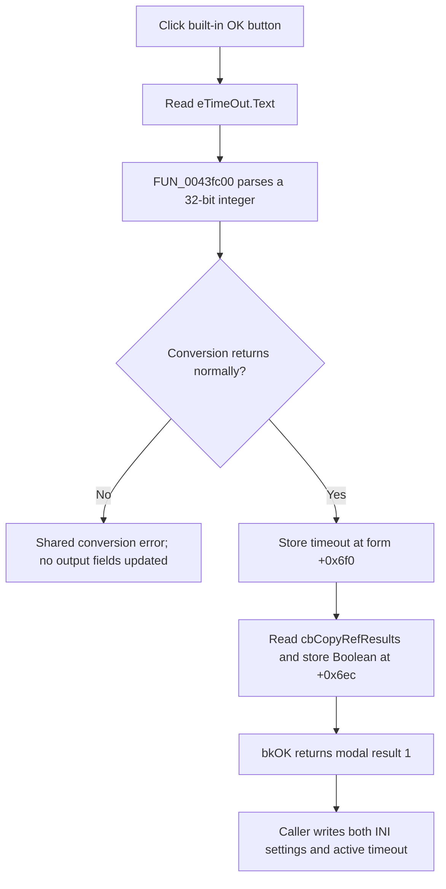

# bOK

> Analysis status: Complete. The recovered handler, form-show loader, built-in OK kind, and modal caller establish timeout parsing, checkbox capture, acceptance, and persistence.

## Control

| Property | Recovered value |
| --- | --- |
| Form | ModelTestOptions |
| Component path | ModelTestOptions.bOK |
| Control class | TBitBtn |
| Caption | Not present in the recovered resource. |
| Hint | Not present in the recovered resource. |
| Text | Not present in the recovered resource. |
| Handler name | bOKClick |
| Handler address | 012e96a0 |
| Graph node | `resource:dfm:ModelTestOptions/ModelTestOptions.bOK` |
| Handler node | `function:012e96a0` |
| Graph layer | UI |

## What happens when clicked

`FUN_012e96a0` reads `eTimeOut.Text` and converts it to a 32-bit integer through `FUN_0043fc00`. A normal conversion result is stored in form field `+0x6f0`. The handler then reads `cbCopyRefResults`, converts every nonzero checked-state value to true, and stores the Boolean in form field `+0x6ec`.

The timeout conversion accepts the recovered signed integer formats but does not apply a minimum or maximum. Empty text, trailing invalid characters, and overflow enter the shared Delphi integer-conversion error path. The handler has no local catch. Normal conversion must finish before either output field is updated.

The button is a `TBitBtn` with built-in kind `bkOK`. The modal caller `FUN_012f3e40` uses result `1` as acceptance. After acceptance, it writes `+0x6f0` to `ModelTest Settings/Opt_Timeout`, copies that value to the active editor's runtime timeout field `+0xac4`, and writes `+0x6ec` to `ModelTest Settings/Opt_CopyRefResults`. The click handler itself does not write the INI file. Canceling the dialog bypasses all three caller writes.

When the dialog is shown, `FUN_012e9740` loads both controls from `TINA.INI`. Missing values default to timeout `0` and Copy RefResults enabled. Later model-test paths read these settings: timeout replaces a testbench file's timeout value, and Copy RefResults controls whether `.ac` and `.tr` reference-result files are copied.

## Click flow

## Handler evidence

- Source: [DecompiledSources/Tina16/functions/00000000012E96A0__FUN_012e96a0.c](../../../DecompiledSources/Tina16/functions/00000000012E96A0__FUN_012e96a0.c)
- Recovered role: Validates and captures ModelTest timeout and reference-result copy options for modal acceptance.
- Current graph summary: Handles 1 Delphi UI event: ModelTestOptions.bOK.OnClick.
- Current graph behavior: Not present in the recovered resource.
- Current graph evidence: Not present in the recovered resource.
- Complexity: complex
- Distinct outgoing calls: 4

## Direct calls

- `function:00414480` — Delphi UnicodeString clear and finalization helper
- `function:0043fc00` — FUN_0043fc00
- `function:0064dd90` — VCL control Unicode text reader
- `function:01b218a0` — FUN_01b218a0

## Resource evidence

- Kind: bkOK
- Modal result: Not present in the recovered resource.
- Checked state: Not present in the recovered resource.
- List items: Not present in the recovered resource.
- Image reference: Not present in the recovered resource.
- Extracted glyph: None.

## Nearby label candidates

Nearby labels are layout candidates only. They are not proof of behavior.

- Rank 1: Timeout at distance 56.

## Analysis limits

- `bkOK` and the caller's modal-result check establish acceptance behavior. The nearby `Timeout` label establishes the edit identity together with the form resource and show handler.
- The recovered source does not name the units of the timeout value. This article does not infer seconds, milliseconds, or another unit.
- The exact user-facing conversion-error text is supplied through a shared runtime resource and is not recovered here.
