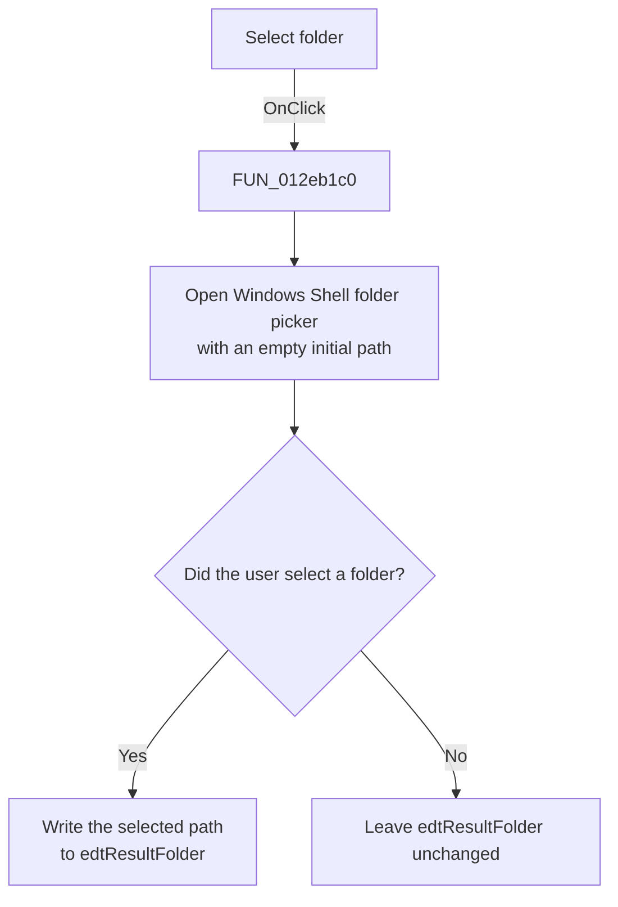

# Select folder

> Analysis status: Reviewed from the recovered handler, its folder-picker callee, and the form resources.

## Control

| Property | Recovered value |
| --- | --- |
| Form | ModReplicationFile |
| Component path | ModReplicationFile.bResultFolder |
| Control class | TButton |
| Caption | Select folder |
| Hint | Not present in the recovered resource. |
| Text | Not present in the recovered resource. |
| Handler name | bResultFolderClick |
| Handler address | 012eb1c0 |
| Graph node | `resource:dfm:ModReplicationFile/ModReplicationFile.bResultFolder` |
| Handler node | `function:012eb1c0` |
| Graph layer | UI |

## What happens when clicked

The handler opens the Windows Shell folder picker. It starts the picker with an empty path. It does not use the current **Result folder** text as the initial folder.

If the user selects a folder, the handler writes the returned path to `edtResultFolder`. If the user cancels the picker, the handler leaves the edit value unchanged. This click does not create or validate the selected directory, load the source XML, or write an output file.

The **Run** handler later reads this value. A non-empty value becomes the directory part of the output path. An empty value makes the generated file name relative to the process working directory.

## Click flow

## Handler evidence

- Source: [DecompiledSources/Tina16/functions/00000000012EB1C0__FUN_012eb1c0.c](../../../DecompiledSources/Tina16/functions/00000000012EB1C0__FUN_012eb1c0.c)
- Recovered role: Select the replication output directory.
- Current graph summary: Handles 1 Delphi UI event: ModReplicationFile.bResultFolder.OnClick.
- Current graph behavior: The handler opens a Shell folder picker and updates the result-folder edit only after an accepted selection.
- Current graph evidence: `FUN_012eb1c0` initializes an empty Unicode string, passes it to `FUN_00b96980`, tests the returned Boolean value, and calls the VCL text setter for the form field at offset `0x710` only when the value is true. The form resource identifies that field as `edtResultFolder`.
- Complexity: complex
- Distinct outgoing calls: 3

## Direct calls

- `function:00414480` — Delphi UnicodeString clear and finalization helper
- `function:0064de00` — VCL control text setter with change suppression
- `function:00b96980` — FUN_00b96980

## Resource evidence

- Kind: Not present in the recovered resource.
- Modal result: Not present in the recovered resource.
- Checked state: Not present in the recovered resource.
- List items: Not present in the recovered resource.
- Image reference: Not present in the recovered resource.
- Extracted glyph: None.

## Nearby label candidates

Nearby labels are layout candidates only. They are not proof of behavior.

- Rank 1: Number of the parameter in the design: at distance 338.
- Rank 2: Working modes: at distance 406.
- Rank 3: Result folder at distance 478.

## Analysis limits

- The recovered handler does not show an error message for a canceled picker.
- The recovered code does not prove the process working directory or whether a later save overwrites an existing file.
