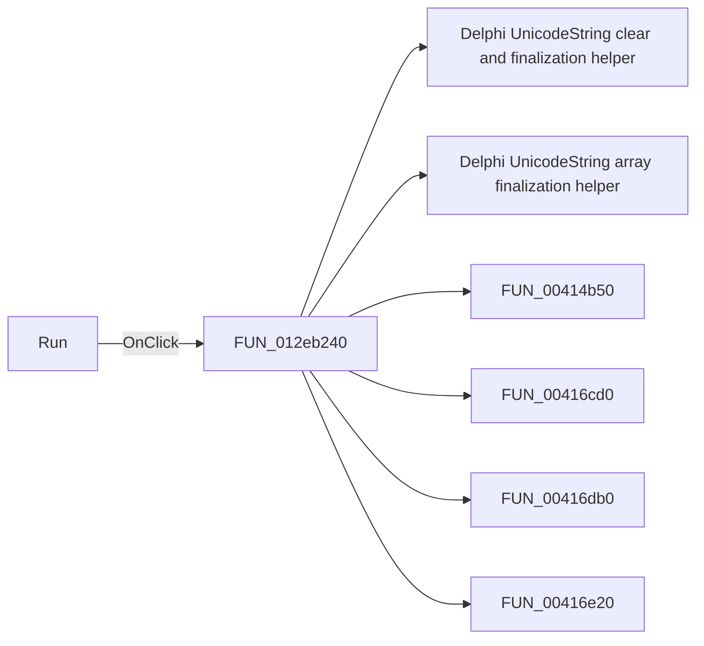

# Run

> Analysis status: Pending individual source review.

## Control

| Property | Recovered value |
| --- | --- |
| Form | ModReplicationFile |
| Component path | ModReplicationFile.bRun |
| Control class | TButton |
| Caption | Run |
| Hint | Not present in the recovered resource. |
| Text | Not present in the recovered resource. |
| Handler name | bRunClick |
| Handler address | 012eb240 |
| Graph node | `resource:dfm:ModReplicationFile/ModReplicationFile.bRun` |
| Handler node | `function:012eb240` |
| Graph layer | UI |

## What happens when clicked

Pending individual analysis. An agent must read the recovered handler source and its relevant callees before it replaces this text.

## Click flow

## Handler evidence

- Source: [DecompiledSources/Tina16/functions/00000000012EB240__FUN_012eb240.c](../../../DecompiledSources/Tina16/functions/00000000012EB240__FUN_012eb240.c)
- Recovered role: Not present in the recovered resource.
- Current graph summary: Handles 1 Delphi UI event: ModReplicationFile.bRun.OnClick.
- Current graph behavior: Not present in the recovered resource.
- Current graph evidence: Not present in the recovered resource.
- Complexity: complex
- Distinct outgoing calls: 19

## Direct calls

- `function:00414480` — Delphi UnicodeString clear and finalization helper
- `function:00414560` — Delphi UnicodeString array finalization helper
- `function:00414b50` — FUN_00414b50
- `function:00416cd0` — FUN_00416cd0
- `function:00416db0` — FUN_00416db0
- `function:00416e20` — FUN_00416e20
- `function:004170c0` — FUN_004170c0
- `function:00417840` — FUN_00417840
- `function:0041b800` — FUN_0041b800
- `function:0041b890` — FUN_0041b890
- `function:00440a20` — FUN_00440a20
- `function:00450070` — FUN_00450070
- `function:00456760` — FUN_00456760
- `function:0064dd90` — VCL control Unicode text reader
- `function:0080d2f0` — FUN_0080d2f0
- `function:00bac3d0` — FUN_00bac3d0
- `function:00c5a450` — FUN_00c5a450
- `function:012ed9f0` — FUN_012ed9f0
- `function:012edab0` — FUN_012edab0

## Resource evidence

- Kind: Not present in the recovered resource.
- Modal result: Not present in the recovered resource.
- Checked state: Not present in the recovered resource.
- List items: Not present in the recovered resource.
- Image reference: Not present in the recovered resource.
- Extracted glyph: None.

## Nearby label candidates

Nearby labels are layout candidates only. They are not proof of behavior.

- Rank 1: Duplicate: at distance 82.
- Rank 2: File source: at distance 138.
- Rank 3: Result folder at distance 176.

## Analysis limits

- Do not infer behavior from the control class, caption, hint, glyph, or nearby label alone.
- Do not replace the pending status until the handler source and relevant call path provide enough evidence.
