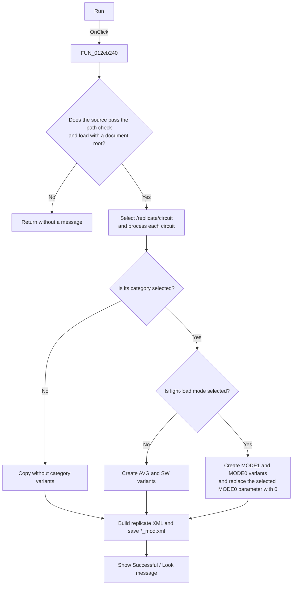

# Run

> Analysis status: Reviewed from the recovered handler, relevant callees, string constants, and form resources.

## Control

| Property | Recovered value |
| --- | --- |
| Form | ModReplicationFile |
| Component path | ModReplicationFile.bRun |
| Control class | TButton |
| Caption | Run |
| Hint | Not present in the recovered resource. |
| Text | Not present in the recovered resource. |
| Handler name | bRunClick |
| Handler address | 012eb240 |
| Graph node | `resource:dfm:ModReplicationFile/ModReplicationFile.bRun` |
| Handler node | `function:012eb240` |
| Graph layer | UI |

## What happens when clicked

The handler reads `edtSourceFile` and checks the path. If the check fails, it stops without a message. It then creates an XML document, loads the source file, gets the document root, and selects `/replicate/circuit`. A failed load or a missing document or root also causes a silent return.

For each source circuit, the handler reads the `path` and `file` values. The **User** option changes `CGLOBAL` to `CUSER` in the path. If **User** is not selected and **Global** is selected, it changes `CUSER` to `CGLOBAL`. The handler normalizes the recovered `%23` marker in the file value and classifies the circuit as `Efficiency`, `Line`, or `Load`. The matching category checkbox decides whether the circuit gets duplicated and renamed.

| Light-load option | Versions for each selected category |
| --- | --- |
| Cleared | `_AVG`, `_SW` |
| Selected | `_AVG_MODE1`, `_SW_MODE1`, `_AVG_MODE0`, `_SW_MODE0` |

The suffix is inserted before the first `.` in the file value. For each `MODE0` version, the handler walks the version actions and parameters. It uses the number from `spE_paramNum` to select a comma-separated parameter field and replaces that field with `0`. Categories whose checkboxes are cleared do not get these duplicate versions and suffixes.

The handler builds a new XML document with a `replicate` root and copies the processed circuit, version, action, and parameter data into it. It removes the source directory, inserts `_mod` before the first `.` in the source base name, and saves the result:

- With a non-empty `edtResultFolder`, it joins the result folder and modified base name with `\`.
- With an empty `edtResultFolder`, it saves the modified base name as a relative path.

After the save call returns, the handler shows a message box with `Successful` and `Look`. The code does not create the result folder, ask before overwrite, or use a transaction. It has no local exception handler. An exception from the XML or save operations therefore prevents the success message and leaves failure handling to the caller.

## Click flow

## Handler evidence

- Source: [DecompiledSources/Tina16/functions/00000000012EB240__FUN_012eb240.c](../../../DecompiledSources/Tina16/functions/00000000012EB240__FUN_012eb240.c)
- Recovered role: Generate a modified replication XML file.
- Current graph summary: Handles 1 Delphi UI event: ModReplicationFile.bRun.OnClick.
- Current graph behavior: The handler validates and loads a source replication XML file, creates selected category and light-load variants, rewrites MODE0 action parameters, saves a new `_mod` XML file, and reports success after the save call returns.
- Current graph evidence: `FUN_012eb240` reads the form controls, calls the recovered path check and XML-document constructor, selects the literal `/replicate/circuit`, branches on the radio buttons and category checkboxes, applies the recovered suffix strings, uses `FUN_00c5a450`, `FUN_012ed9f0`, and `FUN_012edab0` for the selected comma-separated parameter field, constructs the output name with `_mod`, invokes the XML save operation, and then calls the application message-box wrapper.
- Complexity: complex
- Distinct outgoing calls: 19

## Direct calls

- `function:00414480` — Delphi UnicodeString clear and finalization helper
- `function:00414560` — Delphi UnicodeString array finalization helper
- `function:00414b50` — FUN_00414b50
- `function:00416cd0` — FUN_00416cd0
- `function:00416db0` — FUN_00416db0
- `function:00416e20` — FUN_00416e20
- `function:004170c0` — FUN_004170c0
- `function:00417840` — FUN_00417840
- `function:0041b800` — FUN_0041b800
- `function:0041b890` — FUN_0041b890
- `function:00440a20` — FUN_00440a20
- `function:00450070` — FUN_00450070
- `function:00456760` — FUN_00456760
- `function:0064dd90` — VCL control Unicode text reader
- `function:0080d2f0` — FUN_0080d2f0
- `function:00bac3d0` — FUN_00bac3d0
- `function:00c5a450` — FUN_00c5a450
- `function:012ed9f0` — FUN_012ed9f0
- `function:012edab0` — FUN_012edab0

## Resource evidence

- Kind: Not present in the recovered resource.
- Modal result: Not present in the recovered resource.
- Checked state: Not present in the recovered resource.
- List items: Not present in the recovered resource.
- Image reference: Not present in the recovered resource.
- Extracted glyph: None.

## Nearby label candidates

Nearby labels are layout candidates only. They are not proof of behavior.

- Rank 1: Duplicate: at distance 82.
- Rank 2: File source: at distance 138.
- Rank 3: Result folder at distance 176.

## Analysis limits

- The recovered virtual XML calls do not establish the concrete XML library class, output encoding, indentation, or byte-order mark.
- The recovered handler does not show an output-exists check, overwrite confirmation, rollback, or explicit exception recovery.
- The code does not prove the process working directory used for a relative output name.
