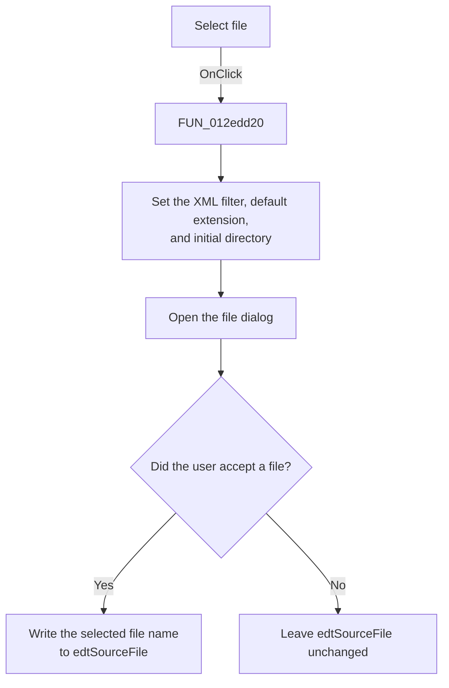

# Select file

> Analysis status: Reviewed from the recovered handler, its file-dialog callees, and the form resources.

## Control

| Property | Recovered value |
| --- | --- |
| Form | ModReplicationFile |
| Component path | ModReplicationFile.btnSourceFolder |
| Control class | TButton |
| Caption | Select file |
| Hint | Not present in the recovered resource. |
| Text | Not present in the recovered resource. |
| Handler name | btnSourceFolderClick |
| Handler address | 012edd20 |
| Graph node | `resource:dfm:ModReplicationFile/ModReplicationFile.btnSourceFolder` |
| Handler node | `function:012edd20` |
| Graph layer | UI |

## What happens when clicked

The handler configures the form's open dialog for XML files. It sets the filter to `Extensible Markup Language|*.xml`, sets the default extension to `xml`, reads the current `edtSourceFile` text, and supplies that text to the dialog's initial-directory setter.

It then opens the dialog. If the user accepts a file, the handler reads the selected file name and writes it to `edtSourceFile`. If the user cancels the dialog, the edit value stays unchanged. The dialog filter, default extension, and initial-directory state have already been updated in both cases.

This click does not load or validate the selected XML file. The **Run** handler performs the path check and XML load.

## Click flow

## Handler evidence

- Source: [DecompiledSources/Tina16/functions/00000000012EDD20__FUN_012edd20.c](../../../DecompiledSources/Tina16/functions/00000000012EDD20__FUN_012edd20.c)
- Recovered role: Select the source replication XML file.
- Current graph summary: Handles 1 Delphi UI event: ModReplicationFile.btnSourceFolder.OnClick.
- Current graph behavior: The handler configures and opens an XML file dialog, then updates the source-file edit only after an accepted selection.
- Current graph evidence: `FUN_012edd20` assigns the recovered XML filter and `xml` extension, reads the edit at form offset `0x6f8`, calls the recovered initial-directory setter `FUN_00724420`, executes the dialog, and uses `FUN_00724270` plus the VCL text setter only when the dialog returns true. The form resource identifies the edit as `edtSourceFile`.
- Complexity: complex
- Distinct outgoing calls: 6

## Direct calls

- `function:00414480` — Delphi UnicodeString clear and finalization helper
- `function:00414ad0` — Delphi UnicodeString assignment helper
- `function:0064dd90` — VCL control Unicode text reader
- `function:0064de00` — VCL control text setter with change suppression
- `function:00724270` — FUN_00724270
- `function:00724420` — FUN_00724420

## Resource evidence

- Kind: Not present in the recovered resource.
- Modal result: Not present in the recovered resource.
- Checked state: Not present in the recovered resource.
- List items: Not present in the recovered resource.
- Image reference: Not present in the recovered resource.
- Extracted glyph: None.

## Nearby label candidates

Nearby labels are layout candidates only. They are not proof of behavior.

- Rank 1: Number of the parameter in the design: at distance 369.
- Rank 2: Working modes: at distance 437.
- Rank 3: Source file at distance 483.

## Analysis limits

- The recovered code does not show a validation message when the user cancels the dialog.
- The file-dialog filter limits the visible choices, but it does not prove that the selected file contains valid replication XML.
