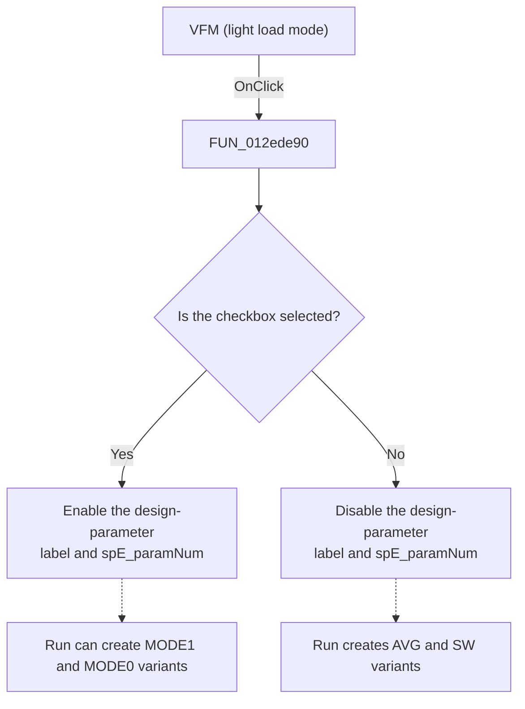

# VFM (light load mode)

> Analysis status: Reviewed from the recovered handler, the Run handler, and the form resources.

## Control

| Property | Recovered value |
| --- | --- |
| Form | ModReplicationFile |
| Component path | ModReplicationFile.chkbLightLoadMode |
| Control class | TCheckBox |
| Caption | VFM (light load mode) |
| Hint | Light load modes such as VFM, PFM, DCM. |
| Text | Not present in the recovered resource. |
| Handler name | chkbLightLoadModeClick |
| Handler address | 012ede90 |
| Graph node | `resource:dfm:ModReplicationFile/ModReplicationFile.chkbLightLoadMode` |
| Handler node | `function:012ede90` |
| Graph layer | UI |

## What happens when clicked

The handler reads the checkbox state and synchronizes two design-parameter controls with it. When the checkbox is selected, it enables the parameter label and `spE_paramNum`. When the checkbox is cleared, it disables both controls. It does not change the numeric value.

The **Run** handler also reads this checkbox. For each enabled **Efficiency**, **Line**, or **Load** category, a cleared checkbox produces two versions with `_AVG` and `_SW` suffixes. A selected checkbox produces four versions with `_AVG_MODE1`, `_SW_MODE1`, `_AVG_MODE0`, and `_SW_MODE0` suffixes. For a `MODE0` version, **Run** uses the number in `spE_paramNum` to select a comma-separated action parameter and replaces that field with `0`.

The resource sets this checkbox to selected by default. Repeated clicks with the same state only apply the same enabled state again.

## Click flow

## Handler evidence

- Source: [DecompiledSources/Tina16/functions/00000000012EDE90__FUN_012ede90.c](../../../DecompiledSources/Tina16/functions/00000000012EDE90__FUN_012ede90.c)
- Recovered role: Toggle the light-load design-parameter controls.
- Current graph summary: Handles 1 Delphi UI event: ModReplicationFile.chkbLightLoadMode.OnClick.
- Current graph behavior: The handler enables or disables the design-parameter label and numeric edit to match the checkbox. The Run handler uses the same state to select two-version or four-version replication output.
- Current graph evidence: `FUN_012ede90` reads the check state from form offset `0x730` and applies that Boolean as the enabled state of the controls at offsets `0x738` and `0x740`. `FUN_012eb240` reads the same checkbox and parses the numeric control at `0x740` through `FUN_00c5a450`. The resource tree and layout identify the paired controls as the design-parameter label and `spE_paramNum`.
- Complexity: simple
- Distinct outgoing calls: 0

## Direct calls

- No direct call edge is present in the recovered graph.

## Resource evidence

- Kind: Not present in the recovered resource.
- Modal result: Not present in the recovered resource.
- Checked state: true
- List items: Not present in the recovered resource.
- Image reference: Not present in the recovered resource.
- Extracted glyph: None.

## Nearby label candidates

Nearby labels are layout candidates only. They are not proof of behavior.

- Rank 1: Number of the parameter in the design: at distance 23.
- Rank 2: Working modes: at distance 91.
- Rank 3: Duplicate: at distance 257.

## Analysis limits

- The hint says to use `0` when a parameter is not implemented. The recovered Run handler does not contain a visible check that treats the value `0` as a disabled setting.
- The recovered click handler has no direct call edges because the checked and enabled operations are virtual calls.
