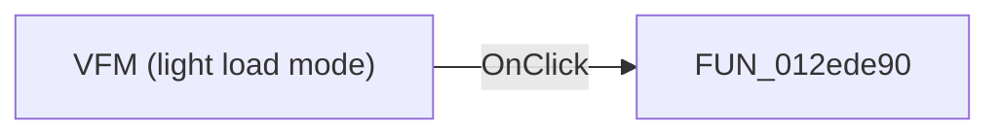

# VFM (light load mode)

> Analysis status: Pending individual source review.

## Control

| Property | Recovered value |
| --- | --- |
| Form | ModReplicationFile |
| Component path | ModReplicationFile.chkbLightLoadMode |
| Control class | TCheckBox |
| Caption | VFM (light load mode) |
| Hint | Light load modes such as VFM, PFM, DCM. |
| Text | Not present in the recovered resource. |
| Handler name | chkbLightLoadModeClick |
| Handler address | 012ede90 |
| Graph node | `resource:dfm:ModReplicationFile/ModReplicationFile.chkbLightLoadMode` |
| Handler node | `function:012ede90` |
| Graph layer | UI |

## What happens when clicked

Pending individual analysis. An agent must read the recovered handler source and its relevant callees before it replaces this text.

## Click flow

## Handler evidence

- Source: [DecompiledSources/Tina16/functions/00000000012EDE90__FUN_012ede90.c](../../../DecompiledSources/Tina16/functions/00000000012EDE90__FUN_012ede90.c)
- Recovered role: Not present in the recovered resource.
- Current graph summary: Handles 1 Delphi UI event: ModReplicationFile.chkbLightLoadMode.OnClick.
- Current graph behavior: Not present in the recovered resource.
- Current graph evidence: Not present in the recovered resource.
- Complexity: simple
- Distinct outgoing calls: 0

## Direct calls

- No direct call edge is present in the recovered graph.

## Resource evidence

- Kind: Not present in the recovered resource.
- Modal result: Not present in the recovered resource.
- Checked state: true
- List items: Not present in the recovered resource.
- Image reference: Not present in the recovered resource.
- Extracted glyph: None.

## Nearby label candidates

Nearby labels are layout candidates only. They are not proof of behavior.

- Rank 1: Number of the parameter in the design: at distance 23.
- Rank 2: Working modes: at distance 91.
- Rank 3: Duplicate: at distance 257.

## Analysis limits

- Do not infer behavior from the control class, caption, hint, glyph, or nearby label alone.
- Do not replace the pending status until the handler source and relevant call path provide enough evidence.
