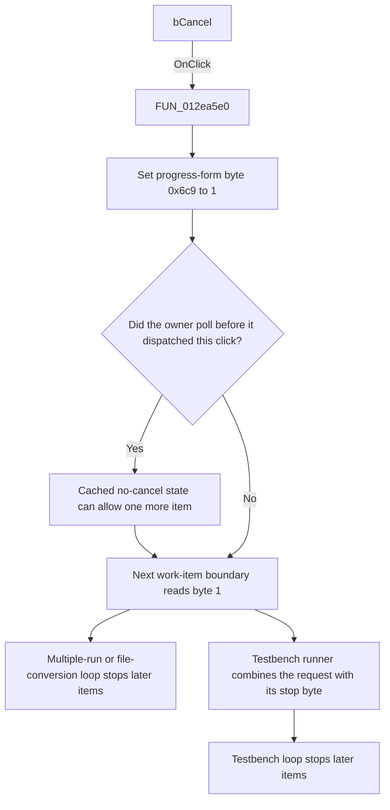

# bCancel

> Analysis status: Source, graph, resource, and cancellation-consumer evidence reviewed.

## Control

| Property | Recovered value |
| --- | --- |
| Form | MTBProgress |
| Component path | MTBProgress.bCancel |
| Control class | TBitBtn |
| Button kind | bkCancel |
| Caption | Not present in the recovered resource. |
| Hint | Not present in the recovered resource. |
| Text | Not present in the recovered resource. |
| Handler name | bCancelClick |
| Handler address | 012ea5e0 |
| Graph node | `resource:dfm:MTBProgress/MTBProgress.bCancel` |
| Handler node | `function:012ea5e0` |
| Graph layer | UI |

## What happens when clicked

The click requests cooperative cancellation of the work that owns the progress form. The recovered `TMTBProgress.bCancelClick` handler unconditionally writes `1` to the byte at form offset `+0x6c9`. It does not inspect the sender, the displayed progress, or any other state. It has no call, branch, return value, or local error path.

The handler does not interrupt work directly. The recovered owners poll the byte at work-item boundaries near their progress updates:

- [`FUN_012f41e0`](../../../DecompiledSources/Tina16/functions/00000000012F41E0__FUN_012f41e0.c) reads the byte after one multiple-run item. When the read returns `1`, its cached loop state stops later items.
- [`FUN_012f5900`](../../../DecompiledSources/Tina16/functions/00000000012F5900__FUN_012f5900.c) reads the byte after processing one `.tsc` file. When the read returns `1`, its cached loop state stops later files.
- [`FUN_0131aef0`](../../../DecompiledSources/Tina16/functions/000000000131AEF0__FUN_0131aef0.c) reads the byte after one testbench item. It combines the request with the runner's existing stop byte at offset `+0x72`, and the loop then stops later items.

Each inspected owner calls the recovered Windows-message dispatch loop, [`FUN_0080cc70`](../../../DecompiledSources/Tina16/functions/000000000080CC70__FUN_0080cc70.c), after it reads the cancellation byte or updates its cached stop state. If that dispatch loop delivers the click, the owner has already saved the earlier no-cancel result. One more work item can then start before the next boundary reads `1`. If no item remains, the workflow ends without another cancellation poll.

[`FUN_012ea5f0`](../../../DecompiledSources/Tina16/functions/00000000012EA5F0__FUN_012ea5f0.c), the recovered `TMTBProgress.FormCreate` handler, clears offset `+0x6c9` to `0` when the form is created. Thus, each new progress form starts without a pending request. Repeated clicks have the same effect because they write `1` again.

The click handler does not close, hide, or destroy the form. The first two recovered owners free their cached progress form after their work path ends. The testbench owner manages its form outside the inspected function. The `bkCancel` resource value supports the control's purpose, but the state write and the owner polling prove its behavior.

## Click flow

## Handler evidence

- Source: [DecompiledSources/Tina16/functions/00000000012EA5E0__FUN_012ea5e0.c](../../../DecompiledSources/Tina16/functions/00000000012EA5E0__FUN_012ea5e0.c)
- Recovered role: Sets the MTB progress form's cooperative cancellation-request byte.
- Current graph summary: Handles 1 Delphi UI event: MTBProgress.bCancel.OnClick.
- State-write evidence: The complete handler writes `1` to form offset `+0x6c9` and returns.
- Initialization evidence: `FUN_012ea5f0`, the form's recovered `OnCreate` handler, writes `0` to the same offset.
- Consumer evidence: `FUN_012f41e0`, `FUN_012f5900`, and `FUN_0131aef0` read the offset at work-item boundaries and use it to stop their loops. Their message-dispatch call follows the read or cached-state update.
- Complexity: simple
- Distinct outgoing calls: 0

## Direct calls

- No direct call edge is present in the recovered graph.

The cancellation effect uses a shared form field instead of a direct call. The important connections are the three reader paths described above.

## Resource evidence

- Kind: bkCancel
- Modal result: Not present in the recovered resource.
- Checked state: Not present in the recovered resource.
- List items: Not present in the recovered resource.
- Image reference: Not present in the recovered resource.
- Extracted glyph: None.

## Nearby label candidates

Nearby labels are layout candidates only. They are not proof of behavior.

- No same-parent label candidate is available.

## No-op and error behavior

- The handler always records the request. It has no condition that can reject or ignore the click.
- A repeated click does not change the result beyond writing the same nonzero byte again.
- The handler does not report success or failure and does not contain exception handling.
- An owner can start one more work item when it dispatches the click after it has cached a no-cancel result. The handler has no direct abort or thread-termination operation.

## Analysis limits

- The recovered source does not provide the Delphi field name for offset `+0x6c9`. This article calls it a cancellation-request byte because all three inspected consumers use it to prevent further work.
- The inspected owners poll only at the shown work-item boundaries. The recovered source does not prove cancellation points inside a work item.
- `bkCancel` does not prove the state protocol by itself. The handler write, form-create reset, and owner reads provide that proof.
